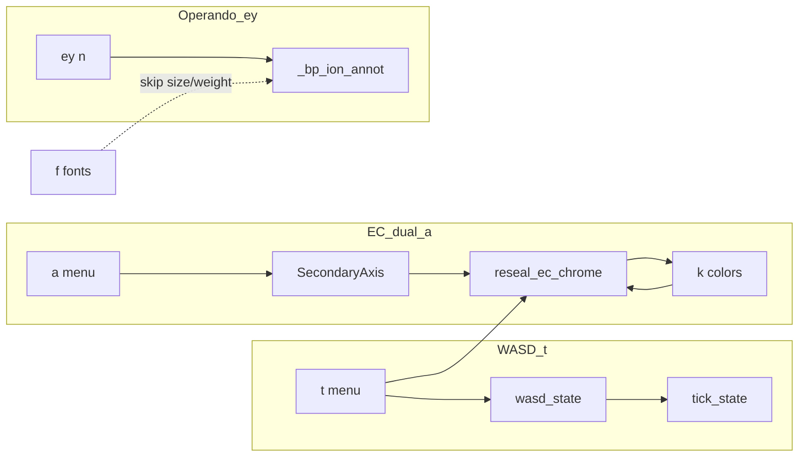

# Menu Keys and Coupling Catalog

Developer reference for every interactive / batch menu key, nested submenu, and
cross-key coupling. Use this before changing menu handlers, session dumps, or
style apply — especially when a fix in one key can break another.

**Not** a user manual. Code paths are relative to `batplot/plot_modes/` unless
noted. Verified against menu printers + dispatch (2026-08-04).

---

## 1. CLI vs menu: do not confuse `i` / `s` / `p` / `b`

| Context | Token | Meaning |
|---------|-------|---------|
| CLI | `--i` / `--interactive` | Open the interactive terminal menu after plotting |
| CLI | `--save` | Write `.pkl` without opening the menu |
| Menu (all modes) | `p` | Export / print style (or style+geometry) |
| Menu | `i` | Import style / geometry |
| Menu | `s` | Save session / project (`.pkl`) |
| Menu | `b` | Undo |
| Menu | `e` | Export figure(s) |
| Menu | `q` | Quit (often with confirm) |
| Menu | `os` / `ops` / `opsg` / `oe` | Overwrite last session / style / style+geom / figure path |

**p/i parity** and **s/b parity** rules: see [DEVELOPING.md](DEVELOPING.md)
(Style Files / Sessions).

Entry dispatch: `batplot/cli.py` → `batplot/batplot.py` → mode routers;
session reload: `session_routing.py`.

---

## 2. Shared conventions (ambiguous letters)

The same letter means different things in different menus. Always check which
submenu is active.

| Letter | Common meanings |
|--------|-----------------|
| `t` | **Top-level:** WASD spines/ticks (XY/EC/operando/CPC/histo/batch). **Histo:** also nested `h` display (`d`/`n`/`m`). **Inside legend:** toggle legend. **Inside dual `a`:** N/A (`c`/`n`/`d`). **Inside ey:** time (clear ion overlays). |
| `n` | **Top-level:** crosshair. **Inside WASD `t`:** major tick spacing. **Inside ey:** ions overlays. **Inside dual `a`:** ions-only X. **Batch options:** crosshair. |
| `f` | **Top-level:** fonts. **Inside line menus:** frame/tick widths. **Inside font submenu:** family. |
| `w`/`a`/`s`/`d` | **WASD sides** (top/left/bottom/right). **Axis limits:** `w`=upper, `s`=lower, `a`=auto. **Legend position:** nudge directions. **Display Chg/Dch:** `c`/`d`/`b` (not WASD). |
| `l` | **Top-level:** line style. **Inside WASD:** tick length. **Inside line:** linestyle / linewidth variants. |
| `c` | Colors / cycles / CIF / canvas / capacity (context-dependent). |
| `q` | Back / quit. Blank often backs out of submenus. |
| `1`–`5` | **WASD props:** 1=spine, 2=major ticks, 3=minor ticks, 4=labels, 5=axis title. Combined as `s2`, `w5`, etc. |

### Shared submenu runners

| Runner | File | Keys |
|--------|------|------|
| Font `f` | `common/menus.py` `run_font_menu` | `f` family, `s` size, `b` weight, `h` highlight → (`t`,`c`,`a`,`p`), `q` |
| Axis limits | `common/menus.py` `run_axis_limit_menu` | two numbers, `w` upper, `s` lower, `a` auto, `q` |
| Legend | `common/menus.py` `run_legend_position_menu` | `t` toggle, `p` position → (`w`,`s`,`a`,`d`,`0`,`x`,`y`), `q` |
| WASD spines | `common/spines.py` `run_spine_tick_menu` | `w/a/s/d`+`1–5`, `i`, `l`, `n`, `m`, `p`, `list`, `q` |
| Size `g` (typical) | mode `run_option_menu` / batch geom | `p` plot frame, `c` canvas (operando: `c`/`o`/`e`/`h`/`s`) |
| Overview `o` (GC/CPC) | `common/overview_metrics.py` | `c`,`r`,`s`,`e`,`q` |
| Color tokens | `color_utils` | `e` screen pick, `u` manage saved, `q` |

---

## 3. Per-mode key tables

### 3.1 XY / 1D

| | |
|--|--|
| Print | `xy/menu.py` `print_xy_menu` |
| Dispatch | `xy/interactive.py` |
| Batch | `batch_session/menu_xy.py` |

**Top-level**

| Key | Function | Notes |
|-----|----------|-------|
| `c` | Colors (curves, palettes, spines, CIF) | |
| `f` | Font | shared `run_font_menu` |
| `l` | Line style | submenu below |
| `t` | WASD spines/ticks | shared |
| `g` | Size | `p`/`c` |
| `h` | Legend / curve labels | |
| `sm` | Smooth | **batch: rejected** |
| `a` | Rearrange curves | **batch: rejected** |
| `o` | Offset | hidden in `--stack`; **batch: rejected** |
| `r` | Rename | |
| `x` / `y` | Axis range | `y` hidden in `--stack` |
| `d` | Derivative | **batch: rejected** |
| `cif` | CIF ticks | also legacy `z`/`j` dispatch |
| `v` | Find peaks | |
| `n` | Crosshair | diffraction only |
| `u` | Axis units XRD | `2`/`q`/`d`/`b`; diffraction only |
| `p`/`i`/`e`/`s`/`b`/`q` | I/O | + overwrite shortcuts |
| `w` | Hidden game | not printed |

**Submenus (single)**

- **`h`:** `v` names, `s` position → `1–4`, `q`
- **`l`:** `c`,`f`,`g`,`l`,`ld`,`d`,`da`,`dd`,`q` — `xy/line_style.py`
- **`sm`:** `r`,`s`,`reset`,`q` (+ numbered reduce/smooth/merge)
- **`o`:** `1–N`,`a`,`r`,`d`,`q` — `xy/offset_menu.py`
- **`d`:** `1–4`,`reset`,`q`
- **`cif`:** `a`,`z`,`t`,`v`,`p`,`c`,`x`,`r`,`q`
- **`r`:** `c`,`t`,`x`,`y`,`s`,`q`
- **`c`:** curve:color / palettes / `w/a/s/d:color` / `t` CIF / `u`/`e`/`q`

**Batch XY:** styles `c,f,l,t,h,g`; geom `r,x,y,v,cif`; options `n,e,p,i,s,b,q`.
CIF batch limited (`a`,`q`). Rejected with message: `sm`,`a`,`o`,`d`.

---

### 3.2 Electrochem (GC / CV / dQ/dV)

| | |
|--|--|
| Print | `electrochem/menu.py` |
| Dispatch | `electrochem/interactive.py` |
| Batch | `batch_session/menu_ec.py` |
| Key set helper | `electrochem_menu_command_keys(...)` |

**Top-level (conditional)**

| Key | Function | When |
|-----|----------|------|
| `f` | Font | always |
| `l` | Line | always |
| `sm` | Smooth / filter | **dQ/dV only**; **batch: rejected** |
| `k` | Spine **colors** | always (CPC uses `c`→spines instead) |
| `t` | WASD spines | always |
| `g` | Size | not canvas mode |
| `h` | Legend | always |
| `d` | Display Chg/Dch | `c`/`d`/`b` |
| `v` | Show/hide files | multi-file |
| `c` | Cycles / colors | always |
| `r` | Rename | always |
| `a` | Capacity / ions / dual X | **GC only** (not dQ/dV); **batch: rejected** |
| `x`/`y` | Scales | always |
| `h`→`ra` | Rearrange legend | multi-file only (under legend submenu, not top-level) |
| `n` | Crosshair | always |
| `o` | Overview | GC when overview enabled |
| `2d` | dQ/dV contour companion | dQ/dV only; **batch: rejected** |
| `p`/`i`/`e`/`s`/`b`/`q` | I/O | always |

**Submenus**

- **`d`:** `c` charge, `d` discharge, `b` both, `q`
- **`l`:** same shape as XY line (`c,f,g,l,ld,d,da,dd,q`)
- **`a` dual X:** `c` capacity, `n` ions, `d` dual, `s` swap (if dual), `u` update C_th, `q` — `electrochem/dual_axis_menu.py`
- **`sm`:** `a`,`d`,`o`,`r`,`q`; outliers `1`/`2` — `smoothing_menu.py`
- **`r`:** `x`,`tx`,`y`,`f`,`s`,`q`
- **`h`:** shared legend `t`/`p` (+ **`ra` rearrange** when multi-file only under `h`, not top-level → `fig._ec_legend_file_order`, persisted in `p`/`i`/`s`/`b`)
- **`o`:** `c`,`r`,`s`,`e`,`q`
- **`c` cycles:** freeform tokens (`all`, ranges, `1:red`, `fall:…`, palettes, `e`/`u`/`q`); multi-file file index first
- **`k`:** `w/a/s/d:color`, `e`,`u`,`q` — `spine_colors.py`
- **`t`:** shared WASD; dual remaps top → SecondaryAxis (see §4.2)

**Batch EC:** styles `f,l,t,k,h,d,v,g`; geom `c,r,x,y`; options +`o`.
Legend rearrange is under `h`→`ra` (multi-file). Rejected: `a`,`sm`,`2d`.

---

### 3.3 Operando (± EC side panel)

| | |
|--|--|
| Print | `operando/menu.py` |
| Dispatch | `operando/interactive.py` |
| Batch | `batch_session/menu_operando.py` |

**Top-level**

| Key | Function | Needs EC |
|-----|----------|----------|
| `oc` | Operando colormap | |
| `el` | EC curve style | yes |
| `v` | Visibility colorbar/EC | |
| `t` | WASD | |
| `k` | Spine colors (pane `o`/`e`, then `w/a/s/d:color`) | |
| `l` | Line widths | |
| `f` | Fonts | |
| `g` | Size | `c`/`o`/`e`/`h`/`s`/`q` |
| `r` | Reverse plot | |
| `ox`/`oy`/`oz` | X / Y / intensity | |
| `or` | Rename operando | |
| `c` | CIF ticks | |
| `pk` | Peak search | |
| `et`/`ex`/`ey`/`er`/`eg` | EC time/x / ion labels / rename/grid | yes |
| `n` | Crosshair | |
| `u` | Axis units XRD | XRD only |
| `p`/`i`/`e`/`s`/`b`/`q` | I/O | |

Legacy size aliases still dispatched: `h`, `ow`, `ew` → size submenu.

**`ey` submenu** (printed: ion labels): `n`=ions overlays, `t`=time (clear overlays), `q`.
Does **not** remap the Y spine (see §4.3).

**Other submenus:** `v` visibility `1–5`,`m`; `oz` `w`/`s`/`b`/`a`; CIF `a,z,t,h,p,v,c,f,r,n,x,b,q`; `pk` `1,e,q`; rename `x,y,s,q`; `el` `c,l,s,q`.

**Batch operando:** same shape (+ `k` spine colors); `ey` syncs `ion_params` + mode, strips `ions_abs` so peers recompute ([`operando_batch_helpers.sync_style_from_ref`](batplot/plot_modes/batch_session/operando_batch_helpers.py)).

**Batch dQ/dV 2D** (`menu_dqdv_2d.py`): operando-like styles without CIF/peaks/EC side panel; `ox` = potential window.

---

### 3.4 CPC / EPC

| | |
|--|--|
| Print | `cpc/menu.py` |
| Dispatch | `cpc/interactive.py` |
| WASD | `cpc/wasd_menu.py` → shared `run_spine_tick_menu` |
| Batch | `batch_session/menu_cpc.py` |

**Top-level:** `f,l,m,c,k,d,ry,t,h,g` (+`v` multi-file); geom `r,x,y,ie`; options `a,n,o,p,i,e,s,b,q`.

**Submenus**

- **`a` (Options):** add file(s) — opens multi-select picker immediately (`_ask_files_dialog`); path fallback if cancelled/unavailable. Formats `.csv`/`.xlsx`/`.xls`/`.mpt`; `.mpt` + abs-only CSV prompt mass mg. Inherits display mode, marker sizes, Eff visibility; preserves legend on/off; relabels single→multi; enables `v`. Wired through `p`/`i`/`s`/`b` (`display_name`, `filepath`, `__cpc_n_files__`). `cpc/add_file.py` (single-session only; not batch)
- **`h`:** `t` toggle, `p` position, **`ra` rearrange** (multi-file only; not top-level) — one list of files in current legend order with stable file ids; enter ids top→bottom (e.g. `1 2 3 4`). Display-only via `fig._cpc_legend_file_order` (colors/`v` indices unchanged). Persisted in `p`/`i`/`s`/`b`. `cpc/legend_order.py`
- **`g`:** `p`,`c`
- **`y`:** `ly` / `ry` then axis-limit menu
- **`d`:** `c`/`d`/`b` — `panel_menus.py`
- **`ry`:** `t`,`q` efficiency visibility
- **`v`:** file indices / `a` / `q` (nested `a`=all; top-level `a`=add file)
- **`l`:** `f`,`g`,`q`
- **`k`:** spine colors (also available under `c`→`s`)
- **`c`:** `ly`,`ry`,`u`,`e`,`s` (spines `w/a/s/d:color`, `auto`), `q`
- **`r`:** `x`,`ly`,`ry`,`f`,`s`,`q`
- **`o` / `t`:** shared overview / WASD

---

### 3.5 Histogram

| | |
|--|--|
| Print/dispatch | `histo/interactive.py` (no `menu.py`) |
| Batch | `batch_session/menu_histo.py` |

**Top-level (single):** `c,f,a,l,t,g` | `w,r,x,y` | `e,p,i,s,b,q`

| Key | Function |
|-----|----------|
| `c` | Colors |
| `f` | Font |
| `a` | Density curve | `t,c,w,l,q` |
| `l` | Lines/grid | `f,g,w,q` |
| `t` | WASD spines/ticks + nested `h` display toggles (`d`/`n`/`m`) via `histo/toggles.py` |
| `g` | Size `p`/`c` |
| `w` | Bar width |
| `r` | Rename `x,y,t,o,s,q` |
| `x` | Range/bins |
| `y` | Y range `w/s/a/q` |

**Batch histo:** styles include `t` as spines/ticks; options use batch I/O column (`n` crosshair + `e,p,i,s,b,q`).

---

## 4. Coupling hubs (bugfix critical)

### 4.1 WASD `t` ↔ tick state ↔ spines

**State:** nested `wasd_state[side]{spine,ticks,minor,labels,title}` ↔ flat
`ax._saved_tick_state` (`t_ticks`,`b_labels`,`mry`, legacy `tx`/`bx`/`ly`/`ry`).

| Key / action | Affects |
|--------------|---------|
| `t` + `w/a/s/d`+`1–5` | Spine / major / minor / labels / title visibility |
| `t`→`n`/`m` | Major/minor locators |
| `t`→`i`/`l` | Tick direction / length |
| `t`→`p` | Title offsets |

**Files:** `common/spines.py`, `common/axis_state.py`, mode `apply_*_wasd_chrome`.

**Tests:** menu smoke; EC dual locator tests under `tests/test_dual_*.py`.

### 4.2 EC `k` + dual `a` ↔ SecondaryAxis

**Fig attrs:** `_xaxis_mode`, `_xaxis_secondary`, `_xaxis_c_theoretical`, `_xaxis_swapped`.

| Key A | Couples to |
|-------|------------|
| `a`→`d` dual | Creates SecondaryAxis; owns WASD **top** chrome for ions |
| `a`→`s` swap | Swaps capacity↔ions roles; locator scale flips; `k` role labels follow |
| `a`→`c`/`n` leave | `_leave_dual_axis_chrome`: clear swap, reseal primary WASD/colors |
| `t` top in dual | SecondaryAxis only; primary top forced off |
| `t`→`n`/`m` | `sync_ec_dual_secax_x_locators` (swap-aware) |
| `k`→`w` | Colors primary top spine **and** SecondaryAxis ticks/title via `_force_ec_dual_secax_tick_colors` |
| `l` frame widths | `ec_dual_width_axes` includes SecondaryAxis |
| `x`/`y`/`g`/`r` after dual | Post-touch `reseal_ec_chrome` |

**Funnel:** `reseal_ec_chrome` = WASD apply + dual locator sync + suppress duplicate top title + `finalize_spine_colors`.

**Files:** `electrochem/{dual_axis_menu,style,spine_colors,interactive,session,style_apply,undo_state}.py`, `ui.py`, `batch_session/ec_batch_helpers.py`.

**Session field:** `xaxis_dual` `{mode,c_theoretical,swapped,top_axis}` — `swapped` forced false when mode≠dual (`xaxis_dual_export_dict`).

**Tests:** `tests/test_dual_tk_a_coupling.py`, `test_dual_pisb_hard_gates.py`, `test_dual_mode_pisb.py`, `test_dual_axis_menu_audit.py`.

### 4.3 Operando `ey`→`n` ions overlays (time spine untouched)

| Does | Does **not** |
|------|----------------|
| Segment tags (`_bp_ion_annot`), guides, `_ec_y_mode='ions'`, `_ions_abs` / `_ion_params`, status-bar ions | Y tick formatter, ylabel, WASD, xlim expand, `labelright` forcing |

`ey`→`t` clears overlays. Legacy `heal_ec_ions_right_label_wasd` / `ensure_ec_ions_right_tick_labels` are **no-ops**.

**Font coupling:** bulk font size/weight **skips** `_bp_ion_annot`; after font restore call `restyle_ec_ion_annotations` (session/style/batch font).

**Files:** `operando/ions_axis.py`, `axes_limits_menu.py`, `session.py`, `style_apply.py`, `interactive.py` `set_fonts`, `common/{fonts,font_extras,batch_font}.py`.

**Tests:** `tests/test_operando_roundtrip.py` (overlay-only + annotation size after font).

### 4.4 Font `f` ↔ artists

**Collectors:** `collect_fig_font_artists` / `collect_operando_font_artists` in `common/fonts.py`.

Touches: axis labels, tick labels (incl. `label2`), duplicate title artists, legend, SecondaryAxis (dual), operando EC + colorbar texts, optional `ax.texts`.

Must include SecondaryAxis text when dual, or fonts desync. Must **not** enlarge ion tags to tick size.

### 4.5 Session / style fields ↔ owning keys

| Session / style field | Owned by menu key(s) |
|-----------------------|----------------------|
| `wasd_state` / `tick_state` | `t` (+ dual remapping) |
| `tick_widths` / `lengths` / `direction` / `locator_state` | `t`→`l`/`i`/`n`/`m`, line `f` frame |
| `spines` (+ side colors) | `t`, EC/operando `k`, XY/histo `c` spines, CPC `k` / `c`→`s` |
| `xaxis_dual` | EC `a` |
| `font` (+ weight/highlight) | `f` |
| `titles` / `title_offsets` | `t`→`p`, rename `r` |
| `ec.mode` / `ion_params` / `ions_abs` / `ion_guides` / `ion_annots` | Operando `ey` |
| `legend` / cycle styles | `h`, `c`, `d`, `ra` |
| geometry / limits / clim | `x`/`y`/`g`/`ox`/… |

Load paths must end with the same reseal/finalize as interactive (EC dual especially).

---

## 5. p / i / s / b matrix

| Mode | Capture / export | Apply / import | Session dump/load | Undo |
|------|------------------|----------------|-------------------|------|
| XY | `xy/style.py` export | `apply_style_config` | `xy/session.py` | `xy/undo_state.py` |
| EC | `electrochem/style.py` snapshots | `style_apply.apply_ec_style_config` | `electrochem/session.py` | `electrochem/undo_state.py` |
| CPC | `cpc/style.py` `_style_snapshot` | `_apply_style` | `cpc/session.py` | CPC undo helpers |
| Operando | `build_operando_ec_style_config_v2` | `style_apply.apply_operando_ec_style_config` | `operando/session.py` | `operando/undo_state.py` |
| Histo | state snap in interactive | `apply_histo_style_snapshot` | `histo/session.py` | histo snapshots |
| Batch all | `batch_panel_state.py` per-kind capture | `edit_ref_then_sync` / import helpers | `batch_save_sessions` | `SyncUndoStacks` `b` |

### Batch sync vs panel-local

Via `edit_ref_then_sync` / `sync_style_from_ref` (`operando_batch_helpers.py`, reused by EC/CPC/XY helpers).

**All batch modes** use *scoped* peer apply where `edit_ref_then_sync` would
otherwise hitchhike unrelated fields. Shared merge utilities live in
`batch_scoped_sync.py`. Full style/session apply stays on **`p`/`i`/`s`/`b`**
(+ undo restore) for backward compatibility.

**Batch EC / dQ/dV** (`ec_batch_helpers.py`):

| Key | Peer sync scope |
|-----|-----------------|
| `f` | Fonts (apply-all font helper) |
| `l` | Linewidth / markers / grid / spine+tick **widths** |
| `t` | WASD + tick spacing/lengths/direction + spine widths |
| `k` | Spine + axis-label **colors** |
| `h` | Legend pos/visibility (+ `legend_file_order` if file counts match) |
| `d` | Display chg/dch mode (apply-all helper) |
| `v` | `file_visibility` only |
| `c` | Cycle colors / visible cycles / display_mode (+ curve lw) |
| `r` | Axis label text only (`apply_ec_labels_only`) |
| `x`/`y`/`g` | Shared limits / canvas size (explicit apply-all) |
| `a`/`sm`/`2d` | Rejected in batch (per-dataset) |
| `p`/`i`/`s`/`b` | Full style/session (backward compatible) |

**Batch CPC** (`cpc_batch_helpers.py`): `r` labels-only; `c` colors; `t` WASD;
`h` legend; `v` file visibility. Fonts/widths/display/ranges already apply-all
scoped.

**Batch XY** (`xy_batch_helpers.py`): `l` line chrome only (keeps peer colors);
`t` already WASD-scoped; `c`/`r`/`x`/`y`/`f`/`g` apply-all scoped.

**Batch operando / dQ/dV-2D** (`operando_batch_helpers.py`): direct artist
appliers (not full `apply_operando_ec_style_config`) — `oc` cmap; `el` EC
curve; `v` visibility; `t` WASD/lw; `k` spine colors; `or`/`er` labels; `ey`
ions mode+params (`ions_abs` stripped; no clim/CIF); `eg` EC grid; CIF `c`
colors+redraw. dQ/dV-2D `ox` rebuilds the V-window only (no full-style reapply).

**Batch histo**: field-copy sync (no hitchhike class).

| Always panel-local under scoped keys | Notes |
|--------------------------------------|--------|
| `_dqdv_smooth_settings` | `sm` rejected; never hitchhikes on `l`/`t`/… |
| `xaxis_dual` / `c_theoretical` | `a` rejected; peer dual mode kept |
| Axis limits / canvas / clim | Unless user uses explicit limit/`g`/`oz`/`psg`/`i` |
| File display names | `r`→`f` stays on the edited panel |
| Operando `ions_abs` | **stripped** — recomputed per panel |
| Per-panel CIF peak tick data | CIF color sync does not replace tick series |

### Post-load / post-import must-run (EC dual)

1. Restore `xaxis_dual` / recreate SecondaryAxis  
2. `apply_ec_wasd_chrome` / `reseal_ec_chrome`  
3. `sync_ec_dual_secax_x_locators`  
4. `finalize_spine_colors` (+ force SecondaryAxis tick colors)  

### Post-load (operando ions)

1. Restore `_ions_abs` / params; `restore_ec_time_y_display` (strip legacy ion formatter)  
2. Rebuild overlays (`place_ec_ion_segment_labels` / `restore_ion_overlays_from_state`)  
3. `apply_session_font_cfg` then `restyle_ec_ion_annotations`  

---

## 6. Fragile zones (consult before editing)

Recent [`BUGFIXES.md`](BUGFIXES.md) themes (2026-08):

1. **Dual `k` skipped SecondaryAxis** → always `_force_ec_dual_secax_tick_colors` + reseal.  
2. **`t`→`n`/`m` only edited primary** → `sync_ec_dual_secax_x_locators`.  
3. **Leave dual left `_xaxis_swapped` sticky** → `_leave_dual_axis_chrome`.  
4. **Operando `ey`→`n` rewrote Y spine** → overlays only; heal/labelright no-ops.  
5. **Font restore sized ion tags like ticks** → `_bp_ion_annot` skip + restyle.

**Helper cheat-sheet**

| Helper | Role |
|--------|------|
| `reseal_ec_chrome` | Dual post-touch funnel |
| `sync_ec_dual_secax_x_locators` | Primary → SecondaryAxis locators |
| `force_ec_dual_primary_top_tick_chrome_off` | No ghost capacity ticks on primary top |
| `_force_ec_dual_secax_tick_colors` | Dual top tick colors after `k` / `tick_params` |
| `finalize_spine_colors` | All modes after chrome changes |
| `sync_tick_state_from_wasd` | Nested WASD ↔ flat tick_state |
| `xaxis_dual_export_dict` | Safe dual dump for p/i/s/b |
| `_leave_dual_axis_chrome` | Exit dual cleanly |
| `restyle_ec_ion_annotations` | Keep ion tags annotation-sized |
| `sync_style_from_ref` | Batch peer style; strips `ions_abs` |

---

## 7. Test anchors (parity enforcement)

| Test | Guards |
|------|--------|
| `tests/test_contracts.py` (`test_menu_command_specs_match_dispatch_keys`) | Printed keys ⊆ dispatch (EC/CPC/operando) |
| `tests/test_all_menus_smoke.py` | Print + quit-smoke all menus / submenus |
| `tests/test_interactive_menu_smoke.py` | Keystroke smoke per mode |
| `tests/test_batch_menu_parity.py` | Batch menus list Tier A/B tokens |
| `tests/test_batch_pisb_contract.py` | Batch p/i/s/b one capture path per kind |
| `tests/test_pisb_deep_all_modes.py` | Deep p/i/s/b + undo |
| `tests/test_dual_tk_a_coupling.py` (+ dual pisb) | EC `t`/`k`/`a` coupling |
| `tests/test_operando_roundtrip.py` | Operando ions overlays + font restyle |
| `tests/test_menu_prompt_order.py` | Menu text before “Press a key:” |
| `tests/test_menu_handler_imports.py` | Handlers importable |

---

## 8. Maintenance (when adding or changing a key)

1. **Print** the key in the mode’s `menu.py` (or histo `_print_histo_menu` / batch `menu_*.py`).  
2. **Dispatch** the same string in interactive / batch loops.  
3. If the key mutates chrome: wire **reseal / finalize** (EC dual) or overlay restyle (operando ions).  
4. Update **export + import + session dump/load + undo** in the same change (p/i and s/b parity).  
5. Add / extend a smoke or round-trip test.  
6. Update **this file**: top-level table, submenu tree, and any new coupling edge.  
7. Add a [`BUGFIXES.md`](BUGFIXES.md) entry if it was a bugfix.  
8. Keep behavior cross-platform (no OS-only paths in menu logic).

**Authoritative printers to re-check after edits**

- `xy/menu.py`, `electrochem/menu.py`, `operando/menu.py`, `cpc/menu.py`
- `histo/interactive.py` `_print_histo_menu`
- `batch_session/menu_{xy,ec,cpc,operando,histo,dqdv_2d}.py`

---

## 9. Quick mode entry map

| Mode | CLI | Interactive |
|------|-----|-------------|
| XY | default files | `--i` |
| GC / CV / dQdV | `--gc` / `--cv` / `--dqdv` | `--i` → EC menu |
| CPC | `--cpc` / `--epc` | `--i` |
| Operando | `--operando` / `--contour` | `--i` |
| Histo | `--histo` | `--i` |
| Batch session | 2+ same-kind `.pkl` | batch menus |
| Canvas | `--canvas` + panels | canvas UI |
| Session reload | `batplot file.pkl` | `session_routing.py` by `kind` |
