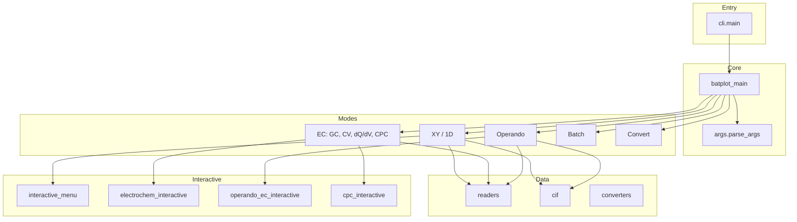

# batplot: Code Structure for Publication

## 1. High-level Architecture

### Plain-language explanation

**What happens when you type a batplot command**

Imagine you type in a terminal:
```
batplot pattern.xye --interactive
```
or
```
batplot battery.csv --gc --mass 7 --i
```

**Step 1 — The front door (cli.py)**  
The computer sees the word `batplot` and starts a small piece of code called the “entry point.” Its job is to do a quick check (e.g. “am I up to date?”) and then pass everything you typed to the main program. Think of it as a reception desk: it does a few checks and then hands you over to the right department.

**Step 2 — The switchboard (batplot.py)**  
The main program receives everything you typed. It then:

1. **Reads what you typed** — It splits your text into parts: filenames (`pattern.xye`, `battery.csv`) and options (`--gc`, `--i`, `--mass 7`). In programming terms, this is “parsing” the command line.
2. **Decides what kind of plot you want** — It looks at the options:
   - `--gc` → galvanostatic cycling (battery voltage vs capacity)
   - `--cv` → cyclic voltammetry
   - `--operando` → operando contour (XRD + electrochemical data)
   - no such flag → ordinary XY plot (XRD, PDF, etc.)
3. **Starts the right plotting code** — Depending on that choice, it runs the appropriate part of the program (XY mode, electrochemistry mode, or operando mode).

**Step 3 — The actual work**  
Once the mode is chosen, a specific module does the plotting and shows the interactive menu (if you used `--i` or `--interactive`).

---

**Technical summary (for readers familiar with Python)**

When a user runs `batplot file.xy --interactive` in the terminal:

1. **Entry point (cli.py)** — The `batplot` command (defined in pyproject.toml) calls `main(argv)` in cli.py. The `argv` argument is the list of command-line strings (e.g. `['file.xy', '--interactive']`). This function does startup tasks (version check) and then hands control to `batplot_main()`.

2. **Central router (batplot.py)** — `batplot_main()` does two things:
   - **Parse**: Calls `parse_args()` to turn the command line (e.g. `['file.xy', '--gc', '--i']`) into an `args` object with flags like `args.gc`, `args.cv`, `args.operando`, and file paths.
   - **Route**: Uses a sequence of `if` checks on those flags to pick which handler to run. For example, if `args.cv` is True, it runs the CV plotting code; if `args.operando` is True, it runs the operando code; otherwise (no EC flags) it treats the input as XY/1D data.

**Diagram (same flow, in boxes):**

```
┌─────────────────────────────────────────────────────────────────────────────┐
│  STEP 1: ENTRY POINT (cli.py)                                               │
│  main(argv) — invoked when user types "batplot file.xy --i"                 │
│  Performs: version check → delegates to batplot_main()                       │
└───────────────────────────────────────┬───────────────────────────────────┘
                                        │
                                        ▼
┌─────────────────────────────────────────────────────────────────────────────┐
│  STEP 2: CENTRAL ROUTER (batplot.py)                                         │
│  batplot_main():                                                            │
│    (a) Read the command line and record what the user asked for:            │
│        which files, which options (e.g. --gc means galvanostatic cycling).   │
│    (b) Based on those options, choose which plot type to run:                │
│        --cv → cyclic voltammetry   --operando → contour + EC panel           │
│        --gc → galvanostatic       (no flag) → ordinary XY/1D plot            │
└───────────────────────────────────────┬───────────────────────────────────┘
                                        │
        ┌───────────────────────────────┼───────────────────────────────┐
        │                               │                               │
        ▼                               ▼                               ▼
┌───────────────────┐  ┌───────────────────────────────┐  ┌─────────────────────────┐
│ STEP 3a: XY/1D    │  │ STEP 3b: Electrochemistry      │  │ STEP 3c: Operando       │
│ Script: interact- │  │ Scripts: electrochem_interact- │  │ Scripts: operando.py,   │
│ ive.py            │  │ ive.py, cpc_interactive.py    │  │ operando_ec_interact-   │
│ Input: text,      │  │ Input: .mpt .csv .xlsx        │  │ ive.py. Input: folder   │
│ Excel, CIF (x,y)  │  │ (BioLogic, Neware, Landt)      │  │ .xye/.xy + optional .mpt│
│ Flags: --xaxis    │  │ Flags: --gc --cv --dqdv --cpc  │  │ Flags: --operando       │
│ --xrange --stack  │  │ --mass --i --all --ro          │  │ --wl --xaxis --1d --i   │
│ --wl --i --all    │  │                                │  │                         │
└─────────┬─────────┘  └───────────────┬─────────────────┘  └───────────┬──────────────┘
        │                     │                              │
        ▼                     ▼                              ▼
┌───────────────┐  ┌───────────────────────────┐  ┌─────────────────────────┐
│ interactive.py│  │ electrochem_interactive   │  │ operando.py             │
│ (1D plot menu)│  │ cpc_interactive (EC)      │  │ operando_ec_interactive  │
│               │  │                           │  │ (contour + EC panel)     │
└───────────────┘  └──────────────────────────┘  └─────────────────────────┘
```

## 2. Module Dependency Structure

```
                    ┌─────────┐
                    │  cli.py │  Entry point
                    └────┬────┘
                         │
                    ┌────▼────┐
                    │batplot  │  Core routing
                    │ .py     │
                    └────┬────┘
                         │
    ┌────────────────────┼────────────────────┐
    │                    │                    │
    ▼                    ▼                    ▼
┌────────┐  ┌────────────────────┐  ┌─────────────────┐
│ args   │  │ readers            │  │ session         │
│ .py    │  │ .py                │  │ .py             │
│ Parse  │  │ read_mpt_file,     │  │ dump/load       │
│ CLI    │  │ read_ec_csv_file,  │  │ .pkl sessions   │
└────────┘  │ robust_loadtxt...   │  └─────────────────┘
            └────────────────────┘
    │                    │                    │
    │                    ▼                    │
    │            ┌─────────────┐              │
    │            │ cif.py      │              │
    │            │ CIF parsing │              │
    │            │ XRD sim     │              │
    │            └─────────────┘              │
    │                    │                    │
    ▼                    ▼                    ▼
┌──────────────────────────────────────────────────────┐
│  Shared modules: utils, ui, style, color_utils,      │
│  plotting, config, converters                        │
└──────────────────────────────────────────────────────┘
    │                    │                    │
    ▼                    ▼                    ▼
┌────────────┐  ┌──────────────────┐  ┌──────────────┐
│ interactive│  │ electrochem_     │  │ operando     │
│ .py        │  │ interactive.py   │  │ .py          │
│ XY menu    │  │ operando_ec_     │  │ operando_ec_ │
│            │  │ interactive.py   │  │ interactive  │
│            │  │ cpc_interactive  │  │ .py          │
└────────────┘  └──────────────────┘  └──────────────┘
```

## 3. Data Flow (Simplified)

```
User Input                    Processing                     Output
──────────                    ──────────                    ──────
.xy, .xye, .qye    ──►  readers.robust_loadtxt  ──►  1D XRD plot
.xy (stacked)      ──►  read_fullprof_rowwise    ──►  Stacked XRD
.gr                ──►  readers.read_gr_file    ──►  PDF/G(r) plot
.cif               ──►  cif.simulate_cif_*      ──►  CIF tick overlay

.mpt (EC)          ──►  readers.read_mpt_file   ──►  GC / CV / dQ/dV / CPC
.csv (EC)          ──►  readers.read_ec_csv_*   ──►  Electrochemistry plot

folder/*.xy        ──►  operando.plot_operando   ──►  2D contour + EC panel
+ .mpt             ──►  _folder + read_mpt_file  ──►  (optional)

--all              ──►  batch.batch_process     ──►  Multiple figures
--convert          ──►  converters.convert_*    ──►  Converted files
```

## 4. Key Modules Summary

| Module | Role |
|--------|------|
| **cli.py** | Entry point; version check; delegates to batplot_main |
| **batplot.py** | Central router; mode selection; orchestrates plotting |
| **args.py** | Command-line parsing; mode-specific help |
| **readers.py** | File I/O: .xy, .xye, .qye, .mpt, .csv, .gr, .nor, Excel |
| **cif.py** | CIF parsing; reflection positions; XRD simulation |
| **operando.py** | 2D contour from folder of scans; EC panel integration |
| **converters.py** | Wavelength/Q/2θ conversion |
| **session.py** | Save/load interactive state (.pkl) for all modes |
| **interactive.py** | XY 1D interactive menu |
| **electrochem_interactive.py** | EC (GC/CV/dQ/dV) interactive menu |
| **operando_ec_interactive.py** | Operando contour interactive menu |
| **cpc_interactive.py** | Capacity-per-cycle interactive menu |
| **ui.py** | Fonts, ticks, axis labels, spine colors |
| **style.py** | Style config (.bps/.bpsg); import/export |
| **utils.py** | Paths, dialogs, natural sort, overwrite confirm |
| **plotting.py** | Label layout (update_labels) |
| **color_utils.py** | Colormaps, user colors, palette preview |
| **batch.py** | Batch processing (XY, EC) |
| **modes.py** | Mode handlers (CV, GC, etc.) |
| **config.py** | User config, user colors |

## 5. Mermaid Diagram (for figures)



## 6. External Dependencies

| Package | Version | Purpose |
|---------|---------|---------|
| numpy | ≥1.21 | Arrays, interpolation, math |
| matplotlib | ≥3.5 | Plotting, figures, colormaps |
| rich | ≥10.0 | Colored help (optional) |
| openpyxl | ≥3.0 | Excel reading (optional) |

---

## 7. Compact Figure (one-page summary)

For a single figure in a publication, the following compact structure can be used:

```
                    ┌────────────────┐
                    │  batplot CLI   │
                    └───────┬────────┘
                            │
              ┌─────────────┼─────────────┐
              │             │             │
              ▼             ▼             ▼
    ┌─────────────┐ ┌─────────────┐ ┌─────────────┐
    │  1D XRD     │ │ Electrochem  │ │  Operando   │
    │  .xy .qye   │ │ .mpt .csv   │ │  folder/    │
    │  .gr .cif   │ │ GC CV dQ/dV  │ │  contour    │
    │             │ │ CPC          │ │  + EC       │
    └──────┬──────┘ └──────┬──────┘ └──────┬──────┘
           │               │               │
           └───────────────┼───────────────┘
                           │
                           ▼
                  ┌────────────────┐
                  │ readers · cif  │  Data I/O
                  │ session · ui   │  State · styling
                  └────────────────┘
```
