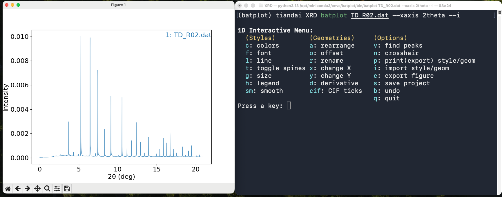
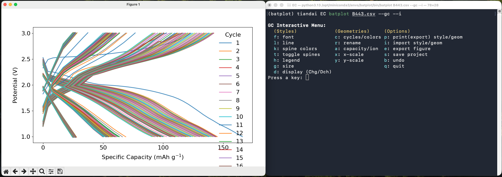
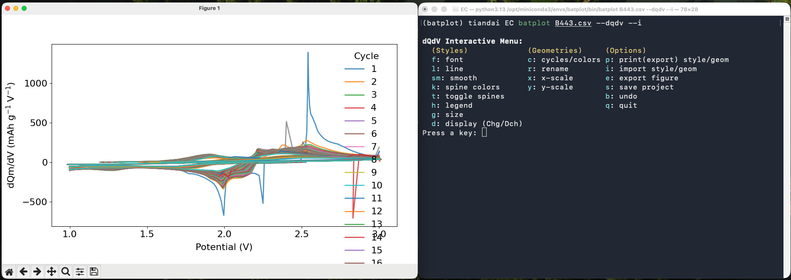
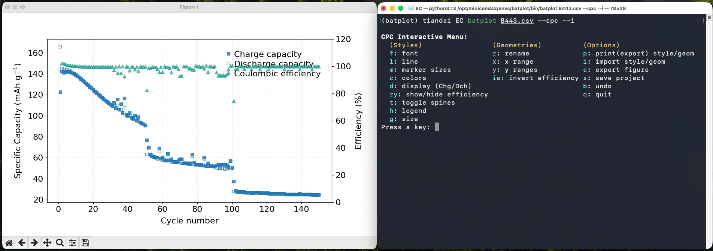
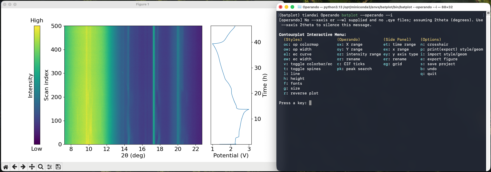

# 1. What Is batplot?

*batplot* is a lightweight, open-source Python command-line interface (CLI) tool designed for rapid, publication-quality visualization of battery and materials characterization data. It reads raw instrument output files directly and produces fully styled, interactive figures from a single terminal command, with no scripting required.

Developed by a battery materials research group, *batplot* was born out of genuine visualization needs for 1D (XY) plots, electrochemical cycling, *operando* / *in situ* 2D contour plots, and column histograms, all under a customized interactive styling interface.

Wether you use Python or commercial softwares such as Origin for your plotting, *batplot* can speed up the data visualization process and help you shift effort to scientific interpretation.

Key capabilities:

- Zero scripting required. Every workflow runs from a single terminal command.
- Interactive menus: live, code-free customization of colors, geometries, spines, cycles and many more.
- Session save: save incomplete figure projects and reload them later.
- Style export: export visual configuration files.
- Batch processing: apply a style file to every matching file in a folder.

## Supported Data Types

*batplot* handles all major data types encountered in modern battery materials research:

| Data category | Supported formats |
|---|---|
| XRD / PDF / XAS | `.xye`, `.xy`, `.qye`, `.dat`, `.csv`, `.txt`, `.brml` (Bruker), `.raw` (Bruker), `.gr`, `.nor` |
| Crystallography | `.cif` |
| Electrochemistry (Neware) | `.csv` / `.xlsx` (GC, dQdV, CPC, EPC) |
| Electrochemistry (Biologic) | `.mpt` (GC, CV, CPC, EPC) |
| Histogram / tabular columns | `.csv`, `.txt` (one numeric column) |
| Generic two-column data | Any text/Excel file |

## Interactive plotting modes

*batplot* has **four** primary interactive modes. Each is launched with a short command; *batplot* reads the files and applies sensible defaults:

- **1D / XY mode:** plot 2-column data. Optimized for XRD with Q / 2θ conversion and CIF tick overlays, but also supports other text/Excel data files.

<strong>Figure 1: 1D mode</strong>

- Electrochemistry (EC) Mode: galvanostatic cycling (GC), cyclic voltammetry (CV), differential capacity (d*Q*/d*V*), and capacity/energy-per-cycle (CPC/EPC) plots from Biologic and Neware output files.

<strong>Figure 2: EC (GC) mode</strong>

<strong>Figure 3: EC (dQ/dV) mode</strong>

<strong>Figure 4: EC (CPC) mode</strong>

- *Operando*/contour mode: assembles a folder of sequential files into a 2D contour map and can plot electrochemical data as a synchronized side panel (if available).

<strong>Figure 5: <em>Operando</em> mode</strong>

- **Histogram mode:** plot a single numeric column (for example particle-size lists) as a bar histogram, with an interactive wizard and menu. See [Histogram](08-examples-histogram-mode.md).

