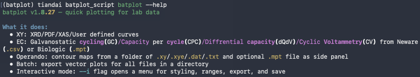
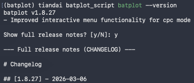
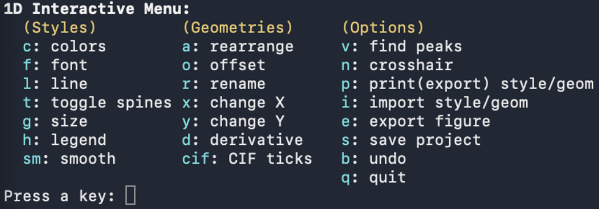
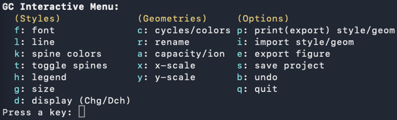
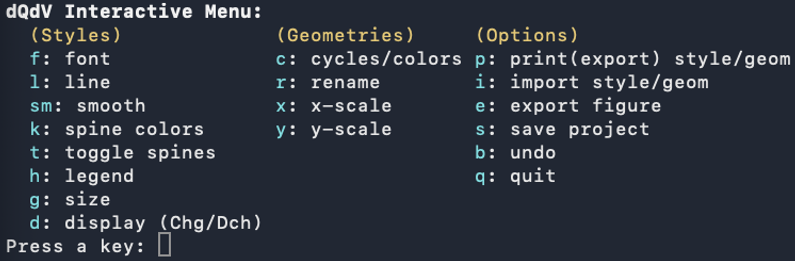
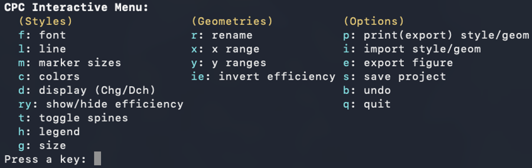
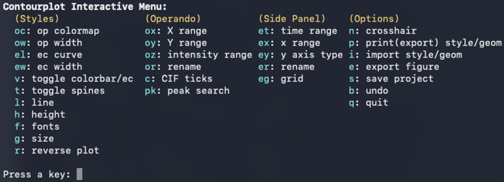

# 4. How to Use batplot

## General Command Structure

*batplot *command follows this pattern:

```text
batplot  [path/]/[files...]/[keyword]  [--flags]
```

__Component__

__Description__

path/

Optional. A folder path when data is not in the current directory. *batplot *looks for supported files in that folder.

files...

One or more data files to overlay.

keywords

Special keywords: allfiles (all supported files), allxyfiles (only .xy), allnorfiles (only .nor), etc.

--flags

Options that control mode, axes, styling, and output. All flags use the double-dash (--) prefix.

## Getting Help

To see *batplot* help and documentation:

```text
batplot --help           # General help
```



<p class="figure-caption"><strong>Figure 6: Help message</strong></p>

```text
batplot --help xy        # 1D / XY mode help
```

```text
batplot --help ec        # Electrochemistry mode help
```

```text
batplot --help op        # *Operando* mode help
```

```text
batplot --help histo     # Histogram mode help
```

```text
batplot --version        # Version and release notes
```



<p class="figure-caption"><strong>Figure 7: Version check</strong></p>

```text
batplot --manual         # Open the online user manual
```

## Recommended Workflow

As navigating to different paths can sometimes be tedious, you can create a folder named "Figures", and use cd to navigate to this "Figures" path. Then, you can directly drag the files/copy the path into the terminal for interactive plotting. Inside interactive menu, you can easily save the plot session/export the figure/export the style/import a style from the "Figures" folder as batplot automatically detects your terminal path and use that to save or find relavant files. For example:

```text
batplot drag/the/file.xy --i
```

```text
batplot drag/the/path --operando --i
```

## Selecting Modes

The plotting mode is determined by which mode flag you include:

__Mode__

__Flag(s) to add__

1D / XY (default)

no mode flag needed; optional `--xaxis` / `--wl` when you want a named axis type or XRD conversion

Galvanostatic cycling

`--gc`


Cyclic voltammetry

`--cv`

Differential capacity

`--dqdv`

Capacity/Energy density per cycle

`--cpc` / `--epc`

*Operando* / contour

`--operando` or `--contour`

Histogram

`--histo`

## The Interactive Menus

Customized interactive menus are the central feature that makes *batplot* unique. Add `--i` to any command to open a text-driven menu in the terminal alongside the live figure window. Every change you make — colors, fonts, axis labels, line widths, tick spacing — updates the figure in real time.

**Full key + subkey reference (per mode — open the chapter you use):**

| Mode | Where every key is introduced |
|------|-------------------------------|
| 1D / XY | [Ch.5 Interactive menu](05-examples-1d-mode.md#xy-interactive-menu) |
| GC / CV / dQ/dV | [Ch.6 EC menu](06-examples-electrochemistry-ec-and-cpc-epc-modes.md#ec-interactive-menu) |
| CPC | [Ch.6 CPC menu](06-examples-electrochemistry-ec-and-cpc-epc-modes.md#cpc-interactive-menu) |
| *Operando* | [Ch.7 *Operando* menu](07-examples-operando-mode.md#operando-interactive-menu) |
| Histogram | [Ch.8 Histogram menu](08-examples-histogram-mode.md#histo-interactive-menu) |
| Batch | [Ch.9 Batch menus](09-batch-processing.md#batch-interactive-menus) |

Index page: [Interactive menus](10-interactive-menus.md).

```text
batplot file.txt --i
```



<p class="figure-caption"><strong>Figure 8: 1D mode</strong></p>

```text
batplot file.csv --gc --i
```



<p class="figure-caption"><strong>Figure 9: GC mode</strong></p>

```text
batplot file.csv --dqdv --i
```



<p class="figure-caption"><strong>Figure 10: d<em>Q</em>/d<em>V</em> mode</strong></p>

```text
batplot file.csv --cpc --i
```



<p class="figure-caption"><strong>Figure 11: CPC mode</strong></p>

```text
batplot --operando --i
```

```text
batplot --contour --i
```



<p class="figure-caption"><strong>Figure 12: <em>Operando</em>/contour mode</strong></p>

Inside interactive menus you can also:

- Press `p` to export style and `i` to import (`.bps` / `.bpsg`; histogram `.bpsh`).
- Press `s` to save the session as a `.pkl` file.
- Press `e` to export the figure; `b` to undo.
- Use **every mode-specific key** documented in that mode’s chapter (links in the table above).

Useful prep utilities before plotting: [`--showcol`](11-utilities.md), [`--strip-header`](11-utilities.md). For editing many sessions at once, see [Batch mode](09-batch-processing.md).

!!! note

    By default, style files (.bps, .bpsg) and image files (.svg, .png, etc.) are exported into a subfolder within the selected path, while session files (.pkl) are exported directly to the selected path.

When using i to import a style file, *batplot* automatically scans the style subfolder in the current path, lists the detected files with numbers, and allows you to select a file by typing its corresponding number.

## Download Tutorial Files

Below sections are some examples of how to use *batplot*, you can find the tutorial files in [this link](https://github.com/chem-plot/batplot/blob/main/batplot_tutorial.zip).
