# 5. 1D Mode

The 1D / XY mode is the default mode of *batplot*. It is optimized for XRD but __support any generic two-column data.__ __By default, *batplot* uses the first and second column to plot as x and y, this can be changed using --readcol flag.__

!!! note "Demo XRD wavelengths"

    In the tutorial / test files:

    - **`TD_R*`** (e.g. `TD_R02.dat`) — synchrotron XRD, **λ = 0.259 Å**
    - **`TD_S0062-64.xy`** — Cu lab source, **λ = 1.54 Å**

## Plot Any Two-column Data

```text
batplot data.txt --i
```

**plots the first two columns as x and y**

## Plot XRD Data with Wavelength Conversion

```text
batplot TD_S0062-64.xy --xaxis 2theta --i
```

**plots Cu XRD in 2θ space**

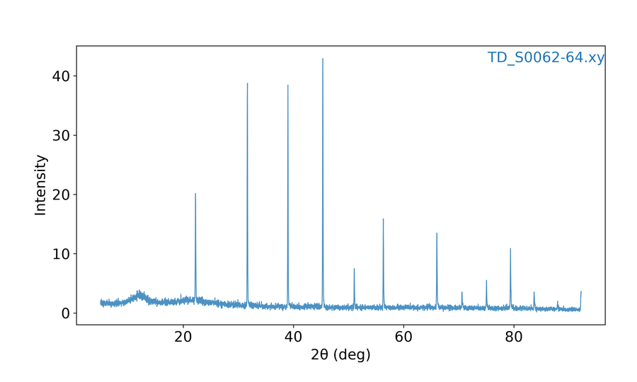

<p class="figure-caption"><strong>Figure: 2θ</strong> (TD_S0062-64.xy, Cu λ = 1.54 Å)</p>

```text
batplot converted/R02.qye --xaxis q --i
```

**plots data already in Q space**


<p class="figure-caption"><strong>Figure: Q-space `.qye`</strong> (converted/R02.qye)</p>

```text
batplot TD_S0062-64.xy --wl 1.54 --i
```

**converts Cu 2θ → Q and plots in Q space**


<p class="figure-caption"><strong>Figure: 1D Q-space</strong> (TD_S0062-64.xy, --wl 1.54)</p>

```text
batplot TD_S0062-64.xy:1.54 --i
```

**same conversion using the per-file `:λ` suffix**

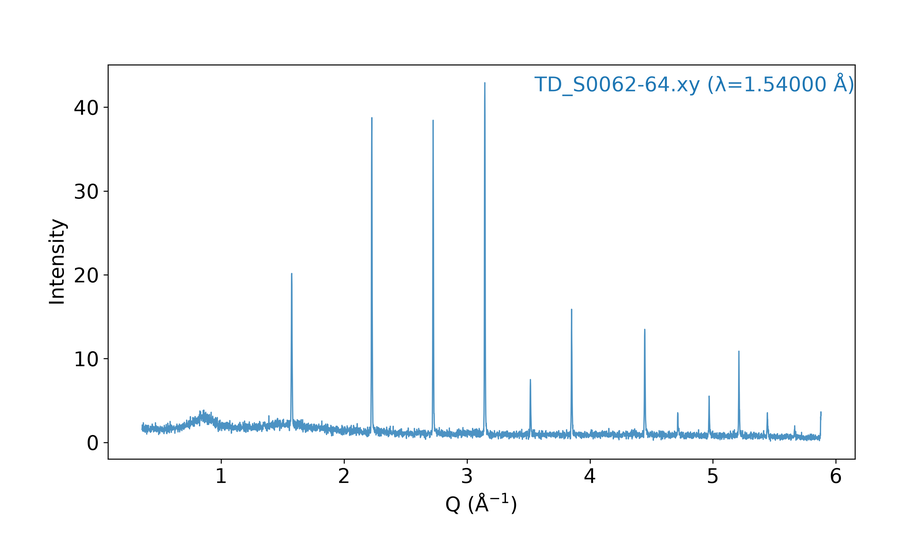

<p class="figure-caption"><strong>Figure: `:λ` suffix → Q</strong> (TD_S0062-64.xy:1.54)</p>

```text
batplot TD_R02.dat TD_R03.dat --wl 0.259 --i
```

**multi-file overlay with the same synchrotron wavelength**

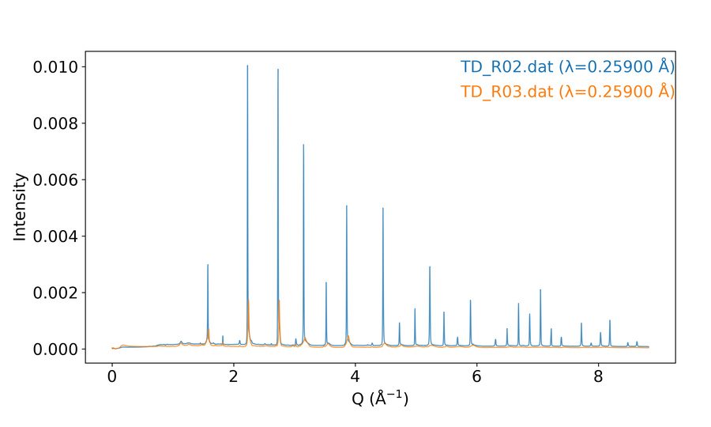

<p class="figure-caption"><strong>Figure: synchrotron overlay</strong> (TD_R02 + TD_R03, --wl 0.259)</p>

```text
batplot TD_S0062-64.xy:1.54 TD_R02.dat:0.259 --i
```

**multi-file overlay with different wavelengths (both plotted in Q)**

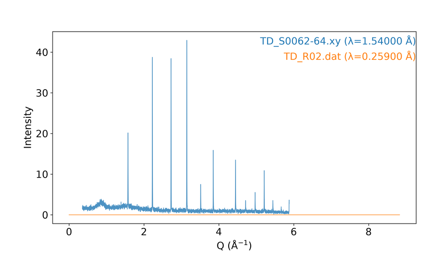

<p class="figure-caption"><strong>Figure: mixed λ overlay</strong> (Cu 1.54 + synchrotron 0.259)</p>

```text
batplot TD_R02.dat:0.259:1.54 --xaxis 2theta --i
```

**re-project synchrotron data into a Cu 2θ frame**

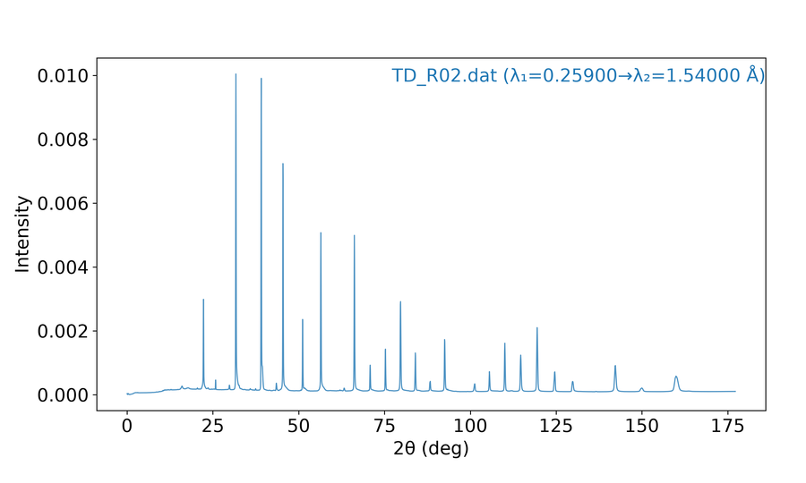

<p class="figure-caption"><strong>Figure: re-projected 2θ</strong> (TD_R02.dat:0.259:1.54)</p>

```text
batplot TD_R02.dat TD_R03.dat --norm --wl 0.259 --i
```

**plots normalized intensity (0–1 scale)**

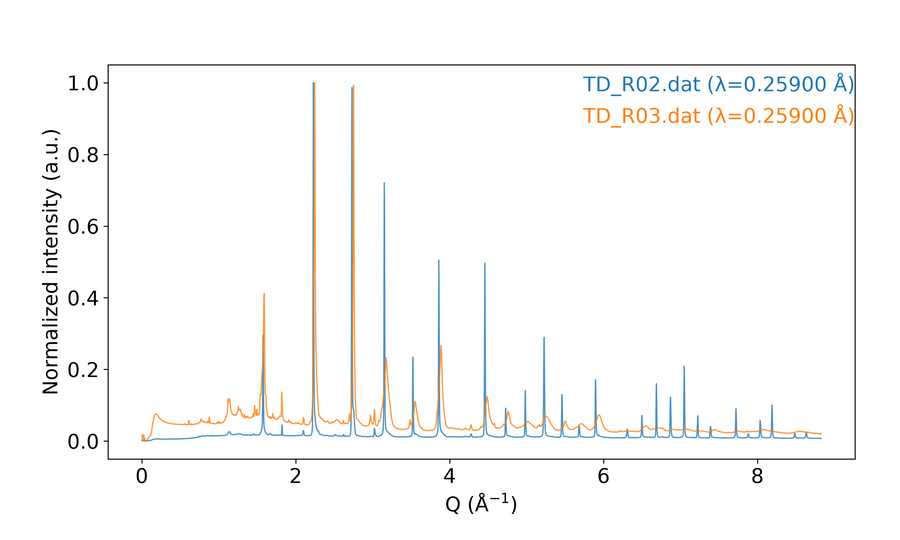

<p class="figure-caption"><strong>Figure: normalized overlay</strong> (--norm --wl 0.259)</p>

## Wavelength Handling {: #wavelength-handling }

*batplot* provides flexible wavelength handling for XRD data. Q and q are always equivalent (case-insensitive). When `--wl` or a `:wavelength` suffix is provided, the x-axis becomes Q-space — you do **not** need `--xaxis q`.

| Syntax | What it does |
|--------|--------------|
| `--wl 1.54` | Apply one wavelength to **all** listed data files: convert 2θ → Q (Cu lab: **1.54 Å**; synchrotron `TD_R*`: **0.259 Å**). |
| `file.xye:1.54` | Per-file wavelength: convert **this** file’s 2θ → Q (other files can use other λ or none). |
| `file.xye:0.259:1.54` | Dual wavelength: treat the file as 2θ at λ₁, re-project to the λ₂ frame (via Q). |
| `phase.cif:1.54` | Calculate CIF reference-tick positions in 2θ using that λ. |

### Examples (terminal style)

```text
batplot TD_S0062-64.xy --wl 1.54 --i
```

**Cu file uses λ = 1.54 Å → plot in Q** (figure above)

```text
batplot TD_S0062-64.xy:1.54 TD_R02.dat:0.259 --i
```

**each file keeps its own measurement wavelength** (figure above)

```text
batplot TD_R02.dat:0.259:1.54 --xaxis 2theta --i
```

**re-project from synchrotron λ to a Cu-like 2θ frame** (figure above)

```text
batplot TD_S0062-64.xy Li2FeSeO.cif:1.54 --xaxis 2theta --wl 1.54 --i
```

**CIF ticks calculated for 2θ at 1.54 Å**

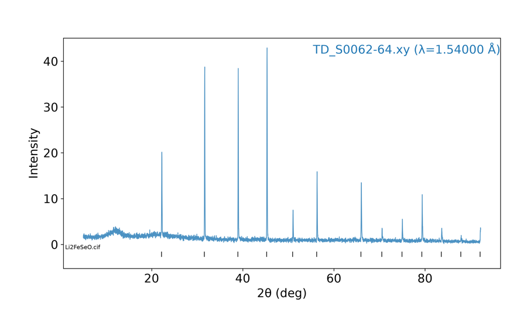

<p class="figure-caption"><strong>Figure: CIF in 2θ</strong> (TD_S0062-64 + Li2FeSeO.cif:1.54)</p>

!!! note

    Any `file:wl` or `file:q` suffix implies Q mode automatically (unless `--xaxis 2theta` wins). Files without wavelength info are then assumed to be already in Q.

    To **export** converted data files (not only plot), use [`--convert` in Utilities](11-utilities.md#convert-xrd-files-convert).

## Using --readcol to Specify Columns {: #using-readcol-to-specify-columns }

These examples use the same multi-column layout as [Utilities — shared demo file](11-utilities.md#shared-demo-file) (`demo_cols.txt` / stripped copy: `angle_deg`, `I_sample`, `I_blank`, `I_norm`).

```text
batplot demo_cols_stripped.txt --readcol 1 4 --xaxis 2theta --i
```

**plots column 1 (`angle_deg`) and column 4 (`I_norm`) as x and y**

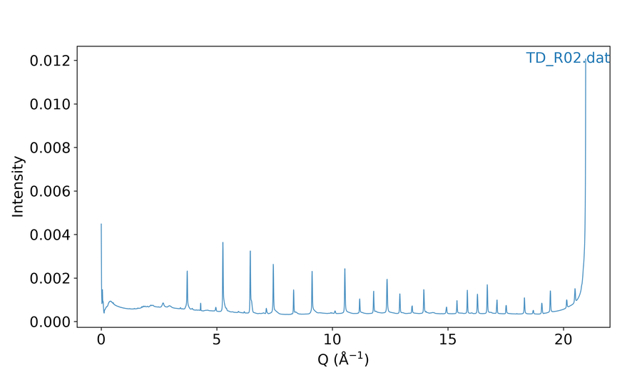

<p class="figure-caption"><strong>Figure: --readcol 1 4</strong> (angle vs I_norm)</p>

```text
batplot demo_cols_stripped.txt --readcol 1 2 1 3 1 4 --xaxis 2theta --i
```

**plots 3 curves with column 1 as x and columns 2, 3, 4 as y**

```text
batplot demo_cols_stripped.txt --readcol 1 2-4 --xaxis 2theta --i
```

**plots 3 curves with column 1 as x and columns 2–4 as y (range shorthand)**

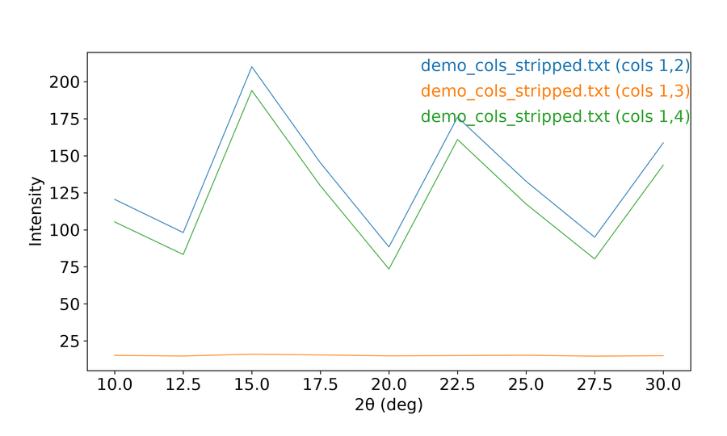

<p class="figure-caption"><strong>Figure: --readcol 1 2-4</strong> (three y columns)</p>

```text
batplot demo_a.txt --readcol 1 2 demo_b.txt --readcol 1 4 --i
```

**plots 2 curves with specified columns for each file**

## Stacking Multiple Files Using --stack

```text
batplot TD_R02.dat TD_R03.dat --xaxis 2theta --stack --i
```

```text
batplot (your/optional/path) allfiles --stack --wl 0.259 --i
```

**with allfiles keyword, batplot reads every text/Excel file in the directory, sorts them in natural order (scan2 before scan10), converts them to Q-space using the per-file wavelength, and stacks them vertically.**

```text
batplot TD_R02.dat TD_R03.dat TD_R05.dat --stack --wl 0.259 --i
```

**three synchrotron `.dat` patterns stacked after Q conversion (λ = 0.259 Å)**

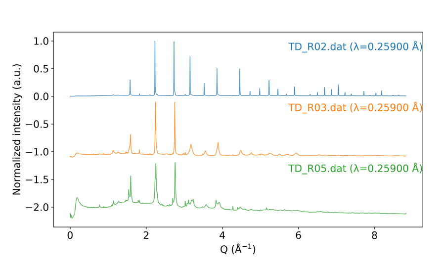

<p class="figure-caption"><strong>Figure: 1D stack</strong> (TD_R02/R03/R05, --stack --wl 0.259)</p>

## Plot with CIF Ticks

```text
batplot TD_S0062-64.xy Li2FeSeO.cif --wl 1.54 --i
```

**plots XRD data with CIF ticks in Q space**

```text
batplot TD_S0062-64.xy Li2FeSeO.cif:1.54 --xaxis 2theta --wl 1.54 --i
```

**plots XRD data with CIF ticks in 2θ space** (figure in Wavelength Handling)

```text
batplot TD_S0062-64.xy:1.54 TD_R02.dat:0.259 Li2FeSeO.cif Li2Se.cif --stack --i
```

**stacks Cu + synchrotron patterns with two CIF tick sets**

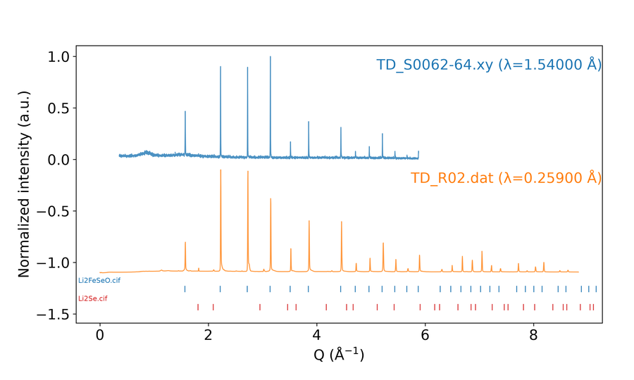

<p class="figure-caption"><strong>Figure: 1D stack + CIF</strong> (Li2FeSeO + Li2Se ticks)</p>

## Derivative Plots

The `--1d` (and `--2d`) flag plots the first derivative dy/dx of each dataset. This is useful for identifying peak positions and inflection points. The derivative is computed using numpy's gradient function, which handles non-uniform x-spacing automatically.

```text
batplot R03_Se.nor --xaxis energy --i
```

**XAS absorption spectrum**

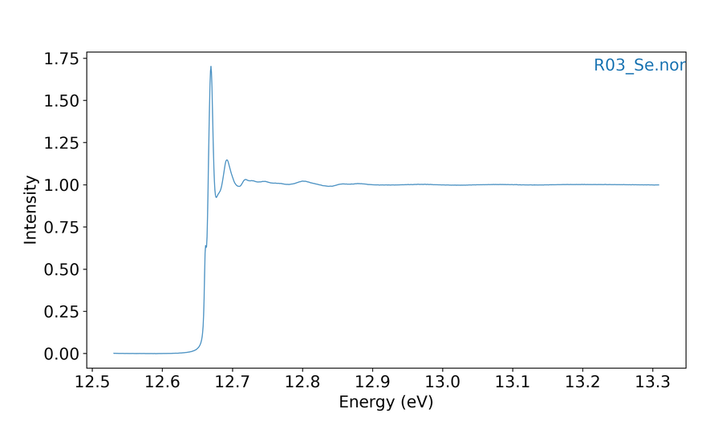

<p class="figure-caption"><strong>Figure: XAS</strong> (R03_Se.nor, --xaxis energy)</p>

```text
batplot R03_Se.nor --1d --xaxis energy --i
```

**first derivative of the XAS spectrum**

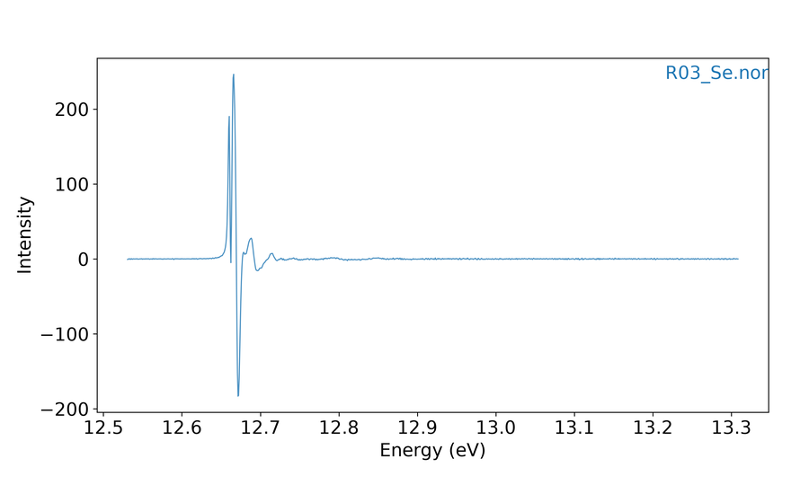

<p class="figure-caption"><strong>Figure: XAS derivative</strong> (--1d --xaxis energy)</p>

```text
batplot allfiles --2d --i
```

```text
batplot R03_Se.nor --1d --xrange 12600 12700
```

## EXAFS k-Weighting

For EXAFS data in k-space, k-weighting options are available:

__Flag__

__Transformation / use case__

--chik

χ(k): standard oscillations

--kchik

k × χ(k): emphasize mid-k features

--k2chik

k² × χ(k): most common weighting, balances signal

--k3chik

k³ × χ(k): emphasize high-k and heavy backscatterers

```text
batplot data.txt --k2chik --i
```

```text
batplot file1.chik file2.chik --k2chik --stack --i
```

## Batch Export

Export every supported file in the current folder as a separate SVG figure:

```text
batplot --all --xaxis 2theta
```

```text
batplot --all mystyle.bpsg      # apply saved style+geometry to every file
```

!!! note

    Adding a style file to apply it works for normal XY plot as well, it is the same as using i command in the interactive menu.

`--all` is **not** the same as the `allfiles` keyword.

Output files are saved to the `Figures/` subdirectory automatically created in the current folder.

## Dual Axes Mode

Use `--ry` so selected files plot on the right y-axis (`--ry` disables `--stack`):

```text
batplot TD_R02.dat TD_R03.dat --ry --wl 0.259 --i
```

**plots `TD_R03.dat` against the right y-axis**

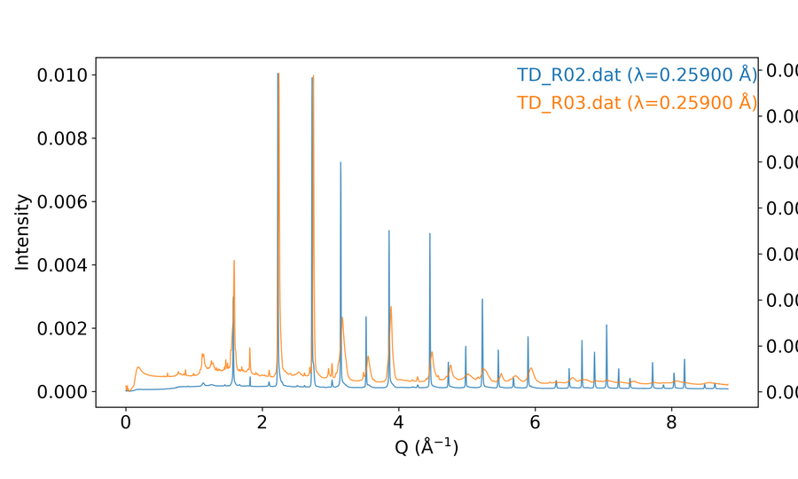

<p class="figure-caption"><strong>Figure: dual y-axis</strong> (TD_R02 + TD_R03 --ry --wl 0.259)</p>

```text
batplot file1.xy file2.xy --ry file3.xy --ry --xaxis 2theta --i
```

**multi-file support for the right y-axis**

With `--txaxis`, right-y curves use the **top** x-axis (default is a shared bottom x):

```text
batplot file1.xy --ry file2.xy --txaxis --i
```

## Interactive menu (1D / XY) — every key and subkey {: #xy-interactive-menu }

### Clickable interactive menu

<div class="bp-menu" markdown="0" id="xy-click-menu">
  <div class="bp-menu-sep">------------------------------------------------------------</div>
  <div class="bp-menu-title">1D Interactive Menu:</div>
  <div class="bp-menu-grid">
    <div class="bp-menu-col">
      <div class="bp-menu-col-head">Styles</div>
      <a class="bp-item" href="#xy-key-c"><span class="bp-k">c</span>: colors</a>
      <a class="bp-item" href="#xy-key-f"><span class="bp-k">f</span>: font</a>
      <a class="bp-item" href="#xy-key-l"><span class="bp-k">l</span>: line style</a>
      <a class="bp-item" href="#xy-key-t"><span class="bp-k">t</span>: spines/ticks</a>
      <a class="bp-item" href="#xy-key-g"><span class="bp-k">g</span>: size</a>
      <a class="bp-item" href="#xy-key-h"><span class="bp-k">h</span>: legend</a>
      <a class="bp-item" href="#xy-key-sm"><span class="bp-k">sm</span>: smooth</a>
    </div>
    <div class="bp-menu-col">
      <div class="bp-menu-col-head">Geometries</div>
      <a class="bp-item" href="#xy-key-a"><span class="bp-k">a</span>: rearrange</a>
      <a class="bp-item" href="#xy-key-o"><span class="bp-k">o</span>: offset</a>
      <a class="bp-item" href="#xy-key-r"><span class="bp-k">r</span>: rename</a>
      <a class="bp-item" href="#xy-key-xy"><span class="bp-k">x</span>: change X</a>
      <a class="bp-item" href="#xy-key-xy"><span class="bp-k">y</span>: change Y</a>
      <a class="bp-item" href="#xy-key-d"><span class="bp-k">d</span>: derivative</a>
      <a class="bp-item" href="#xy-key-cif"><span class="bp-k">cif</span>: CIF ticks</a>
    </div>
    <div class="bp-menu-col">
      <div class="bp-menu-col-head">Options</div>
      <a class="bp-item" href="#xy-key-v"><span class="bp-k">v</span>: find peaks</a>
      <a class="bp-item" href="#xy-key-n"><span class="bp-k">n</span>: crosshair</a>
      <a class="bp-item" href="#xy-key-u"><span class="bp-k">u</span>: axis units (XRD only)</a>
      <a class="bp-item" href="#xy-key-io"><span class="bp-k">p</span>: print(export) style/geom</a>
      <a class="bp-item" href="#xy-key-io"><span class="bp-k">i</span>: import style/geom</a>
      <a class="bp-item" href="#xy-key-io"><span class="bp-k">e</span>: export figure</a>
      <a class="bp-item" href="#xy-key-io"><span class="bp-k">s</span>: save project</a>
      <a class="bp-item" href="#xy-key-io"><span class="bp-k">b</span>: undo</a>
      <a class="bp-item" href="#xy-key-io"><span class="bp-k">q</span>: quit</a>
    </div>
  </div>
  <div class="bp-menu-sep">------------------------------------------------------------</div>
  <p class="bp-menu-note">Looks like the live terminal menu. Click a cyan key to jump to its docs. Keys o/y/d hide under --stack; n/u hide for non-XRD.</p>
</div>

Add `--i` to open the **1D Interactive Menu** beside the live figure. Type a key, then press **Enter**. The menu has three columns: **Styles | Geometries | Options**.

```text
batplot TD_S0062-64.xy:1.54 --i
```

### Key `c` — Colors {: #xy-key-c }

<p class="bp-back" markdown="0"><a href="#xy-click-menu">↑ Back to interactive menu</a></p>

Type a color command at the prompt (not only single letters). Examples: `1:red`, `all viridis`, `s:black`.

| Key / input | What it does | Example |
|-----|--------------|---------|
| `N:color` | Set curve number `N` to a color (name or `#RRGGBB`). | Type `1:red` or `2:#1f77b4`. |
| `all palette` or `1-3 palette` | Apply a colormap to all curves, or only to a numbered range. | Type `all viridis` or `1-3 plasma`. |
| `w:color` / `a:color` / `s:color` / `d:color` | Color the top / left / bottom / right spine Use the matching single-key rows for full detail. | Type one option from w:color` / `a:color` / `s:color` / `d:color, for example the first key listed. |
| `t` | Show or hide the legend (or enter the legend submenu when nested). | Type `t` to toggle; if a submenu opens, use `p` to move it. |
| `v` | Print the current color assignments for curves or spines. | Type `v` to list colors, then adjust with `1:red` or `s:black`. |
| `u` | Open the saved-custom-colors helper (store/reuse hex or named colors). | Type `u`, save a color, then reuse it later as `1:#1f77b4`. |
| `e` | Pick a color from the screen/eyedropper when the prompt offers it. | Type `e`, click a pixel on the figure, confirm the hex value. |
| `q` | Leave this submenu and return one level up (or to the main menu). | Type `q`. |

---

### Key `f` — Font {: #xy-key-f }

<p class="bp-back" markdown="0"><a href="#xy-click-menu">↑ Back to interactive menu</a></p>

| Key | What it does | Example |
|-----|--------------|---------|
| `f` | Choose font family (pick a number from the list, or type a font name) | Type `f`, then `1` for the first listed family, or type `Arial`. |
| `s` | Set the font size used for labels and titles. | Type `s`, then `14`. |
| `b` | Set weight: type `bold` or `normal`, or press Enter to toggle | Type `b`, then `bold` (or press Enter to toggle). |
| `h` | Open text-highlight settings (box behind labels) — see table below | Type `h`, then `t` to turn highlight on. |
| `q` | Leave this submenu and return one level up (or to the main menu). | Type `q`. |

**Inside `h` (text highlight):**

| Key | What it does | Example |
|-----|--------------|---------|
| `t` | Turn the text-highlight background box on or off. | Type `t`. |
| `c` | Set the highlight background color behind labels. | Type `c`, then `yellow` (or `e` to pick from the screen). |
| `a` | Set highlight transparency from 0 (invisible) to 1 (solid). | Type `a`, then `0.35`. |
| `p` | Set how much padding the highlight box adds around text. | Type `p`, then `0.3`. |
| `q` | Leave this submenu and return one level up (or to the main menu). | Type `q`. |

---

### Key `l` — Line style {: #xy-key-l }

<p class="bp-back" markdown="0"><a href="#xy-click-menu">↑ Back to interactive menu</a></p>

| Key | What it does | Example |
|-----|--------------|---------|
| `c` | Set the linewidth of the plotted data curves. | Type `c`, then `1.5`. |
| `f` | Set linewidth of the axes frame and tick marks. | Type `f`, then `1.0`. |
| `g` | Turn the plot grid on/off and adjust grid width when asked. | Type `g`, then follow the on/off or width prompt. |
| `l` | Draw data as solid lines only (no markers). | Type `l`. |
| `ld` | Draw curves as a solid line with markers. | Type `ld`. |
| `d` | Draw markers only (no connecting line) for the selected curves. | Type `d` (or `ld`/`dd` siblings) to switch style, then `q` back. |
| `da` | Draw curves as dashed lines. | Type `da`. |
| `dd` | Draw curves as dashed lines with markers. | Type `dd`. |
| `q` | Leave this submenu and return one level up (or to the main menu). | Type `q`. |

---

### Key `t` — Spines and ticks (WASD) {: #xy-key-t }

<p class="bp-back" markdown="0"><a href="#xy-click-menu">↑ Back to interactive menu</a></p>

Spines are the four border lines of the axes box. Tick marks, tick numbers, and axis titles sit on those sides.

Press **`t`**, then type commands at the spine prompt. Most toggles are a **side letter + number** with **no space** (for example `s2`). You can put several codes on one line.

#### Step 1 — Pick a side (WASD)

| Key | What it does | Example |
|-----|--------------|---------|
| `w` | WASD **top** side of the axes box. | Type `w5` to toggle the top axis title. |
| `a` | WASD **left** side of the axes box. | Type `a4` to toggle left tick numbers. |
| `s` | WASD **bottom** side of the axes box. | Type `s2` to toggle bottom major ticks. |
| `d` | WASD **right** side of the axes box. | Type `d1` to toggle the right spine line. |

#### Step 2 — Pick what to show/hide on that side

| Number | What it does | Example |
|-----|--------------|---------|
| `1` | Toggle the border spine line on the chosen side. | `s1` toggles the bottom spine. |
| `2` | Toggle major tick marks on the chosen side. | `a2` toggles left major ticks. |
| `3` | Toggle minor tick marks on the chosen side. | `s3` toggles bottom minor ticks. |
| `4` | Toggle tick number labels on the chosen side. | `a4` hides or shows left numbers. |
| `5` | Toggle the axis title on the chosen side. | `w5` toggles the top title. |

#### Examples (copy these ideas)

| You type | What it does | Example |
|-----|--------------|---------|
| `s2` | Toggle bottom major tick marks on the plot frame. | Type `s2` once to hide bottom majors; type again to show them. |
| `w5` | Toggle the top axis title visibility. | Type `w5` to hide the top title if it overlaps the plot. |
| `a4` | Toggle left-side tick number labels. | Type `a4` to hide left numbers for a cleaner export. |
| `d1` | Toggle the right spine (border) line. | Type `d1` to remove the right border. |
| `s2 w5 a4` | Apply several WASD toggles in one command (space-separated). | Type `s2 w5 a4` to hide bottom majors, top title, and left numbers together. |

Blank line or `q` leaves a nested prompt; `q` on the spine prompt returns to the main interactive menu.

#### Extra commands (type the letter alone)

| Key | What it does | How to use it | Example |
|-----|--------------|---------------|---------|
| `i` | Flip tick marks to point into vs out of the plot. | Type `i` once; type again to flip back | Type `i` once; type again to flip back. |
| `l` | Set **major tick length** (points). Minor length is set automatically to about 70% | Type `l`, then enter a positive number | Type `l`, then `6`. |
| `n` | Set spacing between major ticks. | Type `n`, then e.g. `x 0.5`, `y 1`, `all 1`, or `x auto` | Type `n`, then `x 0.5`, `all 1`, or `x auto`. |
| `m` | Set how many minor ticks sit between majors. | Type `m`, then e.g. `x 4` or `all 0` (off) | Type `m`, then `x 4` or `all 0` to disable. |
| `p` | Nudge axis titles away from the data. | See the next table | Type `p`, then `w` and use nudge keys. |
| `list` | Print the current spine/tick on/off state for every side. | Read the report, then continue | Type `list`. |
| `q` | Leave this submenu and return one level up (or to the main menu). | Back to the main interactive menu | Type `q`. |

#### Inside `p` — move axis titles

| Key | What it does | Example |
|-----|--------------|---------|
| `w` | WASD **top** side of the axes box. | Type `w5` to toggle the top axis title. |
| `s` | WASD **bottom** side of the axes box. | Type `s2` to toggle bottom major ticks. |
| `a` | WASD **left** side of the axes box. | Type `a4` to toggle left tick numbers. |
| `d` | WASD **right** side of the axes box. | Type `d1` to toggle the right spine line. |
| `r` | Reset all title-offset nudges back to the default positions. | Type `r` after overshooting with `x 0.5` / `y -0.3`. |
| `q` | Leave this submenu and return one level up (or to the main menu). | Type `q`. |

Typical nudge keys after you pick a side: `w`/`s`/`a`/`d` to move, `0` to reset that title, `q` to go back.

#### Workflow tip

1. Press `t` on the main menu.
2. Toggle borders/ticks with codes like `s2` until the frame looks right.
3. Use `n` / `m` so tick spacing matches your data range.
4. Use `p` if a title sits too close to the data.
5. Press `q` to return to the main menu (your figure stays updated).

---

### Key `g` — Size {: #xy-key-g }

<p class="bp-back" markdown="0"><a href="#xy-click-menu">↑ Back to interactive menu</a></p>

Press `g`, then choose what to resize. Sizes are in **inches**.

| Key | What it does | Example |
|-----|--------------|---------|
| `p` | Resize the axes box (plot frame) in inches. | Type `p`, then `6 4`. |
| `c` | Resize the whole figure window in inches. | Type `c`, then `8 6`. |
| `q` | Leave this submenu and return one level up (or to the main menu). | Type `q`. |

**How to enter a size:** after `p` or `c`, type two numbers such as `6 4` (width height), or follow the printed prompt. Soft quit with `q` / blank if you change your mind — you should not get an “invalid size” error for quitting.

---

### Key `h` — Legend {: #xy-key-h }

<p class="bp-back" markdown="0"><a href="#xy-click-menu">↑ Back to interactive menu</a></p>

| Key | What it does | Example |
|-----|--------------|---------|
| `v` | Show or hide curve names inside the legend. | Type `v`. |
| `s` | Move the legend to a corner. | Type `s`, then `1` (top-right). |
| `q` | Leave this submenu and return one level up (or to the main menu). | Type `q`. |

**Inside `s` (legend position):**

| Key | What it does | Example |
|-----|--------------|---------|
| `1` | Place the legend in the top-right corner. | Type `1`. |
| `2` | Place the legend in the top-left corner. | Type `2`. |
| `3` | Place the legend in the bottom-right corner. | Type `3`. |
| `4` | Place the legend in the bottom-left corner. | Type `4`. |

---

### Key `sm` — Smooth / reduce {: #xy-key-sm }

<p class="bp-back" markdown="0"><a href="#xy-click-menu">↑ Back to interactive menu</a></p>

Use this to thin noisy data or apply a smoother. Press `sm` on the main menu first.

| Key | What it does | Example |
|-----|--------------|---------|
| `r` | Open tools that thin the number of points. | Type `r`, then `1` for delete-N / skip-M. |
| `s` | Open smoothing filters for the curves. | Type `s`, then `2` for Savitzky–Golay. |
| `reset` | Restore data from before the last transform in this menu. | Type `reset`. |
| `q` | Leave this submenu and return one level up (or to the main menu). | Type `q`. |

**After you press `r` (reduce points):**

| Key | What it does | Example |
|-----|--------------|---------|
| `1` | Keep the first value in each grouped bin. | Type `1` after setting the group size. |
| `2` | Keep the last value in each grouped bin. | Type `2`. |
| `3` | Average values within each grouped bin. | Type `3`. |
| `q` | Leave this submenu and return one level up (or to the main menu). | Type `q`. |

**After you press `r`, then `3` (merge rule):**

| Key | What it does | Example |
|-----|--------------|---------|
| `1` | Keep the first value in each grouped bin. | Type `1` after setting the group size. |
| `2` | Keep the last value in each grouped bin. | Type `2`. |
| `3` | Average values within each grouped bin. | Type `3`. |
| `4` | Keep the minimum in each grouped bin. | Type `4`. |
| `5` | Keep the maximum in each grouped bin. | Type `5`. |
| `6` | Sum values within each grouped bin. | Type `6`. |

**After you press `s` (smooth):**

| Key | What it does | Example |
|-----|--------------|---------|
| `1` | Keep the first value in each grouped bin. | Type `1` after setting the group size. |
| `2` | Keep the last value in each grouped bin. | Type `2`. |
| `3` | Average values within each grouped bin. | Type `3`. |
| `q` | Leave this submenu and return one level up (or to the main menu). | Type `q`. |

---

### Key `a` — Rearrange curves {: #xy-key-a }

<p class="bp-back" markdown="0"><a href="#xy-click-menu">↑ Back to interactive menu</a></p>

No letter submenu. The menu lists curves as `1`, `2`, `3`, …. Type a new order with spaces, for example `3 1 2 4`.

If the plot becomes messy after reordering, prefer launching with `--stack`.

---

### Key `o` — Vertical offset {: #xy-key-o }

<p class="bp-back" markdown="0"><a href="#xy-click-menu">↑ Back to interactive menu</a></p>

Not available when you used `--stack`.

| Key | What it does | Example |
|-----|--------------|---------|
| `1` … `N` | Pick which curve number to vertically offset. | Type `1`, then enter an offset such as `0.2`. |
| `a` | Set equal **spacing** between stacked curves (prompts for the gap). | Type `a`, then `0.15` to space curves by 0.15 intensity units. |
| `r` | Reset **all curve offsets** back to 0. | Type `r` to collapse every curve to its original baseline. |
| `d` | Change the default **delta** spacing used when applying offsets (original stack spacing). | Type `d`, then `0.2` to set the spacing step. |
| `q` | Leave this submenu and return one level up (or to the main menu). | Type `q`. |

---

### Key `r` — Rename {: #xy-key-r }

<p class="bp-back" markdown="0"><a href="#xy-click-menu">↑ Back to interactive menu</a></p>

| Key | What it does | Example |
|-----|--------------|---------|
| `c` | Rename one plotted curve in the legend. | Type `c`, pick curve `1`, then enter `Sample A`. |
| `t` | Rename a CIF phase title (only if CIF ticks are loaded). | Type `t`, pick the phase, then enter `Li$_2$Se`. |
| `x` | Set the X-axis title text (use `m` first if you need math syntax help). | Type `x`, then `2$\theta$ (deg)` or `Q (Å$^{-1})$`. |
| `y` | Set the Y-axis title text. | Type `y`, then `Intensity (a.u.)`. |
| `s` | Show recently used titles and optionally reuse one. | Type `s`, then enter `1` to reuse the first recent title. |
| `m` | Show help for subscripts, superscripts, and Greek letters in titles. | Type `m`, read the help, then rename with `{sub(2)}` / Greek tokens. |
| `q` | Return to the main interactive menu. | Type `q`. |

---

### Key `x` / `y` — Axis limits {: #xy-key-xy }

<p class="bp-back" markdown="0"><a href="#xy-click-menu">↑ Back to interactive menu</a></p>

Same controls for X (`x`) and Y (`y`). Y is hidden with `--stack`.

| Key / input | What it does | Example |
|-----|--------------|---------|
| `min max` | Enter both limits as two numbers separated by a space. | `10 80` or `3.0 4.2`. |
| `w` | Raise/step the upper axis limit. | Type `w` a few times, or enter a numeric max when prompted. |
| `s` | Lower/step the **lower** axis limit (pair with `w` for the upper). | Type `s` a few times, or enter a numeric min when prompted. |
| `a` | Auto-scale this axis to the visible data. | Type `a` after zooming too far. |
| `q` | Leave this submenu and return one level up (or to the main menu). | Type `q`. |

---

### Key `d` — Derivative {: #xy-key-d }

<p class="bp-back" markdown="0"><a href="#xy-click-menu">↑ Back to interactive menu</a></p>

Not available with `--stack`.

| Key | What it does | Example |
|-----|--------------|---------|
| `1` | Compute dy/dx for the curves. | Type `1`. |
| `2` | Compute the second derivative. | Type `2`. |
| `3` | Compute the reversed derivative dx/dy. | Type `3`. |
| `4` | Compute the reversed second derivative. | Type `4`. |
| `reset` | Restore data from before the last transform in this menu. | Type `reset`. |
| `q` | Leave this submenu and return one level up (or to the main menu). | Type `q`. |

---

### Key `cif` — CIF reference ticks {: #xy-key-cif }

<p class="bp-back" markdown="0"><a href="#xy-click-menu">↑ Back to interactive menu</a></p>

**If no CIF is loaded yet:**

| Key | What it does | Example |
|-----|--------------|---------|
| `a` | Add a CIF (or add files — follow this menu’s label). | Type `a`, then `Li2Se.cif`. |
| `q` | Leave this submenu and return one level up (or to the main menu). | Type `q`. |

**After at least one CIF set exists:**

| Key | What it does | Example |
|-----|--------------|---------|
| `a` | Add one or more CIF files as reference tick sets. | Type `a`, then `Li2Se.cif`. |
| `z` | Toggle Miller-index (**hkl**) labels on CIF ticks. | Type `z` to show or hide hkl text. |
| `t` | Toggle CIF **phase titles** on/off. | Type `t` if titles crowd the plot. |
| `v` | Change the **vertical order** of CIF tick rows. | Type `v`, then enter a new sequence of set numbers. |
| `p` | Shift all CIF ticks up/down (`w`/`s` or a numeric value). | Type `p`, then `w` or `0.05`. |
| `c` | Set CIF tick **colors** per set. | Type `c`, pick set `1`, then `red` or `#1f77b4`. |
| `x` | Show or hide one CIF tick set. | Type `x`, then the set number. |
| `r` | Rename a CIF phase label (same idea as main-menu `r` → `t`). | Type `r`, pick the set, then enter `Li$_2$Se`. |
| `q` | Return to the main interactive menu. | Type `q`. |

---

### Key `v` — Find peaks {: #xy-key-v }

<p class="bp-back" markdown="0"><a href="#xy-click-menu">↑ Back to interactive menu</a></p>

| Key / input | What it does | Example |
|-----|--------------|---------|
| `min max` | Enter both limits as two numbers separated by a space. | `10 80` or `3.0 4.2`. |
| `current` | Use the current on-screen axis window as the search range. | Type `current`. |
| `q` | Leave this submenu and return one level up (or to the main menu). | Type `q`. |

Follow any further numeric prompts (threshold, etc.) as printed.

---

### Key `n` — Crosshair {: #xy-key-n }

<p class="bp-back" markdown="0"><a href="#xy-click-menu">↑ Back to interactive menu</a></p>

Only on diffraction plots. Press `n` to turn the mouse crosshair **on**; press `n` again to turn it **off**. Move the mouse over the plot to read coordinates.

---

### Key `u` — Axis units (XRD only) {: #xy-key-u }

<p class="bp-back" markdown="0"><a href="#xy-click-menu">↑ Back to interactive menu</a></p>

Converts the live X-axis. Hidden for non-XRD data (PDF, XAS, custom axes). Conversions that involve 2θ need a wavelength (`--wl`, `file:wl`, or a prompt).

| Key | What it does | Example |
|-----|--------------|---------|
| `2` | Convert the live X-axis to two-theta. | Type `2` (enter wavelength if prompted). |
| `q` | Leave this submenu and return one level up (or to the main menu). | Type `q`. |
| `d` | Convert the live X-axis to d-spacing. | Type `d`. |
| `b` | Go back without applying the last choice. | Type `b`. |

Data, axis labels/limits, and CIF ticks stay in sync after conversion.

---

### Keys `p` / `i` / `e` / `s` / `b` / `q` — Save, style, export {: #xy-key-io }

<p class="bp-back" markdown="0"><a href="#xy-click-menu">↑ Back to interactive menu</a></p>

| Key | What it does | Example |
|-----|--------------|---------|
| `p` | Export style: usually choose **style only** (`.bps`) or **style + geometry** (`.bpsg`) | Type `p`, choose style-only or style+geometry. |
| `i` | Import a saved style by picking its number from the list. | Type `i`, then `2`. |
| `e` | Export overview values to a file. | Type `e`. |
| `s` | Save the session as a `.pkl` file. | Type `s`, then confirm the name/folder. |
| `b` | Undo the last change stored in history. | Type `b`. |
| `q` | Quit the interactive menu (save first if you need the session) | Type `q`. |

## Convert and Export XRD Data Files

Apart from plotting, batplot can convert XRD data freely between Q and 2 theta space under any wavelength and export the data files in a subfolder under the current path.

```text
batplot data.xy --convert 1.54 q
```

**exports the data file under q space**

```text
batplot data.txt --convert 1.54 0.709
```

**exports the data file under a new wavelength**

```text
batplot data.dat readcol 2 4 --convert 1.54 0.709
```

**exports the data file under a new wavelength with selected x and y**

```text
batplot allfiles --convert 1.54 q
```

**converts and exports allfiles with given wavelength/q**

