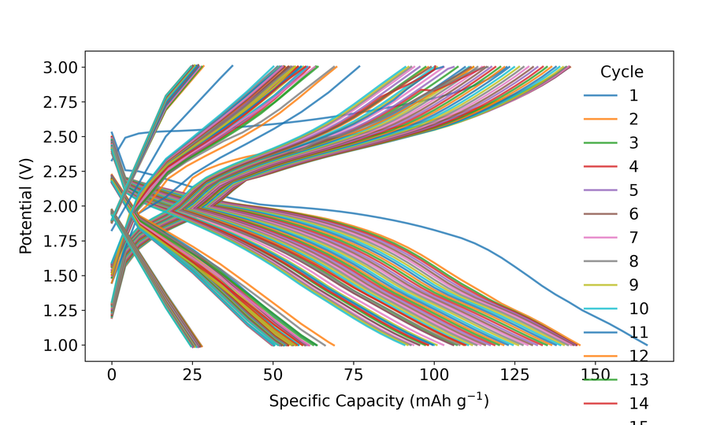
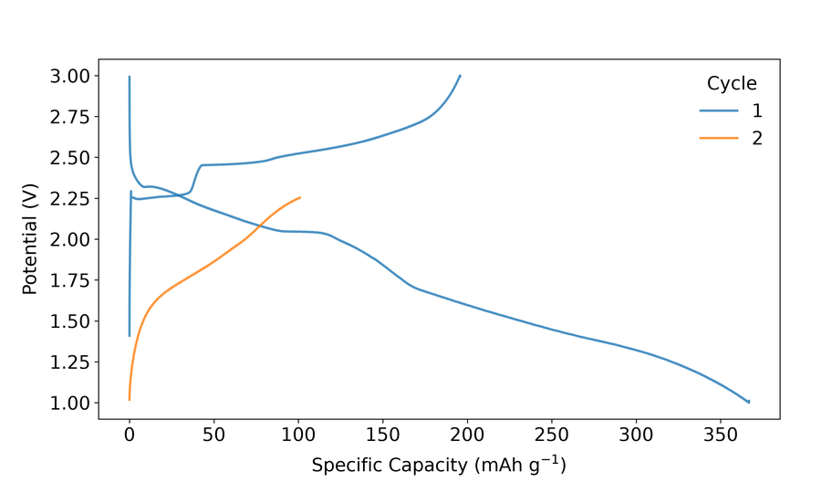
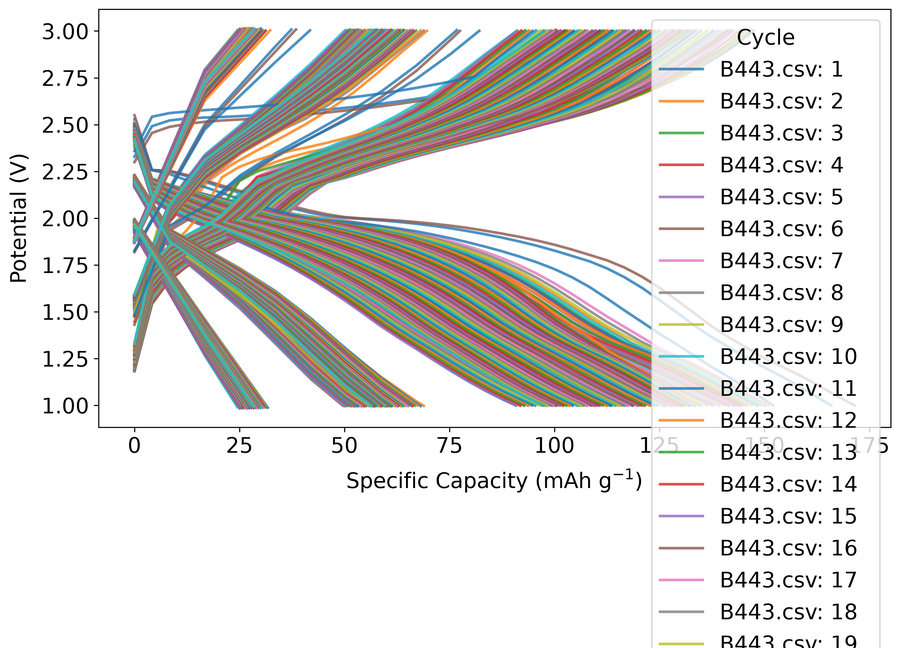
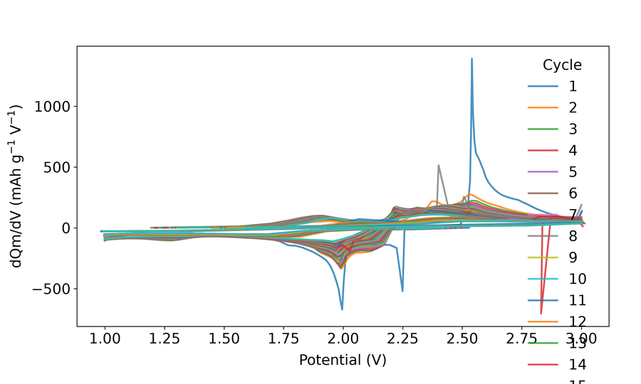
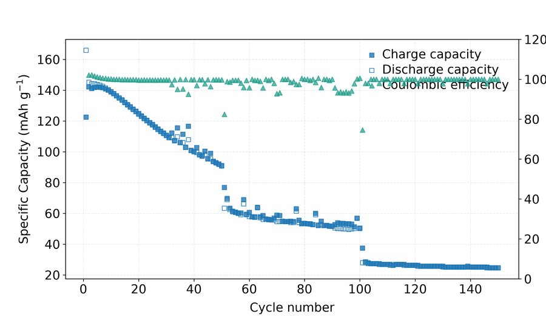
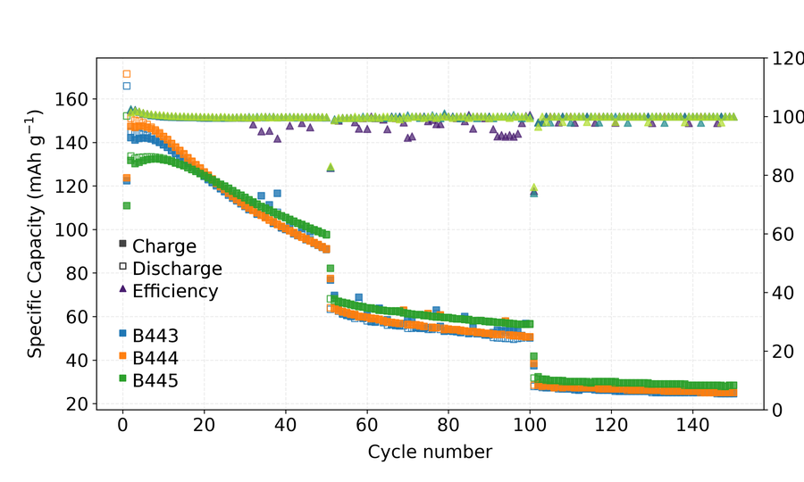
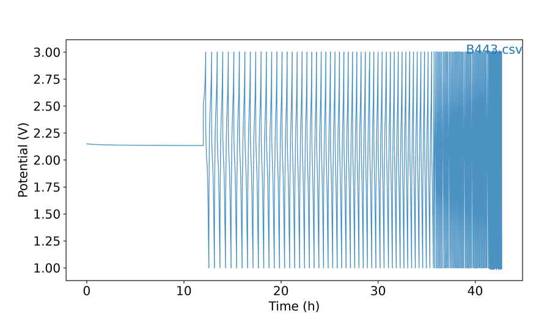

# 6. Electrochemistry (EC) and CPC / EPC Modes

Electrochemistry mode supports four visualization types: galvanostatic cycling (GC), cyclic voltammetry (CV), differential capacity (d*Q*/d*V*), and capacity/energy density-per-cycle (CPC). Both Biologic (.mpt) and Neware (.csv) files are read directly. More instruments are supported upon request.

__Requirement for data exporting from instruments:__

__Neware: Customizer report – check all boxes – export to .csv or .xlsx format__

__BioLogic: Export all to .mpt file__

!!! note

    For BioLogic `.mpt` files in GC and CPC modes, pass `--mass` in milligrams (or with a `g` suffix for grams). For Neware `.csv`/`.xlsx` files that already store **specific** capacity, `--mass` is usually not needed. If the Neware export only has absolute capacity, you still need `--mass` to get mAh/g.

## Galvanostatic Cycling (GC)

Plot potential vs. specific capacity charge/discharge profiles:

```text
batplot B443.csv --gc --i
```

**from a Neware .csv file**



<p class="figure-caption"><strong>Figure: GC mode</strong> (B443.csv --gc)</p>

```text
batplot TD_O2.mpt --gc --mass 7.0 --i
```

**from a Biologic `.mpt` file (mass required in milligrams)**



<p class="figure-caption"><strong>Figure: GC from Biologic</strong> (TD_O2.mpt --gc --mass 7)</p>

```text
batplot battery.mpt --gc --mass 12g --i
```

**from a Biologic .mpt file with high mass loading in grams**

```text
batplot B443.csv B444.csv B445.csv --gc --i
```

**plots all three Neware files**



<p class="figure-caption"><strong>Figure: multi-file GC</strong> (B443 + B444 + B445)</p>

## Cyclic Voltammetry (CV)

Plot current vs. voltage cycles for electrochemical characterization:

```text
batplot cyclic.mpt --cv --i
```

## Differential Capacity (dQ/dV)

Plot dQ/dV vs. potential to identify electrochemical reaction peaks:

```text
batplot B443.csv --dqdv --i
```



<p class="figure-caption"><strong>Figure: dQ/dV</strong> (B443.csv --dqdv)</p>

```text
batplot B443.csv B444.csv --dqdv --i
```

**plots multiple files and compare the peaks**

## Capacity Per Cycle (CPC) 

CPC mode plots charge and discharge specific capacity (and optionally coulombic efficiency) as a function of cycle number. Multiple files from different samples can be overlaid on the same figure.

```text
batplot B443.csv --cpc --i
```

**single file**



<p class="figure-caption"><strong>Figure: CPC mode</strong> (B443.csv --cpc)</p>

```text
batplot B443.csv B444.csv B445.csv --cpc --i
```

**multiple Neware files overlaid in CPC mode**



<p class="figure-caption"><strong>Figure: multi-file CPC</strong> (B443 + B444 + B445)</p>

```text
batplot file1.csv file2.mpt --mass 6.0 --cpc --i
```

**multiple files from different instruments**

## Time vs. Voltage

Plot the raw time (hours) vs. voltage profile from a CSV or MPT file:

```text
batplot B443.csv --xaxis time --i
```



<p class="figure-caption"><strong>Figure: time vs voltage</strong> (B443.csv --xaxis time)</p>

## Interactive menu — Electrochemistry (GC / CV / dQ/dV) {: #ec-interactive-menu }

### Clickable interactive menu

<div class="bp-menu" markdown="0" id="ec-click-menu">
  <div class="bp-menu-sep">------------------------------------------------------------</div>
  <div class="bp-menu-title">Interactive menu:</div>
  <div class="bp-menu-grid">
    <div class="bp-menu-col">
      <div class="bp-menu-col-head">Styles</div>
      <a class="bp-item" href="#ec-key-f"><span class="bp-k">f</span>: font</a>
      <a class="bp-item" href="#ec-key-l"><span class="bp-k">l</span>: line style</a>
      <a class="bp-item" href="#ec-key-sm"><span class="bp-k">sm</span>: smooth</a>
      <a class="bp-item" href="#ec-key-k"><span class="bp-k">k</span>: spine colors</a>
      <a class="bp-item" href="#ec-key-t"><span class="bp-k">t</span>: spines/ticks</a>
      <a class="bp-item" href="#ec-key-g"><span class="bp-k">g</span>: size</a>
      <a class="bp-item" href="#ec-key-h"><span class="bp-k">h</span>: legend</a>
      <a class="bp-item" href="#ec-key-d"><span class="bp-k">d</span>: display (Chg/Dch)</a>
      <a class="bp-item" href="#ec-key-v"><span class="bp-k">v</span>: show/hide files</a>
    </div>
    <div class="bp-menu-col">
      <div class="bp-menu-col-head">Geometries</div>
      <a class="bp-item" href="#ec-key-c"><span class="bp-k">c</span>: cycles/colors</a>
      <a class="bp-item" href="#ec-key-r"><span class="bp-k">r</span>: rename</a>
      <a class="bp-item" href="#ec-key-a"><span class="bp-k">a</span>: capacity/ion</a>
      <a class="bp-item" href="#ec-key-xy"><span class="bp-k">x</span>: x range</a>
      <a class="bp-item" href="#ec-key-xy"><span class="bp-k">y</span>: y range</a>
    </div>
    <div class="bp-menu-col">
      <div class="bp-menu-col-head">Options</div>
      <a class="bp-item" href="#ec-key-io"><span class="bp-k">n</span>: crosshair</a>
      <a class="bp-item" href="#ec-key-o"><span class="bp-k">o</span>: overview</a>
      <a class="bp-item" href="#ec-key-io"><span class="bp-k">p</span>: print(export) style/geom</a>
      <a class="bp-item" href="#ec-key-io"><span class="bp-k">i</span>: import style/geom</a>
      <a class="bp-item" href="#ec-key-io"><span class="bp-k">e</span>: export figure</a>
      <a class="bp-item" href="#ec-key-io"><span class="bp-k">s</span>: save project</a>
      <a class="bp-item" href="#ec-key-io"><span class="bp-k">b</span>: undo</a>
      <a class="bp-item" href="#ec-key-2d"><span class="bp-k">2d</span>: dQ/dV contour</a>
      <a class="bp-item" href="#ec-key-io"><span class="bp-k">q</span>: quit</a>
    </div>
  </div>
  <div class="bp-menu-sep">------------------------------------------------------------</div>
  <p class="bp-menu-note">Union of GC / CV / dQ/dV rows (live menus hide some keys). sm and 2d = dQ/dV only; a and o = GC only; v = multi-file only.</p>
</div>

Add `--i` with `--gc`, `--cv`, or `--dqdv`. Type a key, then press **Enter**. Columns: **Styles | Geometries | Options**. Some keys appear only for certain plot types.

### Key `f` — Font {: #ec-key-f }

<p class="bp-back" markdown="0"><a href="#ec-click-menu">↑ Back to interactive menu</a></p>

| Key | What it does | Example |
|-----|--------------|---------|
| `f` | Choose font family (number from the list, or type a name) | Type `f`, then `1` for the first listed family, or type `Arial`. |
| `s` | Set the font size used for labels and titles. | Type `s`, then `14`. |
| `b` | Set bold vs normal weight (blank Enter often toggles). | Type `b`, then `bold` (or press Enter to toggle). |
| `h` | Open text-highlight tools (colored box behind label text). | Type `h`, then `t` to turn highlight on. |
| `q` | Leave this submenu and return one level up (or to the main menu). | Type `q`. |

**Inside `h` (highlight):**

| Key | What it does | Example |
|-----|--------------|---------|
| `t` | Turn the text-highlight background box on or off. | Type `t`. |
| `c` | Set the highlight background color behind labels. | Type `c`, then `yellow` (or `e` to pick from the screen). |
| `a` | Set highlight transparency from 0 (invisible) to 1 (solid). | Type `a`, then `0.35`. |
| `p` | Set how much padding the highlight box adds around text. | Type `p`, then `0.3`. |
| `q` | Leave this submenu and return one level up (or to the main menu). | Type `q`. |

---

### Key `l` — Line style {: #ec-key-l }

<p class="bp-back" markdown="0"><a href="#ec-click-menu">↑ Back to interactive menu</a></p>

Controls how charge/discharge curves are drawn. **If several files are open**, batplot may first ask which file number to edit (or offer all).

| Key | What it does | Example |
|-----|--------------|---------|
| `c` | Set the linewidth of the plotted data curves. | Type `c`, then `1.5`. |
| `f` | Set linewidth of the axes frame and tick marks. | Type `f`, then `1.0`. |
| `g` | Turn the plot grid on/off and adjust grid width when asked. | Type `g`, then follow the on/off or width prompt. |
| `l` | Draw data as solid lines only (no markers). | Type `l`. |
| `ld` | Draw curves as a solid line with markers. | Type `ld`. |
| `d` | Draw markers only (no connecting line) for the selected curves. | Type `d` (or `ld`/`dd` siblings) to switch style, then `q` back. |
| `da` | Draw curves as dashed lines. | Type `da`. |
| `dd` | Draw curves as dashed lines with markers. | Type `dd`. |
| `q` | Leave this submenu and return one level up (or to the main menu). | Type `q`. |

Cycle **colors** are under main-menu `c`, not here. Spine colors are under `k`.

---

### Key `sm` — Smooth / filter (dQ/dV only) {: #ec-key-sm }

<p class="bp-back" markdown="0"><a href="#ec-click-menu">↑ Back to interactive menu</a></p>

Only listed in **dQ/dV** sessions. Use it to clean noisy differential-capacity curves before styling or exporting.

| Key | What it does | Example |
|-----|--------------|---------|
| `a` | **Potential-step** filter — follows numeric prompts; type `e` at a prompt if you want an on-screen explanation | Type `a`, then enter parameters (or `e` for explain). |
| `d` | Apply the DiffCap filter on dQ/dV. | Type `d`, then follow prompts. |
| `o` | Open outlier-removal methods. | Type `o`, then `1` or `2`. |
| `r` | Reset filtered dQ/dV data back to the **original** curves. | Type `r` after a filter that removed too much. |
| `q` | Leave this submenu and return one level up (or to the main menu). | Type `q`. |

**Inside `o` (outliers):**

| Key | What it does | Example |
|-----|--------------|---------|
| `1` | Remove outliers with a Z-score rule. | Type `1`, then follow the threshold prompt. |
| `2` | Remove outliers with median absolute deviation (MAD). | Type `2`. |

After filtering, you can still use `b` (undo) on the main menu for the last pushed change.

---

### Key `k` — Spine colors {: #ec-key-k }

<p class="bp-back" markdown="0"><a href="#ec-click-menu">↑ Back to interactive menu</a></p>

| Key / input | What it does | Example |
|-----|--------------|---------|
| `w:color` | Set the **top** spine color (name or `#RRGGBB`). | Type `w:black` or `w:#333333`. |
| `a:color` | Set the **left** spine color. | Type `a:red` to match a left-axis series. |
| `s:color` | Set the **bottom** spine color. | Type `s:#444444`. |
| `d:color` | Set the **right** spine color. | Type `d:blue` when a right axis is used. |
| `e` | Pick a color from the screen/eyedropper when the prompt offers it. | Type `e`, click a pixel on the figure, confirm the hex value. |
| `u` | Open the saved-custom-colors helper (store/reuse hex or named colors). | Type `u`, save a color, then reuse it later as `1:#1f77b4`. |
| `q` | Leave this submenu and return one level up (or to the main menu). | Type `q`. |

---

### Key `t` — Spines and ticks {: #ec-key-t }

<p class="bp-back" markdown="0"><a href="#ec-click-menu">↑ Back to interactive menu</a></p>

Spines are the four border lines of the axes box. Tick marks, tick numbers, and axis titles sit on those sides.

Press **`t`**, then type commands at the spine prompt. Most toggles are a **side letter + number** with **no space** (for example `s2`). You can put several codes on one line.

#### Step 1 — Pick a side (WASD)

| Key | What it does | Example |
|-----|--------------|---------|
| `w` | WASD **top** side of the axes box. | Type `w5` to toggle the top axis title. |
| `a` | WASD **left** side of the axes box. | Type `a4` to toggle left tick numbers. |
| `s` | WASD **bottom** side of the axes box. | Type `s2` to toggle bottom major ticks. |
| `d` | WASD **right** side of the axes box. | Type `d1` to toggle the right spine line. |

#### Step 2 — Pick what to show/hide on that side

| Number | What it does | Example |
|-----|--------------|---------|
| `1` | Toggle the border spine line on the chosen side. | `s1` toggles the bottom spine. |
| `2` | Toggle major tick marks on the chosen side. | `a2` toggles left major ticks. |
| `3` | Toggle minor tick marks on the chosen side. | `s3` toggles bottom minor ticks. |
| `4` | Toggle tick number labels on the chosen side. | `a4` hides or shows left numbers. |
| `5` | Toggle the axis title on the chosen side. | `w5` toggles the top title. |

#### Examples (copy these ideas)

| You type | What it does | Example |
|-----|--------------|---------|
| `s2` | Toggle bottom major tick marks on the plot frame. | Type `s2` once to hide bottom majors; type again to show them. |
| `w5` | Toggle the top axis title visibility. | Type `w5` to hide the top title if it overlaps the plot. |
| `a4` | Toggle left-side tick number labels. | Type `a4` to hide left numbers for a cleaner export. |
| `d1` | Toggle the right spine (border) line. | Type `d1` to remove the right border. |
| `s2 w5 a4` | Apply several WASD toggles in one command (space-separated). | Type `s2 w5 a4` to hide bottom majors, top title, and left numbers together. |

Blank line or `q` leaves a nested prompt; `q` on the spine prompt returns to the main interactive menu.

#### Extra commands (type the letter alone)

| Key | What it does | How to use it | Example |
|-----|--------------|---------------|---------|
| `i` | Flip tick marks to point into vs out of the plot. | Type `i` once; type again to flip back | Type `i` once; type again to flip back. |
| `l` | Set **major tick length** (points). Minor length is set automatically to about 70% | Type `l`, then enter a positive number | Type `l`, then `6`. |
| `n` | Set spacing between major ticks. | Type `n`, then e.g. `x 0.5`, `y 1`, `all 1`, or `x auto` | Type `n`, then `x 0.5`, `all 1`, or `x auto`. |
| `m` | Set how many minor ticks sit between majors. | Type `m`, then e.g. `x 4` or `all 0` (off) | Type `m`, then `x 4` or `all 0` to disable. |
| `p` | Nudge axis titles away from the data. | See the next table | Type `p`, then `w` and use nudge keys. |
| `list` | Print the current spine/tick on/off state for every side. | Read the report, then continue | Type `list`. |
| `q` | Leave this submenu and return one level up (or to the main menu). | Back to the main interactive menu | Type `q`. |

#### Inside `p` — move axis titles

| Key | What it does | Example |
|-----|--------------|---------|
| `w` | WASD **top** side of the axes box. | Type `w5` to toggle the top axis title. |
| `s` | WASD **bottom** side of the axes box. | Type `s2` to toggle bottom major ticks. |
| `a` | WASD **left** side of the axes box. | Type `a4` to toggle left tick numbers. |
| `d` | WASD **right** side of the axes box. | Type `d1` to toggle the right spine line. |
| `r` | Reset all title-offset nudges back to the default positions. | Type `r` after overshooting with `x 0.5` / `y -0.3`. |
| `q` | Leave this submenu and return one level up (or to the main menu). | Type `q`. |

Typical nudge keys after you pick a side: `w`/`s`/`a`/`d` to move, `0` to reset that title, `q` to go back.

#### Electrochemistry-specific notes

| Situation | What it does | Example |
|-----|--------------|---------|
| Normal GC / CV / dQ/dV | `n` and `m` prompts usually offer `x`, `y`, and `all` Use the matching single-key rows for full detail. | Type one option from Normal GC / CV / dQ/dV, for example the first key listed. |
| Dual-X GC (capacity + ions) | Spacing prompts may also offer **`tx`** for the **top X** axis — use `tx 0.5` the same way as `x 0.5`. | After enabling dual-X, type `t` → spacing → `tx 0.4` to nudge the top X title. |
| After changing cycles or dual axis | Re-open `t` if tick spacing looks stale; `n`/`m` re-apply cleanly. | Change cycles, then type `t` and set major spacing again if labels look wrong. |

Spine **colors** are a different key: use main-menu **`k`** (or color tools), not `t`.

---

### Key `g` — Size {: #ec-key-g }

<p class="bp-back" markdown="0"><a href="#ec-click-menu">↑ Back to interactive menu</a></p>

Sizes are in **inches**.

| Key | What it does | Example |
|-----|--------------|---------|
| `p` | Set the **plot frame** (axes box) width × height — enter two numbers such as `6 4` | Type `p`, then `6 4`. |
| `c` | Resize the whole figure window in inches. | Type `c`, then `8 6`. |
| `q` | Leave this submenu and return one level up (or to the main menu). | Type `q`. |

Quit a size prompt with `q` or blank if you change your mind.

---

### Key `h` — Legend {: #ec-key-h }

<p class="bp-back" markdown="0"><a href="#ec-click-menu">↑ Back to interactive menu</a></p>

| Key | What it does | Example |
|-----|--------------|---------|
| `t` | Show or hide the legend. | Type `t` to toggle the legend on/off. |
| `p` | Open legend-position controls. | Type `p`, then `w`/`s` or `0.1 0.9`. |
| `ra` | Reorder legend entries when several files are plotted. | Type `ra`, then `2 1 3`. |
| `q` | Leave this submenu and return one level up (or to the main menu). | Type `q`. |

**Inside `p` (legend position):**

| Key / input | What it does | Example |
|-----|--------------|---------|
| `w` / `s` / `a` / `d` | Nudge the legend Use the matching single-key rows for full detail. | Type one option from w` / `s` / `a` / `d, for example the first key listed. |
| `0` | Reset the legend (or item) position to the default. | Type `0` after moving the legend off-canvas. |
| `x` / `y` | Lock motion to one axis Use the matching single-key rows for full detail. | Type one option from x` / `y, for example the first key listed. |
| `x y` | Set an absolute legend position with two numbers (axes fraction). | Type `0.02 0.98` for upper-left inside the axes. |
| `q` | Leave this submenu and return one level up (or to the main menu). | Type `q`. |

---

### Key `d` — Display charge / discharge {: #ec-key-d }

<p class="bp-back" markdown="0"><a href="#ec-click-menu">↑ Back to interactive menu</a></p>

| Key | What it does | Example |
|-----|--------------|---------|
| `c` | Show charge half-cycles only. | Type `c`. |
| `d` | Show discharge half-cycles only. | Type `d`. |
| `b` | Show both charge and discharge traces. | Type `b`. |
| `q` | Leave this submenu and return one level up (or to the main menu). | Type `q`. |

---

### Key `v` — Show / hide files {: #ec-key-v }

<p class="bp-back" markdown="0"><a href="#ec-click-menu">↑ Back to interactive menu</a></p>

Only when several files are open. Type file numbers or ranges as the prompt shows (for example `1 3` or `1-2`).

---

### Key `c` — Cycles and colors {: #ec-key-c }

<p class="bp-back" markdown="0"><a href="#ec-click-menu">↑ Back to interactive menu</a></p>

**If several files are open, first choose a file:**

| Key | What it does | Example |
|-----|--------------|---------|
| `1` … `N` | Select that file number to edit cycles or colors. | Type `1`, then set cycles like `1-10` or a color. |
| `v` | Print the current color assignments for curves or spines. | Type `v` to list colors, then adjust with `1:red` or `s:black`. |
| `q` | Leave this submenu and return one level up (or to the main menu). | Type `q`. |

**Then type a cycle/color command**, for example:

| Input | What it does | Example |
|-------|--------------|---------|
| `1-5` or `all` | Select which cycles to show or restyle. | Type `1-5` for cycles 1–5, or `all` for every cycle. |
| `1:red` | Set the color of one cycle (name or `#RRGGBB`). | Type `3:blue` or `2:#d62728`. |
| `all viridis` | Apply a colormap across the selected / all cycles. | Type `all viridis` or `1-10 plasma`. |
| `fall:…` | Fall-related helpers when the menu offers them (e.g. fall coloring). | Type the printed `fall:…` form if shown. |
| `v` | Print the current cycle colors. | Type `v`, read the list, then adjust with `1:red`. |
| `e` | Pick a color from the screen for the active cycle/file. | Type `e`, click a pixel, confirm. |
| `u` | Reuse a saved custom color. | Type `u`, pick a saved entry, apply it. |
| `q` | Leave this cycle/color prompt. | Type `q`. |

---

### Key `r` — Rename {: #ec-key-r }

<p class="bp-back" markdown="0"><a href="#ec-click-menu">↑ Back to interactive menu</a></p>

| Key | What it does | Example |
|-----|--------------|---------|
| `x` | Set the bottom X-axis title (usually capacity, or time in time-mode plots). | Type `x`, then `Capacity (mAh g$^{-1}$)`. |
| `tx` | Set the **top** X-axis title when dual-X (capacity + ions) is enabled. | Type `tx`, then `x in Li$_x$MO$_2$`. |
| `y` | Set the Y-axis title (usually potential). | Type `y`, then `Potential (V vs Li/Li$^+$)`. |
| `f` | Rename a **file** entry in the legend (**multi-file** sessions). | Type `f`, pick file `2`, then enter `Cell B`. |
| `s` | Show recently used titles and optionally reuse one. | Type `s`, then enter `1`. |
| `m` | Show math / Greek typing help for titles. | Type `m`, then use `{sub(2)}` when renaming. |
| `q` | Return to the main EC menu. | Type `q`. |

---

### Key `a` — Capacity / ions (GC only) {: #ec-key-a }

<p class="bp-back" markdown="0"><a href="#ec-click-menu">↑ Back to interactive menu</a></p>

| Key | What it does | Example |
|-----|--------------|---------|
| `c` | Show **capacity only** on the bottom X-axis. | Type `c` to leave ions/dual mode and plot capacity. |
| `n` | Show **number of ions only** on the bottom X-axis. | Type `n` (needs mass / capacity-per-ion params when prompted). |
| `d` | Enable **dual** X-axis (capacity bottom, ions top). | Type `d` to show both scales at once. |
| `s` | **Swap** top and bottom axes while in dual mode. | Type `s` after `d` to put ions on the bottom. |
| `u` | Update the **theoretical capacity** / ion-conversion parameters. | Type `u`, then enter new mass or capacity-per-ion values. |
| `q` | Return to the main EC menu. | Type `q`. |

---

### Key `x` / `y` — Axis limits {: #ec-key-xy }

<p class="bp-back" markdown="0"><a href="#ec-click-menu">↑ Back to interactive menu</a></p>

| Key / input | What it does | Example |
|-----|--------------|---------|
| `min max` | Enter both limits as two numbers separated by a space. | `10 80` or `3.0 4.2`. |
| `w` | Raise/step the upper axis limit. | Type `w` a few times, or enter a numeric max when prompted. |
| `s` | Lower/step the **lower** axis limit. | Type `s` a few times, or enter a numeric min when prompted. |
| `a` | Auto-scale this axis to the visible data. | Type `a` after zooming too far. |
| `q` | Leave this submenu and return one level up (or to the main menu). | Type `q`. |

---

### Key `o` — Overview (GC only) {: #ec-key-o }

<p class="bp-back" markdown="0"><a href="#ec-click-menu">↑ Back to interactive menu</a></p>

| Key | What it does | Example |
|-----|--------------|---------|
| `c` | Open the capacity / efficiency summary table. | Type `c`, inspect printed values, then `q` back. |
| `r` | Open the retention overview table. | Type `r`. |
| `s` | Show a short numerical summary of the overview. | Type `s`. |
| `e` | Export overview values to a file. | Type `e`. |
| `q` | Leave this submenu and return one level up (or to the main menu). | Type `q`. |

---

### Key `2d` — dQ/dV contour (dQ/dV only) {: #ec-key-2d }

<p class="bp-back" markdown="0"><a href="#ec-click-menu">↑ Back to interactive menu</a></p>

Opens a **second figure**: a 2D contour of differential capacity vs potential (and cycle/time-like stacking), similar in spirit to *operando* contours.

| Step | What it does | Example |
|-----|--------------|---------|
| 1 | From the dQ/dV interactive menu, press `2d` to open a contour companion. | Type `2d` on the dQ/dV menu. |
| 2 | Enter the **potential window** when asked (min and max V). | When prompted, type `2.5 4.2`. |
| 3 | Style the new contour window (colormap, ranges, export, …). | In the contour menu, type `oc` then `viridis`. |
| 4 | Save that contour with `s` if you want a `.pkl` for later / batch styling. | Type `s`, choose a path, confirm. |

Not available in batch multi-`.pkl` editing — create contours from single-session `--i`, save, then open those `.pkl` files together.

---

### Keys `n` / `p` / `i` / `e` / `s` / `b` / `q` {: #ec-key-io }

<p class="bp-back" markdown="0"><a href="#ec-click-menu">↑ Back to interactive menu</a></p>

| Key | What it does | Example |
|-----|--------------|---------|
| `n` | Toggle the crosshair helper on the figure. | Type `n` once to show, again to hide. |
| `p` | Export a reusable style file (`.bps` / `.bpsg` / `.bpsh`). | Type `p`, choose style-only or style+geometry. |
| `i` | Import a saved style by picking its number from the list. | Type `i`, then `2`. |
| `e` | Export the figure image (svg, png, …). | Type `e`, choose format and folder. |
| `s` | Save the session as a `.pkl` file. | Type `s`, then confirm the name/folder. |
| `b` | Undo the last change stored in history. | Type `b`. |
| `q` | Leave this submenu and return one level up (or to the main menu). | Type `q`. |

## Interactive menu — CPC / EPC {: #cpc-interactive-menu }

### Clickable interactive menu

<div class="bp-menu" markdown="0" id="cpc-click-menu">
  <div class="bp-menu-sep">------------------------------------------------------------</div>
  <div class="bp-menu-title">CPC Interactive Menu:</div>
  <div class="bp-menu-grid">
    <div class="bp-menu-col">
      <div class="bp-menu-col-head">Styles</div>
      <a class="bp-item" href="#cpc-key-f"><span class="bp-k">f</span>: font</a>
      <a class="bp-item" href="#cpc-key-l"><span class="bp-k">l</span>: line style</a>
      <a class="bp-item" href="#cpc-key-m"><span class="bp-k">m</span>: marker sizes</a>
      <a class="bp-item" href="#cpc-key-c"><span class="bp-k">c</span>: colors</a>
      <a class="bp-item" href="#cpc-key-k"><span class="bp-k">k</span>: spine colors</a>
      <a class="bp-item" href="#cpc-key-d"><span class="bp-k">d</span>: display (Chg/Dch)</a>
      <a class="bp-item" href="#cpc-key-ry"><span class="bp-k">ry</span>: show/hide efficiency</a>
      <a class="bp-item" href="#cpc-key-t"><span class="bp-k">t</span>: spines/ticks</a>
      <a class="bp-item" href="#cpc-key-h"><span class="bp-k">h</span>: legend</a>
      <a class="bp-item" href="#cpc-key-g"><span class="bp-k">g</span>: size</a>
      <a class="bp-item" href="#cpc-key-v"><span class="bp-k">v</span>: show/hide files</a>
    </div>
    <div class="bp-menu-col">
      <div class="bp-menu-col-head">Geometries</div>
      <a class="bp-item" href="#cpc-key-r"><span class="bp-k">r</span>: rename</a>
      <a class="bp-item" href="#cpc-key-x"><span class="bp-k">x</span>: x range</a>
      <a class="bp-item" href="#cpc-key-y"><span class="bp-k">y</span>: y ranges</a>
      <a class="bp-item" href="#cpc-key-ie"><span class="bp-k">ie</span>: invert efficiency</a>
    </div>
    <div class="bp-menu-col">
      <div class="bp-menu-col-head">Options</div>
      <a class="bp-item" href="#cpc-key-a"><span class="bp-k">a</span>: add file(s)</a>
      <a class="bp-item" href="#cpc-key-io"><span class="bp-k">n</span>: crosshair</a>
      <a class="bp-item" href="#cpc-key-o"><span class="bp-k">o</span>: overview</a>
      <a class="bp-item" href="#cpc-key-io"><span class="bp-k">p</span>: print(export) style/geom</a>
      <a class="bp-item" href="#cpc-key-io"><span class="bp-k">i</span>: import style/geom</a>
      <a class="bp-item" href="#cpc-key-io"><span class="bp-k">e</span>: export figure</a>
      <a class="bp-item" href="#cpc-key-io"><span class="bp-k">s</span>: save project</a>
      <a class="bp-item" href="#cpc-key-io"><span class="bp-k">b</span>: undo</a>
      <a class="bp-item" href="#cpc-key-io"><span class="bp-k">q</span>: quit</a>
    </div>
  </div>
  <div class="bp-menu-sep">------------------------------------------------------------</div>
  <p class="bp-menu-note">Click a key to jump to its description. Use ↑ Back to interactive menu under each key to return here.</p>
</div>

Menu title: **CPC Interactive Menu**. Columns: **Styles | Geometries | Options**.

```text
batplot battery.csv --cpc --i
```

### Key `f` — Font {: #cpc-key-f }

<p class="bp-back" markdown="0"><a href="#cpc-click-menu">↑ Back to interactive menu</a></p>

| Key | What it does | Example |
|-----|--------------|---------|
| `f` | Choose font **family** (pick a number from the list, or type a font name) | Type `f`, then `1` for the first listed family, or type `Arial`. |
| `s` | Set the font size used for labels and titles. | Type `s`, then `14`. |
| `b` | Set **weight**: type `bold` or `normal`, or press Enter to toggle | Type `b`, then `bold` (or press Enter to toggle). |
| `h` | Text **highlight** (colored box behind labels) — see next table | Type `h`, then `t` to turn highlight on. |
| `q` | Leave this submenu and return one level up (or to the main menu). | Type `q`. |

**Inside `h` (highlight):**

| Key | What it does | Example |
|-----|--------------|---------|
| `t` | Turn the text-highlight background box on or off. | Type `t`. |
| `c` | Set the highlight background color behind labels. | Type `c`, then `yellow` (or `e` to pick from the screen). |
| `a` | Set highlight transparency from 0 (invisible) to 1 (solid). | Type `a`, then `0.35`. |
| `p` | Set how much padding the highlight box adds around text. | Type `p`, then `0.3`. |
| `q` | Leave this submenu and return one level up (or to the main menu). | Type `q`. |

---

### Key `l` — Line widths {: #cpc-key-l }

<p class="bp-back" markdown="0"><a href="#cpc-click-menu">↑ Back to interactive menu</a></p>

CPC `l` is narrower than XY/EC: it styles the **frame/ticks** and **grid**, not per-marker dash styles (markers use `m`).

| Key | What it does | Example |
|-----|--------------|---------|
| `f` | Set linewidth of the axes frame and tick marks. | Type `f`, then `1.0`. |
| `g` | Turn the plot grid on/off and adjust grid width when asked. | Type `g`, then follow the on/off or width prompt. |
| `q` | Leave this submenu and return one level up (or to the main menu). | Type `q`. |

---

### Key `m` — Marker sizes {: #cpc-key-m }

<p class="bp-back" markdown="0"><a href="#cpc-click-menu">↑ Back to interactive menu</a></p>

CPC plots use markers for capacity and efficiency points. Press `m`, then follow the prompts:

| Prompt (typical) | What it does | Example |
|-----|--------------|---------|
| Charge markers | A positive size number (matplotlib marker size) for charge points. | Enter `8` for larger charge markers. |
| Discharge markers | A positive size number for discharge markers. | Enter `6`. |
| Efficiency markers | A positive size number when efficiency is plotted. | Enter `5`. |

Type `q` or leave blank when a prompt allows backing out. If several files are open, you may be asked which file to edit first.

---

### Key `c` — Colors {: #cpc-key-c }

<p class="bp-back" markdown="0"><a href="#cpc-click-menu">↑ Back to interactive menu</a></p>

| Key | What it does | Example |
|-----|--------------|---------|
| `ly` | Color the **left-Y** (capacity/energy) curves. | Type `ly`, then `1:red` or a palette command. |
| `ry` | Color the **right-Y** (efficiency) series when shown. | Type `ry`, then `green`. |
| `s` | Open **spine-color** controls (top/bottom/left/right, optional auto). | Type `s`, then `a:black`. |
| `u` | Manage saved custom colors for reuse. | Type `u`, save a hex, reuse later. |
| `e` | Pick a color from the screen/eyedropper. | Type `e`, click a pixel, confirm. |
| `q` | Return to the main CPC menu. | Type `q`. |

**Inside `s` (spines):**

| Key / input | What it does | Example |
|-----|--------------|---------|
| `w:color` / `a:color` / `s:color` / `d:color` | Color the top / left / bottom / right spine. | Type `w:black` or `a:#4561F7`. |
| `auto` | Apply automatic spine/label colors (typically single-file sessions). | Type `auto` to restore default spine coloring. |
| `e` | Pick a color from the screen/eyedropper when the prompt offers it. | Type `e`, click a pixel on the figure, confirm the hex value. |
| `q` | Return to the previous menu without further changes. | Type `q`. |

---

### Key `k` — Spine colors {: #cpc-key-k }

<p class="bp-back" markdown="0"><a href="#cpc-click-menu">↑ Back to interactive menu</a></p>

| Key / input | What it does | Example |
|-----|--------------|---------|
| `w` / `a` / `s` / `d` (+ color as prompted) | Color the top / left / bottom / right spine. | Type `a` then `red`, or `w:#333333`. |
| `auto` | Apply automatic spine/label colors (typically single-file sessions). | Type `auto` to restore default spine coloring. |
| `e` | Pick a color from the screen/eyedropper when the prompt offers it. | Type `e`, click a pixel on the figure, confirm the hex value. |
| `q` | Return to the previous menu without further changes. | Type `q`. |

---

### Key `d` — Display Chg / Dch {: #cpc-key-d }

<p class="bp-back" markdown="0"><a href="#cpc-click-menu">↑ Back to interactive menu</a></p>

| Key | What it does | Example |
|-----|--------------|---------|
| `c` | Show charge half-cycles only. | Type `c`. |
| `d` | Show discharge half-cycles only. | Type `d`. |
| `b` | Show both charge and discharge traces. | Type `b`. |
| `q` | Return to the previous menu without further changes. | Type `q`. |

---

### Key `ry` — Efficiency axis {: #cpc-key-ry }

<p class="bp-back" markdown="0"><a href="#cpc-click-menu">↑ Back to interactive menu</a></p>

| Key | What it does | Example |
|-----|--------------|---------|
| `t` | Show or hide the efficiency (right) axis. | Type `t`. |
| `q` | Return to the previous menu without further changes. | Type `q`. |

---

### Key `t` — Spines and ticks {: #cpc-key-t }

<p class="bp-back" markdown="0"><a href="#cpc-click-menu">↑ Back to interactive menu</a></p>

Spines are the four border lines of the axes box. Tick marks, tick numbers, and axis titles sit on those sides.

Press **`t`**, then type commands at the spine prompt. Most toggles are a **side letter + number** with **no space** (for example `s2`). You can put several codes on one line.

#### Step 1 — Pick a side (WASD)

| Key | What it does | Example |
|-----|--------------|---------|
| `w` | WASD **top** side of the axes box. | Type `w5` to toggle the top axis title. |
| `a` | WASD **left** side of the axes box. | Type `a4` to toggle left tick numbers. |
| `s` | WASD **bottom** side of the axes box. | Type `s2` to toggle bottom major ticks. |
| `d` | WASD **right** side of the axes box. | Type `d1` to toggle the right spine line. |

#### Step 2 — Pick what to show/hide on that side

| Number | What it does | Example |
|-----|--------------|---------|
| `1` | Toggle the border spine line on the chosen side. | `s1` toggles the bottom spine. |
| `2` | Toggle major tick marks on the chosen side. | `a2` toggles left major ticks. |
| `3` | Toggle minor tick marks on the chosen side. | `s3` toggles bottom minor ticks. |
| `4` | Toggle tick number labels on the chosen side. | `a4` hides or shows left numbers. |
| `5` | Toggle the axis title on the chosen side. | `w5` toggles the top title. |

#### Examples (copy these ideas)

| You type | What it does | Example |
|-----|--------------|---------|
| `s2` | Toggle bottom major tick marks on the plot frame. | Type `s2` once to hide bottom majors; type again to show them. |
| `w5` | Toggle the top axis title visibility. | Type `w5` to hide the top title if it overlaps the plot. |
| `a4` | Toggle left-side tick number labels. | Type `a4` to hide left numbers for a cleaner export. |
| `d1` | Toggle the right spine (border) line. | Type `d1` to remove the right border. |
| `s2 w5 a4` | Apply several WASD toggles in one command (space-separated). | Type `s2 w5 a4` to hide bottom majors, top title, and left numbers together. |

Blank line or `q` leaves a nested prompt; `q` on the spine prompt returns to the main interactive menu.

#### Extra commands (type the letter alone)

| Key | What it does | How to use it | Example |
|-----|--------------|---------------|---------|
| `i` | Flip tick marks to point into vs out of the plot. | Type `i` once; type again to flip back | Type `i` once; type again to flip back. |
| `l` | Set **major tick length** (points). Minor length is set automatically to about 70% | Type `l`, then enter a positive number | Type `l`, then `6`. |
| `n` | Set spacing between major ticks. | Type `n`, then e.g. `x 0.5`, `y 1`, `all 1`, or `x auto` | Type `n`, then `x 0.5`, `all 1`, or `x auto`. |
| `m` | Set how many minor ticks sit between majors. | Type `m`, then e.g. `x 4` or `all 0` (off) | Type `m`, then `x 4` or `all 0` to disable. |
| `p` | Nudge axis titles away from the data. | See the next table | Type `p`, then `w` and use nudge keys. |
| `list` | Print the current spine/tick on/off state for every side. | Read the report, then continue | Type `list`. |
| `q` | Leave this submenu and return one level up (or to the main menu). | Back to the main interactive menu | Type `q`. |

#### Inside `p` — move axis titles

| Key | What it does | Example |
|-----|--------------|---------|
| `w` | WASD **top** side of the axes box. | Type `w5` to toggle the top axis title. |
| `s` | WASD **bottom** side of the axes box. | Type `s2` to toggle bottom major ticks. |
| `a` | WASD **left** side of the axes box. | Type `a4` to toggle left tick numbers. |
| `d` | WASD **right** side of the axes box. | Type `d1` to toggle the right spine line. |
| `r` | Reset all title-offset nudges back to the default positions. | Type `r` after overshooting with `x 0.5` / `y -0.3`. |
| `q` | Leave this submenu and return one level up (or to the main menu). | Type `q`. |

Typical nudge keys after you pick a side: `w`/`s`/`a`/`d` to move, `0` to reset that title, `q` to go back.

#### CPC-specific notes

CPC figures often have a left Y (capacity) and a right Y (efficiency). The WASD sides still mean top/left/bottom/right of the **active axes frame**.

| Tip | What it does | Example |
|-----|--------------|---------|
| Efficiency axis | After showing efficiency with `ry`, you may want `d2` / `d4` (right ticks/labels) visible. | Type `ry` to show efficiency, then `d4` so right-axis numbers appear. |
| Spine colors | Use main-menu `k` or `c` → `s`, not the `t` (ticks) menu. | Type `k`, then `a:black` to color the left spine. |

---

### Key `h` — Legend {: #cpc-key-h }

<p class="bp-back" markdown="0"><a href="#cpc-click-menu">↑ Back to interactive menu</a></p>

| Key | What it does | Example |
|-----|--------------|---------|
| `t` | Show or hide the legend box. | Type `t`. |
| `p` | Open legend-position controls. | Type `p`, then `w`/`s` or `0.1 0.9`. |
| `ra` | Reorder legend entries when several files are plotted. | Type `ra`, then `2 1 3`. |
| `q` | Return to the previous menu without further changes. | Type `q`. |

---

### Key `g` — Size {: #cpc-key-g }

<p class="bp-back" markdown="0"><a href="#cpc-click-menu">↑ Back to interactive menu</a></p>

Sizes are in **inches**.

| Key | What it does | Example |
|-----|--------------|---------|
| `p` | Set the **plot frame** (axes box) — enter width and height, e.g. `6 4` | Type `p`, then `6 4`. |
| `c` | Resize the whole figure window in inches. | Type `c`, then `8 6`. |
| `q` | Leave this submenu and return one level up (or to the main menu). | Type `q`. |

---

### Key `v` — Show / hide files {: #cpc-key-v }

<p class="bp-back" markdown="0"><a href="#cpc-click-menu">↑ Back to interactive menu</a></p>

Only listed when **more than one** file is in the session.

| Key / input | What it does | Example |
|-----|--------------|---------|
| `1` `2` … or ranges like `1-3` | Show only the listed file numbers (hide the rest). | Type `1 3` or `1-3` to keep those files visible. |
| `a` | Show all files again after hiding some. | Type `a` to restore every file in the legend. |
| `q` | Leave this submenu and return one level up (or to the main menu). | Type `q`. |

---

### Key `r` — Rename {: #cpc-key-r }

<p class="bp-back" markdown="0"><a href="#cpc-click-menu">↑ Back to interactive menu</a></p>

| Key | What it does | Example |
|-----|--------------|---------|
| `x` | Set the X-axis title (usually cycle number). | Type `x`, then `Cycle number`. |
| `ly` | Set the **left** Y-axis title (capacity or energy). | Type `ly`, then `Specific capacity (mAh g$^{-1}$)`. |
| `ry` | Set the **right** Y-axis title (efficiency). | Type `ry`, then `Coulombic efficiency (%)`. |
| `f` | Rename a **file** entry in the legend. | Type `f`, pick file `1`, then enter `Cathode A`. |
| `s` | Show recently used titles and optionally reuse one. | Type `s`, then enter `1`. |
| `m` | Show math / Greek typing help for titles. | Type `m`, then use `{sub(2)}` when renaming. |
| `q` | Return to the main CPC menu. | Type `q`. |

---

### Key `x` — X limits {: #cpc-key-x }

<p class="bp-back" markdown="0"><a href="#cpc-click-menu">↑ Back to interactive menu</a></p>

| Key / input | What it does | Example |
|-----|--------------|---------|
| `min max` | Enter both limits as two numbers separated by a space. | `10 80` or `3.0 4.2`. |
| `w` | Raise/step the upper axis limit. | Type `w` a few times, or enter a numeric max when prompted. |
| `s` | Lower/step the **lower** axis limit. | Type `s` a few times, or enter a numeric min when prompted. |
| `a` | Auto-scale this axis to the visible data. | Type `a` after zooming too far. |
| `q` | Leave this submenu and return one level up (or to the main menu). | Type `q`. |

---

### Key `y` — Y limits {: #cpc-key-y }

<p class="bp-back" markdown="0"><a href="#cpc-click-menu">↑ Back to interactive menu</a></p>

CPC has two Y axes. First choose which one:

| Key | What it does | Example |
|-----|--------------|---------|
| `ly` | Edit limits on the **left** Y-axis (capacity / energy). | Type `ly`, then `0 200` or `a` to autoscale. |
| `ry` | Edit limits on the **right** Y-axis (efficiency). | Type `ry`, then `90 105`. |

Then use the same controls as `x` (`min max`, `w`, `s`, `a`, `q`).

---

### Key `ie` — Invert efficiency {: #cpc-key-ie }

<p class="bp-back" markdown="0"><a href="#cpc-click-menu">↑ Back to interactive menu</a></p>

Flips the efficiency (right) axis so high/low swap direction — useful when you want Coulombic efficiency to increase “downward” or match a journal style.

| Situation | What it does | Example |
|-----|--------------|---------|
| One file | Efficiency axis inverts immediately (or after confirm if prompted). | Type `ie` in a one-file CPC session to flip the efficiency axis. |
| Several files | Pick which file’s efficiency axis to invert first. | Type `ie`, then `2` to invert file 2’s efficiency axis. |

---

### Key `a` — Add file(s) {: #cpc-key-a }

<p class="bp-back" markdown="0"><a href="#cpc-click-menu">↑ Back to interactive menu</a></p>

Adds more CPC-compatible data files into **this live session** without restarting batplot.

| Step | What it does | Example |
|-----|--------------|---------|
| 1 | Press `a` to add one or more CPC files into the session. | Type `a` on the CPC menu. |
| 2 | Enter path(s) or use the file picker prompts. | Type `./cellB.txt` or pick from the listed files. |
| 3 | New series appear; use `c` / `v` / `r` to color, hide, or rename. | Type `c` then `2:green`, or `r` → `f` to rename the new file. |

**Not available** when you are in batch multi-`.pkl` editing — add data in a single-session `--i` instead.

---

### Key `o` — Overview {: #cpc-key-o }

<p class="bp-back" markdown="0"><a href="#cpc-click-menu">↑ Back to interactive menu</a></p>

| Key | What it does | Example |
|-----|--------------|---------|
| `c` | Open the capacity / efficiency summary table. | Type `c`, inspect printed values, then `q` back. |
| `r` | Open the retention overview table. | Type `r`. |
| `s` | Show a short numerical summary of the overview. | Type `s`. |
| `e` | Export overview values to a file. | Type `e`. |
| `q` | Return to the previous menu without further changes. | Type `q`. |

---

### Keys `n` / `p` / `i` / `e` / `s` / `b` / `q` {: #cpc-key-io }

<p class="bp-back" markdown="0"><a href="#cpc-click-menu">↑ Back to interactive menu</a></p>

| Key | What it does | Example |
|-----|--------------|---------|
| `n` | Toggle the crosshair helper on the figure. | Type `n` once to show, again to hide. |
| `p` | Export a reusable style file (`.bps` / `.bpsg` / `.bpsh`). | Type `p`, choose style-only or style+geometry. |
| `i` | Import a saved style by picking its number from the list. | Type `i`, then `2`. |
| `e` | Export the figure image (svg, png, …). | Type `e`, choose format and folder. |
| `s` | Save the session as a `.pkl` file. | Type `s`, then confirm the name/folder. |
| `b` | Undo the last change stored in history. | Type `b`. |
| `q` | Leave this submenu and return one level up (or to the main menu). | Type `q`. |
