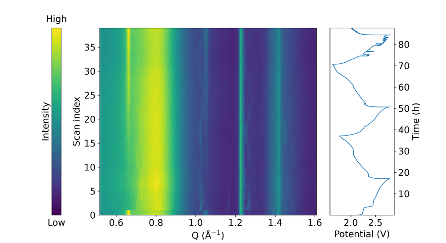

# 7. *Operando* Mode

*Operando* mode is the most distinctive feature of *batplot*. When pointed at a folder containing sequential XRD, PDF, or XAS scans (or any text based data files) collected during an electrochemical experiment, it automatically assembles them into a 2D contour map. When a Biologic .mpt file is detected in the same folder, it also renders the GC curve as a synchronized side panel.

This dual-panel figure, correlating structural evolution with the electrochemical state of the cell, is the primary visualization type in *operando* battery research and previously required dedicated, per-experiment scripting to produce. Now, *batplot *generates it from raw files in a single command.

!!! note

    Navigate into (or specify) the folder containing the scan files before running the command. The .mpt file (if present) must be in the same folder as the scan files.

## Basic *Operando* Launch

Navigate to the data folder and run:

```text
batplot --operando --i
```

**Or with explicit folder path:**

```text
batplot /path/to/operando/ --operando --i
```

*batplot* detects supported scan files (`.xye`, `.qye`, `.xy`, `.dat`, …), assembles them into a contour with natural sorting, and — if an `.mpt` or DataLogger CSV is present — places the electrochemical trace in a synchronized side panel.

!!! note "Demo *operando* wavelength"

    Tutorial **Operando** scans are `TD_S0034_*` from a **Cu** source — use **`--wl 1.54`**. (Synchrotron `TD_R*` patterns use **0.259 Å**.)

## Wavelength Conversion in *Operando* Mode

Convert data from 2θ to Q:

```text
batplot --operando --wl 1.54 --i
```

**Cu lab *operando* (demo `TD_S0034_*`)**



<p class="figure-caption"><strong>Figure: <em>Operando</em> contour</strong> (--operando --wl 1.54; subset of demo scans)</p>

```text
batplot --operando --wl 0.259 --i
```

**synchrotron *operando* (use when your scans are `TD_R*`-style / λ = 0.259 Å)**

## CIF Phase Tick Marks on the Contour

CIF files can be appended to overlay Bragg reflection tick marks directly on the *operando* contour panel. The same wavelength conversion logic used in 1D mode applies here.

```text
batplot /path/to/operando Li2FeSeO.cif Li2Se.cif --operando --wl 1.54 --i
```


<p class="figure-caption"><strong>Figure: <em>Operando</em> + CIF</strong> (Li2FeSeO + Li2Se, --wl 1.54)</p>

## Derivative Contour

Plot the first or second derivative dy/dx of each scan as the contour, useful for XAS:

```text
batplot --operando --1d --xaxis Energy --i
```

```text
batplot --operando --2d --xaxis Energy --i
```

## Bruker `.brml` and EC side panel

Place multi-scan Bruker `.brml` files (for example `…_cyc1.brml`, `…_cyc2.brml`) in a folder. Use `--wl` when converting to Q:

```text
batplot RA_O5 --operando --wl 0.709 --i
```

The EC side panel can use a Biologic `.mpt` **or** a Biologic DataLogger CSV (`*--DataLogger.csv`) in the same folder (time is concatenated across cycles when applicable).

## Averaging and column selection

```text
batplot --operando --average --i
```

```text
batplot --operando --sum --i
```

```text
batplot --operando --readcolc 2 3 --readcols 1 2 --i
```

- `--readcolc`: columns for the contour scans  
- `--readcols`: columns for the side-panel EC file  

## Interactive menu — *Operando* (contour) {: #operando-interactive-menu }

### Clickable interactive menu

<div class="bp-menu" markdown="0" id="op-click-menu">
  <div class="bp-menu-sep">------------------------------------------------------------</div>
  <div class="bp-menu-title">Contourplot Interactive Menu:</div>
  <div class="bp-menu-grid">
    <div class="bp-menu-col">
      <div class="bp-menu-col-head">Styles</div>
      <a class="bp-item" href="#op-key-oc"><span class="bp-k">oc</span>: op colormap</a>
      <a class="bp-item" href="#op-key-el"><span class="bp-k">el</span>: ec curve</a>
      <a class="bp-item" href="#op-key-v"><span class="bp-k">v</span>: toggle colorbar/ec</a>
      <a class="bp-item" href="#op-key-t"><span class="bp-k">t</span>: spines/ticks</a>
      <a class="bp-item" href="#op-key-k"><span class="bp-k">k</span>: spine colors</a>
      <a class="bp-item" href="#op-key-l"><span class="bp-k">l</span>: line style</a>
      <a class="bp-item" href="#op-key-f"><span class="bp-k">f</span>: font</a>
      <a class="bp-item" href="#op-key-g"><span class="bp-k">g</span>: size</a>
      <a class="bp-item" href="#op-key-r"><span class="bp-k">r</span>: reverse plot</a>
    </div>
    <div class="bp-menu-col">
      <div class="bp-menu-col-head"><em>Operando</em></div>
      <a class="bp-item" href="#op-key-limits"><span class="bp-k">ox</span>: X range</a>
      <a class="bp-item" href="#op-key-limits"><span class="bp-k">oy</span>: Y range</a>
      <a class="bp-item" href="#op-key-oz"><span class="bp-k">oz</span>: intensity range</a>
      <a class="bp-item" href="#op-key-rename"><span class="bp-k">or</span>: rename</a>
      <a class="bp-item" href="#op-key-c"><span class="bp-k">c</span>: CIF ticks</a>
      <a class="bp-item" href="#op-key-pk"><span class="bp-k">pk</span>: peak search</a>
    </div>
    <div class="bp-menu-col">
      <div class="bp-menu-col-head">Side Panel</div>
      <a class="bp-item" href="#op-key-limits"><span class="bp-k">et</span>: time range</a>
      <a class="bp-item" href="#op-key-limits"><span class="bp-k">ex</span>: x range</a>
      <a class="bp-item" href="#op-key-ey"><span class="bp-k">ey</span>: ion labels (time Y)</a>
      <a class="bp-item" href="#op-key-rename"><span class="bp-k">er</span>: rename</a>
      <a class="bp-item" href="#op-key-eg"><span class="bp-k">eg</span>: grid</a>
    </div>
    <div class="bp-menu-col">
      <div class="bp-menu-col-head">Options</div>
      <a class="bp-item" href="#op-key-io"><span class="bp-k">n</span>: crosshair</a>
      <a class="bp-item" href="#op-key-u"><span class="bp-k">u</span>: axis units (XRD only)</a>
      <a class="bp-item" href="#op-key-io"><span class="bp-k">p</span>: print(export) style/geom</a>
      <a class="bp-item" href="#op-key-io"><span class="bp-k">i</span>: import style/geom</a>
      <a class="bp-item" href="#op-key-io"><span class="bp-k">e</span>: export figure</a>
      <a class="bp-item" href="#op-key-io"><span class="bp-k">s</span>: save project</a>
      <a class="bp-item" href="#op-key-io"><span class="bp-k">b</span>: undo</a>
      <a class="bp-item" href="#op-key-io"><span class="bp-k">q</span>: quit</a>
    </div>
  </div>
  <div class="bp-menu-sep">------------------------------------------------------------</div>
  <p class="bp-menu-note">Shown with EC side panel (richest layout). Contour-only sessions omit el and the Side Panel column; u hides for non-XRD.</p>
</div>

Add `--operando --i`. Menu title: **Contourplot Interactive Menu**.

| Layout | Columns |
|--------|---------|
| With EC side panel | **Styles \| *Operando* \| Side Panel \| Options** |
| Contour only | **Styles \| *Operando* \| Options** (no `el`, no Side Panel) |

### Key `oc` — *Operando* colormap {: #op-key-oc }

<p class="bp-back" markdown="0"><a href="#op-click-menu">↑ Back to interactive menu</a></p>

Changes the false-color map of the contour (intensity → color).

| What you type | What it does | Example |
|-----|--------------|---------|
| A **number** from the printed list | Apply that numbered colormap from the printed list. | Type `3` to apply the third listed colormap. |
| A **name** (e.g. `viridis`, `inferno`, `coolwarm`) | Apply that matplotlib colormap if recognized. | Type `viridis` or `inferno`. |
| `q` or blank (when allowed) | Leave this submenu and return one level up (or to the main menu). | Type `q`. |

The colorbar updates with the map. Intensity limits are separate (`oz`).

---

### Key `el` — EC curve style {: #op-key-el }

<p class="bp-back" markdown="0"><a href="#op-click-menu">↑ Back to interactive menu</a></p>

Only when a side panel exists.

| Key | What it does | Example |
|-----|--------------|---------|
| `c` | Set the **color** of the EC side-panel curve. | Type `c`, then `red` or pick with `e`. |
| `l` | Set the EC curve **linewidth**. | Type `l`, then `2`. |
| `s` | Open EC **line style** (solid / markers / dashed). | Type `s`, then `ld` or `da`. |
| `q` | Return to the main *operando* menu. | Type `q`. |

**Inside `s`:**

| Key | What it does | Example |
|-----|--------------|---------|
| `l` | Draw data as solid lines only (no markers). | Type `l`. |
| `ld` | Draw curves as a solid line with markers. | Type `ld`. |
| `d` | Draw markers only (no connecting line) for the selected curves. | Type `d` (or `ld`/`dd` siblings) to switch style, then `q` back. |
| `da` | Draw curves as dashed lines. | Type `da`. |
| `dd` | Draw curves as dashed lines with markers. | Type `dd`. |
| `q` | Return to the previous menu without further changes. | Type `q`. |

---

### Key `v` — Visibility {: #op-key-v }

<p class="bp-back" markdown="0"><a href="#op-click-menu">↑ Back to interactive menu</a></p>

**With EC side panel:**

| Key | What it does | Example |
|-----|--------------|---------|
| `1` | Toggle **colorbar** visibility. | Type `1`. |
| `2` | Toggle the **EC panel** visibility. | Type `2`. |
| `3` | Toggle **both** colorbar and EC panel. | Type `3`. |
| `4` | Toggle colorbar label mode (High/Low vs normal numbers). | Type `4`. |
| `5` | Edit the colorbar label **text**. | Type `5`, then `Intensity (a.u.)`. |
| `m` | Move the colorbar / EC panel **horizontal** position. | Type `m`, then `c` or `e`, then `a`/`d`. |
| `q` | Return to the main *operando* menu. | Type `q`. |

**Contour only** (no EC): the prompt lists a shorter set (`1` / `2` / `3` / `m` / `q`) for colorbar and labels.

---

### Key `t` — Spines and ticks {: #op-key-t }

<p class="bp-back" markdown="0"><a href="#op-click-menu">↑ Back to interactive menu</a></p>

*Operando* can style **two panels**. First choose which panel, then use the full WASD tools.

#### Step 0 — Choose a panel

| Key | What it does | Example |
|-----|--------------|---------|
| `o` | Select the operando / contour panel for styling. | Type `o`, then `s2` to toggle bottom major ticks. |
| `e` | Select the electrochemistry side panel for styling. | Type `e`, then `a4`. |

Then use the same spine/tick system as other modes:

Spines are the four border lines of the axes box. Tick marks, tick numbers, and axis titles sit on those sides.

Press **`t`**, then type commands at the spine prompt. Most toggles are a **side letter + number** with **no space** (for example `s2`). You can put several codes on one line.

#### Step 1 — Pick a side (WASD)

| Key | What it does | Example |
|-----|--------------|---------|
| `w` | WASD **top** side of the axes box. | Type `w5` to toggle the top axis title. |
| `a` | WASD **left** side of the axes box. | Type `a4` to toggle left tick numbers. |
| `s` | WASD **bottom** side of the axes box. | Type `s2` to toggle bottom major ticks. |
| `d` | WASD **right** side of the axes box. | Type `d1` to toggle the right spine line. |

#### Step 2 — Pick what to show/hide on that side

| Number | What it does | Example |
|-----|--------------|---------|
| `1` | Toggle the border spine line on the chosen side. | `s1` toggles the bottom spine. |
| `2` | Toggle major tick marks on the chosen side. | `a2` toggles left major ticks. |
| `3` | Toggle minor tick marks on the chosen side. | `s3` toggles bottom minor ticks. |
| `4` | Toggle tick number labels on the chosen side. | `a4` hides or shows left numbers. |
| `5` | Toggle the axis title on the chosen side. | `w5` toggles the top title. |

#### Examples (copy these ideas)

| You type | What it does | Example |
|-----|--------------|---------|
| `s2` | Toggle bottom major tick marks on the plot frame. | Type `s2` once to hide bottom majors; type again to show them. |
| `w5` | Toggle the top axis title visibility. | Type `w5` to hide the top title if it overlaps the plot. |
| `a4` | Toggle left-side tick number labels. | Type `a4` to hide left numbers for a cleaner export. |
| `d1` | Toggle the right spine (border) line. | Type `d1` to remove the right border. |
| `s2 w5 a4` | Apply several WASD toggles in one command (space-separated). | Type `s2 w5 a4` to hide bottom majors, top title, and left numbers together. |

Blank line or `q` leaves a nested prompt; `q` on the spine prompt returns to the main interactive menu.

#### Extra commands (type the letter alone)

| Key | What it does | How to use it | Example |
|-----|--------------|---------------|---------|
| `i` | Flip tick marks to point into vs out of the plot. | Type `i` once; type again to flip back | Type `i` once; type again to flip back. |
| `l` | Set **major tick length** (points). Minor length is set automatically to about 70% | Type `l`, then enter a positive number | Type `l`, then `6`. |
| `n` | Set spacing between major ticks. | Type `n`, then e.g. `x 0.5`, `y 1`, `all 1`, or `x auto` | Type `n`, then `x 0.5`, `all 1`, or `x auto`. |
| `m` | Set how many minor ticks sit between majors. | Type `m`, then e.g. `x 4` or `all 0` (off) | Type `m`, then `x 4` or `all 0` to disable. |
| `p` | Nudge axis titles away from the data. | See the next table | Type `p`, then `w` and use nudge keys. |
| `list` | Print the current spine/tick on/off state for every side. | Read the report, then continue | Type `list`. |
| `q` | Leave this submenu and return one level up (or to the main menu). | Back to the main interactive menu | Type `q`. |

#### Inside `p` — move axis titles

| Key | What it does | Example |
|-----|--------------|---------|
| `w` | WASD **top** side of the axes box. | Type `w5` to toggle the top axis title. |
| `s` | WASD **bottom** side of the axes box. | Type `s2` to toggle bottom major ticks. |
| `a` | WASD **left** side of the axes box. | Type `a4` to toggle left tick numbers. |
| `d` | WASD **right** side of the axes box. | Type `d1` to toggle the right spine line. |
| `r` | Reset all title-offset nudges back to the default positions. | Type `r` after overshooting with `x 0.5` / `y -0.3`. |
| `q` | Leave this submenu and return one level up (or to the main menu). | Type `q`. |

Typical nudge keys after you pick a side: `w`/`s`/`a`/`d` to move, `0` to reset that title, `q` to go back.

#### *Operando*-specific notes

| Tip | What it does | Example |
|-----|--------------|---------|
| Contour-only figure | There is no `e` panel — you only style the contour. | Type `o` (not `e`) then `s2` for bottom ticks on the contour. |
| Colorbar / EC visibility | That is main-menu `v`, not `t` Use the matching single-key rows for full detail. | Type one option from Colorbar / EC visibility, for example the first key listed. |
| Spine colors | Use main-menu `k` or `c` → `s`, not the `t` (ticks) menu. | Type `k`, then `a:black` to color the left spine. |

---

### Key `k` — Spine colors {: #op-key-k }

<p class="bp-back" markdown="0"><a href="#op-click-menu">↑ Back to interactive menu</a></p>

| Step | What it does | Example |
|-----|--------------|---------|
| 1 | Choose which panel to style: `o` (contour) or `e` (EC side panel). | Type `o` then continue with WASD keys. |
| 2 | Color that panel’s spines with `w:color` / `a:color` / `s:color` / `d:color`, or use `e` / `u`. | After `o`, type `a:#333333` or `e` to pick from screen. |

---

### Key `l` — Line widths {: #op-key-l }

<p class="bp-back" markdown="0"><a href="#op-click-menu">↑ Back to interactive menu</a></p>

Styles the **frame and tick** linewidths on the contour figure (not the EC curve — use `el` for that).

| What you do | Detail | Example |
|-------------|--------|---------|
| Press `l` | Opens prompts for contour **frame and tick** linewidths (not the EC curve). | Type `l` from the main menu. |
| Enter a positive number | Applies that linewidth to the prompted element. | Type `1.5` when asked for frame width. |
| `q` / blank when allowed | Leave without changing. | Type `q` or press Enter if blank is allowed. |

EC panel curve style is under **`el`**. Grid on the EC panel is **`eg`**.

---

### Key `f` — Font {: #op-key-f }

<p class="bp-back" markdown="0"><a href="#op-click-menu">↑ Back to interactive menu</a></p>

| Key | What it does | Example |
|-----|--------------|---------|
| `f` | Choose the font family (pick a list number or type a name). | Type `f`, then `2` or `Helvetica`. |
| `s` | Set the font size in points. | Type `s`, then `12`. |
| `b` | Choose bold or normal font weight. | Type `b`, then `bold`. |
| `h` | Open text-highlight tools (colored box behind label text). | Type `h`, then `t` to turn highlight on. |
| `q` | Return to the previous menu without further changes. | Type `q`. |

---

### Key `g` — Size / layout {: #op-key-g }

<p class="bp-back" markdown="0"><a href="#op-click-menu">↑ Back to interactive menu</a></p>

*Operando* size is richer than 1D: you can change the whole figure **and** the relative panel widths/height.

| Key | What it does | Example |
|-----|--------------|---------|
| `c` | Whole **figure** (canvas) size in inches — enter width and height. | Type `c`, then `8 6`. |
| `o` | Set the **operando / contour panel width** (inches). | Type `o`, then `5.5`. |
| `e` | Set the **EC side-panel width** (inches), when that panel exists. | Type `e`, then `2.0`. |
| `h` | Set the shared **panel height** (contour + colorbar + EC). | Type `h`, then `4.0`. |
| `s` | **Scale** the whole layout by a factor (e.g. `1.2`). | Type `s`, then `1.2` to enlarge everything 20%. |
| `q` | Return to the main *operando* menu. | Type `q`. |

Older aliases `ow` / `ew` (and sometimes `h` typed from the old menu) still open this size menu.

(Older aliases `h` / `ow` / `ew` still open this size menu.)

---

### Key `r` — Reverse plot {: #op-key-r }

<p class="bp-back" markdown="0"><a href="#op-click-menu">↑ Back to interactive menu</a></p>

Reverses contour stacking immediately. No submenu.

---

### Keys `ox` / `oy` / `et` / `ex` — Limits {: #op-key-limits }

<p class="bp-back" markdown="0"><a href="#op-click-menu">↑ Back to interactive menu</a></p>

| Key / input | What it does | Example |
|-----|--------------|---------|
| `min max` | Enter both limits as two numbers separated by a space. | `10 80` or `3.0 4.2`. |
| `w` | Raise/step the upper axis limit. | Type `w` a few times, or enter a numeric max when prompted. |
| `s` | Lower/step the **lower** axis limit. | Type `s` a few times, or enter a numeric min when prompted. |
| `a` | Auto-scale this axis to the visible data. | Type `a` after zooming too far. |
| `q` | Return to the previous menu without further changes. | Type `q`. |

---

### Key `oz` — Intensity scale {: #op-key-oz }

<p class="bp-back" markdown="0"><a href="#op-click-menu">↑ Back to interactive menu</a></p>

| Key | What it does | Example |
|-----|--------------|---------|
| `limit1 limit2` | Set both intensity limits at once (either order). | Type `0 200` or `200 0`. |
| `w` | Edit the **upper** intensity limit only. | Type `w`, then `150`. |
| `s` | Edit the **lower** intensity limit only. | Type `s`, then `10`. |
| `b` | Open a **drag bar** (RangeSlider) to adjust the intensity window interactively. | Type `b`, drag the handles, close the slider window. |
| `a` | Auto-fit intensity to the **visible** X/Y region. | Type `a` after zooming into a weak feature. |
| `q` | Return to the main *operando* menu. | Type `q`. |

---

### Keys `or` / `er` — Rename {: #op-key-rename }

<p class="bp-back" markdown="0"><a href="#op-click-menu">↑ Back to interactive menu</a></p>

Use **`or`** to rename titles on the **operando / contour** panel. Use **`er`** to rename titles on the **EC side panel** (only when that panel exists). Both menus share the same subkeys:

| Key | What it does | Example |
|-----|--------------|---------|
| `x` | Set this panel’s **X-axis title** (contour X for `or`, EC X such as capacity for `er`). | After `or` or `er`: type `x`, then `Q (Å$^{-1})$` or `Capacity (mAh g$^{-1}$)`. |
| `y` | Set this panel’s **Y-axis title** (scan/time on the contour, or potential/ions on EC). | Type `y`, then `Time (h)` or `Potential (V)`. |
| `s` | List **recently used** titles for this mode and optionally reuse one. | Type `s`, then enter `1` to reuse the first recent title. |
| `m` | Show **math / Greek** typing help for titles (subscripts, superscripts, symbols). | Type `m`, then later enter a title using `{sub(2)}` or Greek helpers. |
| `q` | Leave the rename menu and return to the main contour menu. | Type `q`. |

---

### Key `ey` — Time-axis labels {: #op-key-ey }

<p class="bp-back" markdown="0"><a href="#op-click-menu">↑ Back to interactive menu</a></p>

| Key | What it does | Example |
|-----|--------------|---------|
| `n` | Switch the EC Y readout / overlays to **number of ions** (prompts for mass, capacity-per-ion, start-ions). | Type `n`, then e.g. `4.5 26.8 0`. |
| `t` | Switch back to **time** on the EC Y-axis (hours). | Type `t`. |
| `q` | Return to the main *operando* menu. | Type `q`. |

---

### Key `eg` — EC grid {: #op-key-eg }

<p class="bp-back" markdown="0"><a href="#op-click-menu">↑ Back to interactive menu</a></p>

Toggles the grid on the EC side panel.

---

### Key `c` — CIF ticks {: #op-key-c }

<p class="bp-back" markdown="0"><a href="#op-click-menu">↑ Back to interactive menu</a></p>

**No CIF yet:**

| Key | What it does | Example |
|-----|--------------|---------|
| `a` | Add a CIF (or add files — follow this menu’s label). | Type `a`, then `Li2Se.cif`. |
| `q` | Return to the previous menu without further changes. | Type `q`. |

**With CIF sets:**

| Key | What it does | Example |
|-----|--------------|---------|
| `a` | Add one or more CIF files as reference tick sets. | Type `a`, then `Li2Se.cif`. |
| `z` | Toggle Miller-index (**hkl**) labels. | Type `z`. |
| `t` | Toggle CIF **phase titles** on/off. | Type `t`. |
| `h` | Toggle **highlight** so CIF ticks stay visible when overlaid on the contour. | Type `h`. |
| `p` | Toggle CIF placement **above** vs **below** the contour. | Type `p`. |
| `v` | Adjust **vertical position** of one CIF set (`w`/`s` or a number). | Type `v`, pick set `1`, then `w` or `0.02`. |
| `c` | Set CIF tick **colors** (per set or colormap). | Type `c`, then color set `1` with `red`. |
| `f` | Set the CIF title **font** (family/size). | Type `f`, then change size to `10`. |
| `r` | Rename one CIF phase label. | Type `r`, pick the set, enter `Li$_2$Se`. |
| `n` | Hide or show the **name** of one CIF set. | Type `n`, pick the set. |
| `x` | Show or hide one CIF tick set. | Type `x`, then the set number. |
| `b` | Undo the last CIF change. | Type `b`. |
| `q` | Return to the main *operando* menu. | Type `q`. |

**Inside CIF `f`:**

| Key | What it does | Example |
|-----|--------------|---------|
| `f` | Choose the font family (pick a list number or type a name). | Type `f`, then `2` or `Helvetica`. |
| `s` | Set the font size in points. | Type `s`, then `12`. |
| `q` | Return to the previous menu without further changes. | Type `q`. |

---

### Key `pk` — Peak search {: #op-key-pk }

<p class="bp-back" markdown="0"><a href="#op-click-menu">↑ Back to interactive menu</a></p>

| Key | What it does | Example |
|-----|--------------|---------|
| `1` | Run peak find with the current settings. | Type `1`. |
| `e` | Print an explanation of the options in this menu. | Type `e`. |
| `q` | Return to the previous menu without further changes. | Type `q`. |

---

### Key `u` — Axis units (XRD only) {: #op-key-u }

<p class="bp-back" markdown="0"><a href="#op-click-menu">↑ Back to interactive menu</a></p>

| Key | What it does | Example |
|-----|--------------|---------|
| `2` | Convert the live X-axis to two-theta. | Type `2` (enter wavelength if prompted). |
| `q` | Leave this submenu and return one level up (or to the main menu). | Type `q`. |
| `d` | Convert the live X-axis to d-spacing. | Type `d`. |
| `b` | Return to the previous menu without further changes. | Type `q`. |

---

### Keys `n` / `p` / `i` / `e` / `s` / `b` / `q` {: #op-key-io }

<p class="bp-back" markdown="0"><a href="#op-click-menu">↑ Back to interactive menu</a></p>

| Key | What it does | Example |
|-----|--------------|---------|
| `n` | Toggle the crosshair helper on the figure. | Type `n` once to show, again to hide. |
| `p` | Export a reusable style file (`.bps` / `.bpsg` / `.bpsh`). | Type `p`, choose style-only or style+geometry. |
| `i` | Import a saved style by picking its number from the list. | Type `i`, then `2`. |
| `e` | Export the figure image (svg, png, …). | Type `e`, choose format and folder. |
| `s` | Save the session as a `.pkl` file. | Type `s`, then confirm the name/folder. |
| `b` | Undo the last change stored in history. | Type `b`. |
| `q` | Leave this submenu and return one level up (or to the main menu). | Type `q`. |
