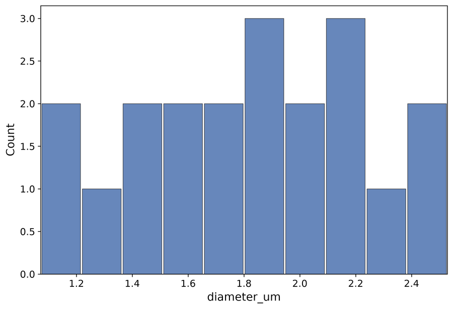

# 8. Histogram Mode

Histogram mode plots **one numeric column** from tabular `.csv` or `.txt` data (particle-size lists, image-analysis exports, and similar). It is a fourth interactive mode alongside XY, EC/CPC, and *operando*.

## Basic usage

```text
batplot sizes.csv --histo --i
```

With `--i`, *batplot* runs a short **wizard**, then opens the histogram interactive menu.

Non-interactive export (no menu):

```text
batplot sizes.csv --histo --histocol 2 --bins 10 --out hist.png
```

From [`docs/demo_data/sizes.csv`](demo_data/sizes.csv) (column 2 = `diameter_um`):

```text
batplot sizes.csv --histo --histocol 2 --bins 10 --i
```



<p class="figure-caption"><strong>Figure: Histogram</strong> (sizes.csv, --histocol 2, --bins 10)</p>

Preview columns first:

```text
batplot --showcol sizes.csv
```

Mode help:

```text
batplot --help histo
```

## Startup wizard (`--histo --i`)

1. Choose the column to histogram (numbered list with a short preview).
2. Set the histogram range (`xmin xmax`, or `auto`).
3. Set bin width, or `bins=N` for a fixed number of equal-width bins.

Then the figure appears and the **Histogram Interactive Menu** is available.

## Interactive menu — Histogram (every key and subkey) {: #histo-interactive-menu }

### Clickable interactive menu

<div class="bp-menu" markdown="0" id="histo-click-menu">
  <div class="bp-menu-sep">------------------------------------------------------------</div>
  <div class="bp-menu-title">Histogram Interactive Menu:</div>
  <div class="bp-menu-grid">
    <div class="bp-menu-col">
      <div class="bp-menu-col-head">Styles</div>
      <a class="bp-item" href="#histo-key-c"><span class="bp-k">c</span>: colors</a>
      <a class="bp-item" href="#histo-key-f"><span class="bp-k">f</span>: font</a>
      <a class="bp-item" href="#histo-key-a"><span class="bp-k">a</span>: density curve</a>
      <a class="bp-item" href="#histo-key-l"><span class="bp-k">l</span>: lines/grid</a>
      <a class="bp-item" href="#histo-key-t"><span class="bp-k">t</span>: spines/ticks (+h display)</a>
      <a class="bp-item" href="#histo-key-g"><span class="bp-k">g</span>: size</a>
    </div>
    <div class="bp-menu-col">
      <div class="bp-menu-col-head">Geometries</div>
      <a class="bp-item" href="#histo-key-w"><span class="bp-k">w</span>: bar width</a>
      <a class="bp-item" href="#histo-key-r"><span class="bp-k">r</span>: rename labels</a>
      <a class="bp-item" href="#histo-key-x"><span class="bp-k">x</span>: range/bins</a>
      <a class="bp-item" href="#histo-key-y"><span class="bp-k">y</span>: y range</a>
    </div>
    <div class="bp-menu-col">
      <div class="bp-menu-col-head">Options</div>
      <a class="bp-item" href="#histo-key-io"><span class="bp-k">e</span>: export figure</a>
      <a class="bp-item" href="#histo-key-io"><span class="bp-k">p</span>: export style</a>
      <a class="bp-item" href="#histo-key-io"><span class="bp-k">i</span>: import style</a>
      <a class="bp-item" href="#histo-key-io"><span class="bp-k">s</span>: save session</a>
      <a class="bp-item" href="#histo-key-io"><span class="bp-k">b</span>: undo</a>
      <a class="bp-item" href="#histo-key-io"><span class="bp-k">q</span>: quit</a>
    </div>
  </div>
  <div class="bp-menu-sep">------------------------------------------------------------</div>
  <p class="bp-menu-note">Click a key to jump to its description. Use ↑ Back to interactive menu under each key to return here.</p>
</div>

After the wizard, the **Histogram Interactive Menu** opens: **Styles | Geometries | Options**. Style files use **`.bpsh`** (not `.bps`).

### Key `c` — Colors {: #histo-key-c }

<p class="bp-back" markdown="0"><a href="#histo-click-menu">↑ Back to interactive menu</a></p>

| Key / input | What it does | Example |
|-----|--------------|---------|
| `bar:color` | Set the histogram bar fill color (name or `#RRGGBB`). | Type `bar:steelblue` or `bar:#4C72B0`. |
| `edge:color` | Set the histogram bar edge/outline color. | Type `edge:black` or `edge:#222222`. |
| `alpha:…` | Set bar fill transparency (0 = invisible, 1 = opaque). | Type `alpha:0.7` for slightly transparent bars. |
| `palette` / named palette | Apply a palette when offered Use the matching single-key rows for full detail. | Type one option from palette` / named palette, for example the first key listed. |
| `w:color` / `a:color` / `s:color` / `d:color` | Spine colors Use the matching single-key rows for full detail. | Type one option from w:color` / `a:color` / `s:color` / `d:color, for example the first key listed. |
| `v` | Print the current color assignments for curves or spines. | Type `v` to list colors, then adjust with `1:red` or `s:black`. |
| `u` | Open the saved-custom-colors helper (store/reuse hex or named colors). | Type `u`, save a color, then reuse it later as `1:#1f77b4`. |
| `e` | Pick a color from the screen/eyedropper when the prompt offers it. | Type `e`, click a pixel on the figure, confirm the hex value. |
| `q` | Return to the previous menu without further changes. | Type `q`. |

---

### Key `f` — Font {: #histo-key-f }

<p class="bp-back" markdown="0"><a href="#histo-click-menu">↑ Back to interactive menu</a></p>

| Key | What it does | Example |
|-----|--------------|---------|
| `f` | Choose the font family (pick a list number or type a name). | Type `f`, then `2` or `Helvetica`. |
| `s` | Set the font size in points. | Type `s`, then `12`. |
| `b` | Choose bold or normal font weight. | Type `b`, then `bold`. |
| `h` | Open text-highlight tools (colored box behind label text). | Type `h`, then `t` to turn highlight on. |
| `q` | Return to the previous menu without further changes. | Type `q`. |

---

### Key `a` — Density curve {: #histo-key-a }

<p class="bp-back" markdown="0"><a href="#histo-click-menu">↑ Back to interactive menu</a></p>

Overlays a smooth **density estimate** on top of the histogram bars.

| Key | What it does | Example |
|-----|--------------|---------|
| `t` | Turn the density-curve overlay on or off. | Type `t`. |
| `c` | Set the linewidth of the plotted data curves. | Type `c`, then `2`. |
| `w` | Set linewidth for the density curve or grid (as listed). | Type `w`, then `1.5`. |
| `l` | Open or apply line-style choices (solid/dashed/markers) for curves. | Type `l`, then `ld` for line+markers or `da` for dashed. |
| `a` | Set highlight transparency from 0 (invisible) to 1 (solid). | Type `a`, then `0.35`. |
| `q` | Leave this submenu and return one level up (or to the main menu). | Type `q`. |

**Inside `l` (line style):**

| Key | What it does | Example |
|-----|--------------|---------|
| `s` | Use a solid linestyle for the density curve. | Type `s`. |
| `d` | Use a dashed linestyle for the density curve. | Type `d`. |
| `t` | Use a dotted linestyle for the density curve. | Type `t`. |
| `q` | Leave this submenu and return one level up (or to the main menu). | Type `q`. |

Y-axis mode (density vs count) is under main-menu **`t` → `h` → `d`**, not here.

---

### Key `l` — Lines / grid {: #histo-key-l }

<p class="bp-back" markdown="0"><a href="#histo-click-menu">↑ Back to interactive menu</a></p>

| Key | What it does | Example |
|-----|--------------|---------|
| `f` | Set linewidth of the axes frame and tick marks. | Type `f`, then `1.0`. |
| `g` | Turn the plot grid on/off and adjust grid width when asked. | Type `g`, then follow the on/off or width prompt. |
| `w` | Set linewidth for the density curve or grid (as listed). | Type `w`, then `1.5`. |
| `q` | Return to the previous menu without further changes. | Type `q`. |

---

### Key `t` — Spines, ticks, and display {: #histo-key-t }

<p class="bp-back" markdown="0"><a href="#histo-click-menu">↑ Back to interactive menu</a></p>

Spines are the four border lines of the axes box. Tick marks, tick numbers, and axis titles sit on those sides.

Press **`t`**, then type commands at the spine prompt. Most toggles are a **side letter + number** with **no space** (for example `s2`). You can put several codes on one line.

#### Step 1 — Pick a side (WASD)

| Key | What it does | Example |
|-----|--------------|---------|
| `w` | WASD **top** side of the axes box. | Type `w5` to toggle the top axis title. |
| `a` | WASD **left** side of the axes box. | Type `a4` to toggle left tick numbers. |
| `s` | WASD **bottom** side of the axes box. | Type `s2` to toggle bottom major ticks. |
| `d` | WASD **right** side of the axes box. | Type `d1` to toggle the right spine line. |

#### Step 2 — Pick what to show/hide on that side

| Number | What it does | Example |
|-----|--------------|---------|
| `1` | Toggle the border spine line on the chosen side. | `s1` toggles the bottom spine. |
| `2` | Toggle major tick marks on the chosen side. | `a2` toggles left major ticks. |
| `3` | Toggle minor tick marks on the chosen side. | `s3` toggles bottom minor ticks. |
| `4` | Toggle tick number labels on the chosen side. | `a4` hides or shows left numbers. |
| `5` | Toggle the axis title on the chosen side. | `w5` toggles the top title. |

#### Examples (copy these ideas)

| You type | What it does | Example |
|-----|--------------|---------|
| `s2` | Toggle bottom major tick marks on the plot frame. | Type `s2` once to hide bottom majors; type again to show them. |
| `w5` | Toggle the top axis title visibility. | Type `w5` to hide the top title if it overlaps the plot. |
| `a4` | Toggle left-side tick number labels. | Type `a4` to hide left numbers for a cleaner export. |
| `d1` | Toggle the right spine (border) line. | Type `d1` to remove the right border. |
| `s2 w5 a4` | Apply several WASD toggles in one command (space-separated). | Type `s2 w5 a4` to hide bottom majors, top title, and left numbers together. |

Blank line or `q` leaves a nested prompt; `q` on the spine prompt returns to the main interactive menu.

#### Extra commands (type the letter alone)

| Key | What it does | How to use it | Example |
|-----|--------------|---------------|---------|
| `i` | Flip tick marks to point into vs out of the plot. | Type `i` once; type again to flip back | Type `i` once; type again to flip back. |
| `l` | Set **major tick length** (points). Minor length is set automatically to about 70% | Type `l`, then enter a positive number | Type `l`, then `6`. |
| `n` | Set spacing between major ticks. | Type `n`, then e.g. `x 0.5`, `y 1`, `all 1`, or `x auto` | Type `n`, then `x 0.5`, `all 1`, or `x auto`. |
| `m` | Set how many minor ticks sit between majors. | Type `m`, then e.g. `x 4` or `all 0` (off) | Type `m`, then `x 4` or `all 0` to disable. |
| `p` | Nudge axis titles away from the data. | See the next table | Type `p`, then `w` and use nudge keys. |
| `list` | Print the current spine/tick on/off state for every side. | Read the report, then continue | Type `list`. |
| `q` | Leave this submenu and return one level up (or to the main menu). | Back to the main interactive menu | Type `q`. |

#### Inside `p` — move axis titles

| Key | What it does | Example |
|-----|--------------|---------|
| `w` | WASD **top** side of the axes box. | Type `w5` to toggle the top axis title. |
| `s` | WASD **bottom** side of the axes box. | Type `s2` to toggle bottom major ticks. |
| `a` | WASD **left** side of the axes box. | Type `a4` to toggle left tick numbers. |
| `d` | WASD **right** side of the axes box. | Type `d1` to toggle the right spine line. |
| `r` | Reset all title-offset nudges back to the default positions. | Type `r` after overshooting with `x 0.5` / `y -0.3`. |
| `q` | Leave this submenu and return one level up (or to the main menu). | Type `q`. |

Typical nudge keys after you pick a side: `w`/`s`/`a`/`d` to move, `0` to reset that title, `q` to go back.

#### Extra for histogram: `h` display tools

On the spine prompt you can also type **`h`** to open histogram display toggles (this is unique to histogram mode).

| Key | What it does | Example |
|-----|--------------|---------|
| `d` | Toggle Y-axis between **density** and **count**. | Type `d` to switch to density (or back to counts). |
| `n` | Show or hide numeric **labels on bars**. | Type `n`. |
| `m` | Show or hide **mean and median** marker lines. | Type `m`. |
| `q` | Return to the spines/ticks menu. | Type `q`. |

Bar fill colors and density-curve styling are separate keys (`c` and `a` on the main menu).

---

### Key `g` — Size {: #histo-key-g }

<p class="bp-back" markdown="0"><a href="#histo-click-menu">↑ Back to interactive menu</a></p>

Sizes are in **inches**.

| Key | What it does | Example |
|-----|--------------|---------|
| `p` | Resize the axes box (plot frame) in inches. | Type `p`, then `6 4`. |
| `c` | Resize the whole figure window in inches. | Type `c`, then `8 6`. |
| `q` | Leave this submenu and return one level up (or to the main menu). | Type `q`. |

After `p` or `c`, type two numbers such as `6 4`, or quit with `q` / blank.

---

### Key `w` — Bar width {: #histo-key-w }

<p class="bp-back" markdown="0"><a href="#histo-click-menu">↑ Back to interactive menu</a></p>

Controls how wide each bar is **inside its bin** (not the bin edges themselves).

| What you type | What it does | Example |
|-----|--------------|---------|
| A number between **0 and 1** | Fraction of the bin width filled by the bar (e.g. `0.8`). | Type `0.8` for bars that leave a small gap. |
| `q` / blank when allowed | Cancel Use the matching single-key rows for full detail. | Type one option from q` / blank when allowed, for example the first key listed. |

The current value is shown in the main menu label next to `w`. Bin edges / count of bins are set with **`x`**.

---

### Key `r` — Rename {: #histo-key-r }

<p class="bp-back" markdown="0"><a href="#histo-click-menu">↑ Back to interactive menu</a></p>

| Key | What it does | Example |
|-----|--------------|---------|
| `x` | Set the histogram **X-axis** title (the binned quantity). | Type `x`, then `Particle size (µm)`. |
| `y` | Set the histogram **Y-axis** title (count or density). | Type `y`, then `Counts` or `Density`. |
| `t` | Set the figure **title** above the plot. | Type `t`, then `PSD — sample A`. |
| `o` | Set an optional **top** axis label. | Type `o`, then `n = 1200 particles`. |
| `s` | Show recently used titles and optionally reuse one. | Type `s`, then enter `1`. |
| `m` | Show math / Greek typing help for titles. | Type `m`, then use `{sub(2)}` when renaming. |
| `q` | Return to the main histogram menu. | Type `q`. |

---

### Key `x` — Range / bins {: #histo-key-x }

<p class="bp-back" markdown="0"><a href="#histo-click-menu">↑ Back to interactive menu</a></p>

Re-runs the same kind of questions as the startup wizard, so you can change the histogram without restarting.

| Step (typical) | What it does | Example |
|-----|--------------|---------|
| Display range | Set the X display window as `xmin xmax`, or `auto`. | Type `0 10` to show 0–10, or `auto` for full span. |
| Binning | Set a bin width number, or `bins=N` for N equal bins. | Type `0.5` for width 0.5, or `bins=40`. |
| Cancel | Abort the current prompt and return. | Type `q` when offered. |

This does **not** delete your raw column data; it only changes how bars are built and displayed. Bar width fraction is separate (`w`).

---

### Key `y` — Y limits {: #histo-key-y }

<p class="bp-back" markdown="0"><a href="#histo-click-menu">↑ Back to interactive menu</a></p>

| Key / input | What it does | Example |
|-----|--------------|---------|
| `min max` | Enter both limits as two numbers separated by a space. | `10 80` or `3.0 4.2`. |
| `w` / `s` | Step upper / lower Use the matching single-key rows for full detail. | Type one option from w` / `s, for example the first key listed. |
| `a` | Auto-scale this axis to the visible data. | Type `a` after zooming too far. |
| `q` | Return to the previous menu without further changes. | Type `q`. |

---

### Keys `p` / `i` / `e` / `s` / `b` / `q` {: #histo-key-io }

<p class="bp-back" markdown="0"><a href="#histo-click-menu">↑ Back to interactive menu</a></p>

| Key | What it does | Example |
|-----|--------------|---------|
| `p` | Export a reusable style file (`.bps` / `.bpsg` / `.bpsh`). | Type `p`, choose style-only or style+geometry. |
| `i` | Import a saved style by picking its number from the list. | Type `i`, then `2`. |
| `e` | Export the figure image (svg, png, …). | Type `e`, choose format and folder. |
| `s` | Save the session as a `.pkl` file. | Type `s`, then confirm the name/folder. |
| `b` | Undo the last change stored in history. | Type `b`. |
| `q` | Leave this submenu and return one level up (or to the main menu). | Type `q`. |

## Batch export

Export each CSV/TXT in the folder as its own figure under `Figures/`. **`--histocol` is required** for `--all` (column number or header name):

```text
batplot --all --histo --histocol Length
```

```text
batplot allfiles --histo --histocol 7 --binwidth 1
```

```text
batplot --all mystyle.bpsh --histo --histocol Length
```

## Batch interactive editing

Edit two or more histograms together (styles sync across panels):

```text
batplot allfiles --histo --i
```

If `--histocol` is omitted, the wizard runs on the first file and the same column/bin layout is reused for the rest. See also [Batch mode](09-batch-processing.md).

## Flags (histogram)

```text
batplot sizes.csv --histo --i
```

```text
batplot sizes.csv --histo --histocol diameter_um --i
```

```text
batplot sizes.csv --histo --histocol 1 --xrange 0 20 --i
```

```text
batplot sizes.csv --histo --histocol 1 --binwidth 0.5 --i
```

```text
batplot sizes.csv --histo --histocol 1 --bins 40 --i
```

```text
batplot --histo --histocol 1 --all
```

```text
batplot allfiles --histo --histocol 1 --i
```

| Flag | What it does |
|------|--------------|
| `--histo` | Launch histogram mode for the listed file(s). |
| `--histocol N` | Choose the numeric column (1-indexed number or header name). |
| `--xrange A B` | Restrict the histogram display window on X. |
| `--binwidth W` | Set the width of each bin. |
| `--bins N` | Use *N* equal-width bins across the range. |
| `--all` | Batch-export one figure per CSV/TXT (requires `--histocol`). |
| `allfiles` | Expand to every CSV/TXT in the folder. |
