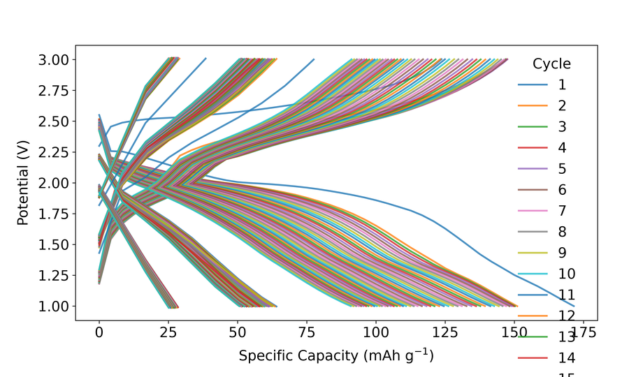
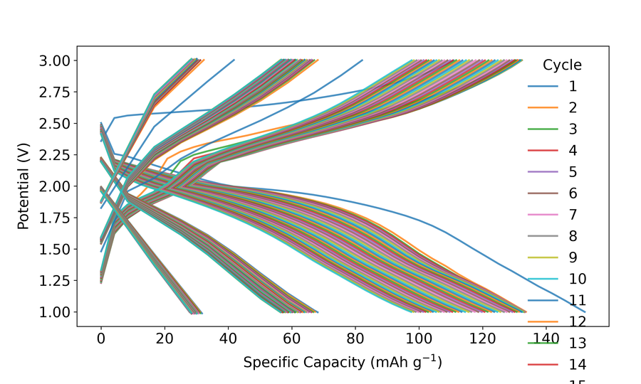

# 9. Batch mode

*batplot* batch workflows cover three related jobs:

1. **Batch export** — one figure (or session) per file with `--all`
2. **Session save** — write `.pkl` files with `--save` (with or without `--i`)
3. **Batch edit** — open several `.pkl` sessions of the **same kind** and sync styles/geometry from one interactive menu

Interactive key details live in [Interactive menus](10-interactive-menus.md); this chapter focuses on **when** to use batch and what differs from single-session `--i`.

## 9.1 Batch export (`--all`)

Export each matching file as a separate figure under `Figures/`:

```text
batplot --all --gc
```

```text
batplot --all --xaxis 2theta --xrange 10 80
```

```text
batplot --all --format png
```

!!! example "Tutorial — EC batch peers from demo files"

    Same GC export for each Neware CSV (what `--all --gc` produces per file):

    ```text
    batplot B443.csv --gc --out B443.png
    batplot B444.csv --gc --out B444.png
    batplot B445.csv --gc --out B445.png
    ```

    

    <p class="figure-caption"><strong>Figure: batch peer 1</strong> (B443.csv --gc)</p>

    

    <p class="figure-caption"><strong>Figure: batch peer 2</strong> (B444.csv --gc)</p>

    

    <p class="figure-caption"><strong>Figure: batch peer 3</strong> (B445.csv --gc)</p>

Apply a shared style while exporting:

```text
batplot --all style.bps --gc --mass 7
```

```text
batplot --all mystyle.bpsh --histo --histocol Length
```

!!! note
    `--all` is **not** the same as the `allfiles` keyword. `allfiles` overlays many files on **one** figure (or expands inputs); `--all` writes **one output per file**.

## 9.2 Saving sessions (`--save`)

`--save` writes the same `.pkl` sessions as interactive `s`, without requiring `--i`:

```text
batplot pattern.xye --xaxis 2theta --save
```

```text
batplot --all --xaxis 2theta --xrange 10 80 --save
```

**Naming rules (fact-checked against CLI behavior):**

- **Single file:** default name = data-file stem; you choose the folder when prompted.
- **`--all`:** one session per file (default names); folder chosen once.
- **Combined plots** (e.g. `allfiles`, multi-file GC/CPC, `--operando`): you **must** provide a session name.

```text
batplot file1.csv file2.csv --gc --save
```

```text
batplot --operando --wl 1.54 --save
```

Reload later:

```text
batplot my_session.pkl --i
```

## 9.3 Batch edit (multiple `.pkl` + `--i`)

Edit several saved sessions together. Panels must be the **same kind** (all GC, all XY, all histo, …):

```text
batplot file1.pkl file2.pkl file3.pkl --i
```

Typical uses: set the same font, frame size, colors, or spine settings on every panel, then `e` / `s` / `p` for all.

### What batch can sync

Batch keeps most style/geometry keys for that mode and always offers Options I/O (`e`/`p`/`i`/`s`/`b`/`q`, plus `n` crosshair when listed). Full printed keys per batch kind are below.

### Not available in batch (use single-session `--i`)

| Mode | Keys not in batch (or strongly limited) | Why |
|------|-------------------------------------------|-----|
| XY | `sm`, `a` (rearrange), `o` (offset), `d` (derivative) | Per-curve data transforms / ordering |
| XY CIF | Full CIF editor; batch `cif` is **add-only** | Keep peer sessions simple |
| EC | `a` (capacity/ion), `2d` (open dQ/dV contour) | Dual-axis / companion figure |
| EC | `sm` | **Allowed only** if the batch is dQ/dV (not GC/CV) |
| CPC | `a` (add file(s)) | Adding data is single-session |
| CPC | Dedicated `k` row | Spine colors via color / WASD paths instead |

If you type a rejected key, *batplot* tells you to use single-session `--i`.

## 9.4 Batch interactive menus — keys per mode {: #batch-interactive-menus }

Header looks like `Batch … Menu (N plots)`. Nested subkeys are the same as the single-session chapters unless a row below says otherwise.

Full single-session trees: [XY](05-examples-1d-mode.md#xy-interactive-menu) · [EC](06-examples-electrochemistry-ec-and-cpc-epc-modes.md#ec-interactive-menu) · [CPC](06-examples-electrochemistry-ec-and-cpc-epc-modes.md#cpc-interactive-menu) · [*Operando*](07-examples-operando-mode.md#operando-interactive-menu) · [Histogram](08-examples-histogram-mode.md#histo-interactive-menu).

### Options column (every batch kind)

These keys appear in the **Options** column of every batch menu. Nested prompts match single-session behavior unless a difference table below says otherwise.

| Key | What it does | Example |
|-----|--------------|---------|
| `n` | Toggle the crosshair helper on the active figure. | Type `n` once to show coordinates; type again to hide. |
| `e` | Export the current batch figures (paths and formats as prompted). | Type `e`, choose PNG/PDF, confirm the folder. |
| `p` | Export the shared style settings to a style file. | Type `p`, then save e.g. `batch_style.json`. |
| `i` | Import a previously exported style onto the batch. | Type `i`, pick `batch_style.json`, confirm apply-all. |
| `s` | Save all (or selected) sessions as `.pkl` files. | Type `s`, accept the suggested folder, confirm. |
| `b` | Undo the last batch styling change when undo is available. | Type `b` after a mistaken color change. |
| `q` | Quit the batch interactive menu. | Type `q`. |
| `os` / `ops` / … | Overwrite using the **last** save/export paths (only after a prior save/export in this session). | After exporting once, type `os` to overwrite the same paths. |

### Batch XY — printed keys

| Column | Keys shown | What this column is for | Example |
|--------|------------|-------------------------|---------|
| Styles | `c` `f` `l` `t` `h` `g` | Colors, fonts, lines, ticks/spines, help, grid — same subkeys as [XY](05-examples-1d-mode.md#xy-interactive-menu). | Type `c`, then `1:red` to recolor curve 1 on **all** loaded XY sessions. |
| Geometries | `r` `x` `y` `v` `cif` | Rename, X/Y ranges, visibility, CIF (add-only in batch). | Type `x`, then `10 70` to set the same 2θ window on every plot. |
| Options | see table above | Export / save / undo / quit shared across the batch. | Type `e` to export every figure in one pass. |

| Difference vs single XY | What it means | Example |
|-------------------------|---------------|---------|
| Rejected if typed | Per-curve data transforms are single-session only: `sm`, `a` (rearrange), `o` (offset), `d` (derivative). | Typing `o` prints a message to use single-session `--i` instead. |
| `cif` submenu | Batch CIF is **add-only**: only `a` (add) and `q` are accepted. | Type `cif` → `a`, add a phase; editing/removing ticks needs a single session. |
| `g` | Grid submenu: `p` = plot-frame grid, `c` = figure/canvas grid, `q` = back. | Type `g` → `p` to toggle the plot grid on all XY figures. |

### Batch EC — printed keys

| Column | Keys shown | What it means | Example |
|--------|------------|---------------|---------|
| Styles | `f` `l` · `sm` **only if dQ/dV** · `t` `k` `h` `d` · `v` if multi-file · `g` | Fonts, lines, optional smooth, ticks, spine colors, help, dash, visibility, grid. | In a dQ/dV batch, type `sm` then `1` for moving-average smoothing on all contours’ parent style path. |
| Geometries | `c` `r` `x` `y` | Cycles/colors, rename, X/Y limits — see [EC](06-examples-electrochemistry-ec-and-cpc-epc-modes.md#ec-interactive-menu). | Type `c` → `1-10` to keep cycles 1–10 on every GC in the batch. |
| Options | standard + `o` overview **unless** the batch is dQ/dV | Overview (`o`) is for GC-style batches, not dQ/dV contour batches. | On a GC batch, type `o` then `c` for a capacity table; on dQ/dV batch, `o` is refused. |

| Difference vs single EC | What it means | Example |
|-------------------------|---------------|---------|
| Rejected | `a` (capacity/ion dual axis) and `2d` (open a new contour companion) are single-session. | Typing `2d` in batch tells you to open one `.pkl` with `--i` instead. |
| `sm` | Allowed only when the batch kind is **dQ/dV**. | On a dQ/dV batch, type `sm` then `1`; on a GC batch, `sm` is rejected. |
| `o` on dQ/dV batch | Overview is GC-oriented and not available. | Type `o` on a dQ/dV batch → GC-only message. |

### Batch CPC — printed keys

| Column | Keys shown | What it means | Example |
|--------|------------|---------------|---------|
| Styles | `f` `l` `m` `d` `ry` `t` `h` · `v` if multi · `g` | Fonts, lines, markers, dash, right-Y efficiency, ticks, help, visibility, grid. | Type `ry` to show efficiency on every CPC plot in the batch. |
| Geometries | `c` `r` `x` `y` `ie` | Cycles/colors, rename, limits, invert efficiency — see [CPC](06-examples-electrochemistry-ec-and-cpc-epc-modes.md#cpc-interactive-menu). | Type `ie` to invert the efficiency axis across the batch. |
| Options | standard + `o` | Shared options plus overview. | Type `o` → `c` for capacity/efficiency summaries. |

| Difference vs single CPC | What it means | Example |
|--------------------------|---------------|---------|
| Missing | No `a` (add file) and no top-level `k`; color spines via `c` → `s` or WASD/`t` paths instead. | To add another CPC file, open one session with `--i` and use `a`; in batch, type `c` then spine-color helpers if offered. |

### Batch *Operando*

Same keys and subkeys as [*operando* single-session](07-examples-operando-mode.md#operando-interactive-menu), including nested tables there (each with an **Example** column). Side-panel columns (`e` / `el` / …) appear only if the loaded sessions have an EC panel.

| Situation | What it means | Example |
|-----------|---------------|---------|
| Sessions with EC panel | Full four-column menu (Styles / *Operando* / Side Panel / Options). | Type `er` to rename the EC panel X/Y titles on every matching session. |
| Contour-only sessions | No Side Panel column; `e`-panel keys are unavailable. | Type `or` (not `er`) to rename contour axis titles. |

### Batch Histogram — printed keys

| Column | Keys shown | What it means | Example |
|--------|------------|---------------|---------|
| Styles | `c` `f` `a` `l` `t` `g` | Bar colors, fonts, alpha, density line, ticks, grid — see [histogram](08-examples-histogram-mode.md#histo-interactive-menu). | Type `c` → `bar:steelblue` on every histogram. |
| Geometries | `w` `r` `x` `y` | Bin width / bins, rename, X/Y ranges. | Type `w`, then `bins=40` to use 40 bins on all plots. |
| Options | standard **including `n` crosshair** | Same Options table as above; crosshair is available. | Type `n` to read bin centers under the cursor. |

Nested `t` → `h` display toggles still work (see [histogram menu](08-examples-histogram-mode.md#histo-interactive-menu)).

### Batch dQ/dV 2D contours

| Column | Keys shown | What it means | Example |
|--------|------------|---------------|---------|
| Styles | `oc` `v` `t` `k` `l` `f` `g` `r` | Colormap, visibility, ticks, spine colors, lines, fonts, grid, rename. | Type `oc` then `inferno` to set the colormap on every contour. |
| Contour | `ox` (potential window) `oy` `oz` `or` | Potential / scan / intensity windows and rename — same ideas as single dQ/dV 2D. | Type `ox`, then `2.5 4.2` for the potential window. |
| Options | standard | Export / save / undo / quit for the whole contour batch. | Type `s` to save all styled contour sessions. |

No CIF, peaks, or EC side panel. Create contours from a single dQ/dV session with `2d`, save `.pkl`, then open those files together for batch styling.

```text
batplot allfiles --histo --i
```

