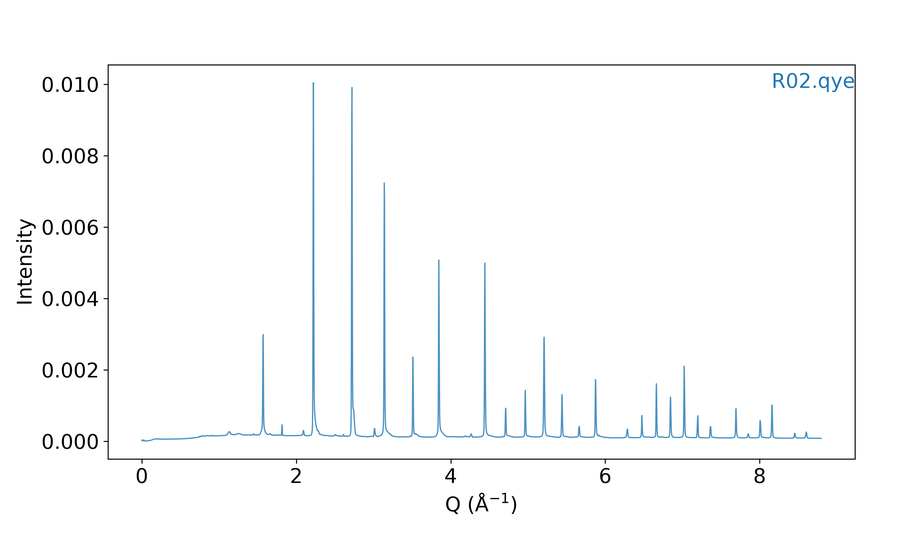

# 11. Utilities

Small CLI helpers you often use **before** interactive plotting. They do not replace the mode chapters.

**How examples work here:** every utility is shown as a **terminal session** — the command you type, then the text *batplot* prints. Interactive menu keys still use tables in the mode chapters; CLI commands always use this terminal style.

## Shared demo file

`--showcol`, `--strip-header`, and `--readcol` below all use the **same** simulated file `demo_cols.txt`. It has:

- **2 metadata lines** at the top → removed with `--strip-header`
- **4 data columns** → listed with `--showcol`
- **Non-default Y columns** → selected with `--readcol` (e.g. plot `angle_deg` vs `I_norm` instead of the default first two columns)

```text
Instrument: DemoLab
Exported: 2026-01-15
angle_deg	I_sample	I_blank	I_norm
10.0	120.5	15.2	105.3
12.5	98.1	14.8	83.3
15.0	210.0	16.0	194.0
17.5	145.2	15.5	129.7
20.0	88.4	14.9	73.5
22.5	176.0	15.1	160.9
25.0	132.7	15.3	117.4
27.5	95.0	14.7	80.3
30.0	158.6	15.0	143.6
```

## Preview columns (`--showcol`)

Print numbered columns, header names when found, and the first values in each column. Use this to decide `--readcol` (or `--histocol` / `--readcolc` / `--readcols` on other file types). Works for CSV, Excel, text, `.mpt`, `.brml`, Bruker `.raw`, and similar.

```text
batplot --showcol demo_cols.txt
```

```text
=== demo_cols.txt ===
  Leading non-data lines (not used as column names):
    (1) Instrument: DemoLab
    (2) Exported: 2026-01-15
  [1] angle_deg
      10, 12.5, 15, 17.5, 20, 22.5, 25, 27.5, 30
  [2] I_sample
      120.5, 98.1, 210, 145.2, 88.4, 176, 132.7, 95, 158.6
  [3] I_blank
      15.2, 14.8, 16, 15.5, 14.9, 15.1, 15.3, 14.7, 15
  [4] I_norm
      105.3, 83.3, 194, 129.7, 73.5, 160.9, 117.4, 80.3, 143.6
```

`--showcol` already skips the two metadata lines for previewing, but those lines can still confuse some tools and clutter the file. Next, strip them for a clean copy.

## Strip header lines (`--strip-header`)

Copy files with the first *N* lines removed into a `stripped/` subfolder next to each input. **Originals are never modified.** Binary formats (`.brml`, `.raw`, `.xlsx`, …) are skipped.

Remove the two metadata lines from the same `demo_cols.txt`:

```text
batplot demo_cols.txt --strip-header 2
```

```text
Stripped 2 header line(s): demo_cols.txt → …/stripped/demo_cols.txt
Done: stripped headers from 1 file(s) → 'stripped/' subfolder(s).
```

Contents of the stripped copy (also saved in-repo as `demo_cols_stripped.txt`):

```text
angle_deg	I_sample	I_blank	I_norm
10.0	120.5	15.2	105.3
12.5	98.1	14.8	83.3
15.0	210.0	16.0	194.0
17.5	145.2	15.5	129.7
20.0	88.4	14.9	73.5
22.5	176.0	15.1	160.9
25.0	132.7	15.3	117.4
27.5	95.0	14.7	80.3
30.0	158.6	15.0	143.6
```

Preview again — no “Leading non-data lines” warning:

```text
batplot --showcol demo_cols_stripped.txt
```

```text
=== demo_cols_stripped.txt ===
  [1] angle_deg
      10, 12.5, 15, 17.5, 20, 22.5, 25, 27.5, 30
  [2] I_sample
      120.5, 98.1, 210, 145.2, 88.4, 176, 132.7, 95, 158.6
  [3] I_blank
      15.2, 14.8, 16, 15.5, 14.9, 15.1, 15.3, 14.7, 15
  [4] I_norm
      105.3, 83.3, 194, 129.7, 73.5, 160.9, 117.4, 80.3, 143.6
```

### Folder form (same idea, many files)

```text
batplot /path/to/folder --strip-header 2 --ext .txt
```

```text
batplot /path/to/folder --strip-header 2 --ext .xy,.dat,.txt
```

## Choose columns (`--readcol`)

Default 1D plotting uses columns **1** and **2**. For a real three-column file such as `TD_R02.dat`, pick another Y with `--readcol` (see also [1D mode](05-examples-1d-mode.md#using-readcol-to-specify-columns)):

```text
batplot TD_R02.dat --readcol 1 3 --xaxis q --i
```

**X = column 1, Y = column 3**


<p class="figure-caption"><strong>Figure: --readcol 1 3</strong> (TD_R02.dat)</p>

Plot both Y columns against the same X:

```text
batplot TD_R02.dat --readcol 1 2 1 3 --xaxis q --i
```

**two curves: columns 2 and 3 vs column 1**

```text
batplot TD_R02.dat --readcol 1 2-3 --xaxis q --i
```

**same thing with range shorthand**


<p class="figure-caption"><strong>Figure: --readcol 1 2-3</strong> (TD_R02.dat)</p>

```text
batplot TD_R02.dat --readcol 1 2 TD_R03.dat --readcol 1 3 --xaxis q --i
```

**each file can pick its own columns**

After `--showcol` on the shared `demo_cols.txt` layout above, you can likewise plot headered columns (e.g. `--readcol 1 4` for `angle_deg` vs `I_norm`).

## Convert XRD files (`--convert`)

Rewrite XRD x-axes between 2θ / Q / d (and wavelength frames) into a `converted/` subfolder. Originals are left untouched. Units are case-insensitive (`q`/`Q`, `d`/`D`, `2theta`/`2th`/`tth`). A bare number means **2θ at that wavelength (Å)**.

`--convert` needs ordinary two-column XRD (or `--readcol` to pick X/Y). From the manuscript demo tree, `XRD/converted/R02.qye` is already in Q:

```text
batplot R02.qye --xaxis q --out plot.png
```



<p class="figure-caption"><strong>Figure: converted Q-space XRD</strong> (XRD/converted/R02.qye)</p>

### Example — 2θ (λ = 1.54 Å) → Q

Starting from a small `clean.xy` (2θ, intensity):

```text
batplot clean.xy --convert 1.54 q
```

```text
Saved …/converted/clean.qye
Exported 1 file(s) to: …/converted
```

Start of `converted/clean.qye`:

```text
# # Converted from clean.xy: 2θ (λ=1.54 Å) → Q
 0.355933  100.000000
 0.391501  120.000000
 0.427060  90.000000
 0.711189  200.000000
```

### Example — re-project 2θ between two wavelengths

```text
batplot clean.xy --convert 1.54 0.7093
```

```text
Saved …/converted/clean.xy
Exported 1 file(s) to: …/converted
```

```text
# # Converted from clean.xy: 2θ (λ=1.54 Å) → 2θ (λ=0.7093 Å)
 2.302346  100.000000
 2.532448  120.000000
 2.762512  90.000000
```

### Other common convert forms

```text
batplot data.qye --convert q 1.54
```

```text
batplot file.qye --convert q d
```

```text
batplot /path/to/folder --ext .xy --convert 0.26 q
```

```text
batplot demo_cols.txt --readcol 1 4 --convert 1.54 q
```

```text
batplot allfiles --ext xy --convert 2theta q --wl 1.5406 --convert-ext qye
```

Plot-time wavelength suffixes (`file.xye:1.54`, dual `:λ1:λ2`, CIF `:λ`) are documented under [1D / XY — Wavelength Handling](05-examples-1d-mode.md#wavelength-handling).

## Open the manual / version / help

```text
batplot --manual
```

Opens the online user manual in your browser.

```text
batplot --version
```

Prints the installed version and release notes.

```text
batplot --help ec
```

Shows electrochemistry-specific help (`xy`, `op`, `histo` also work).
